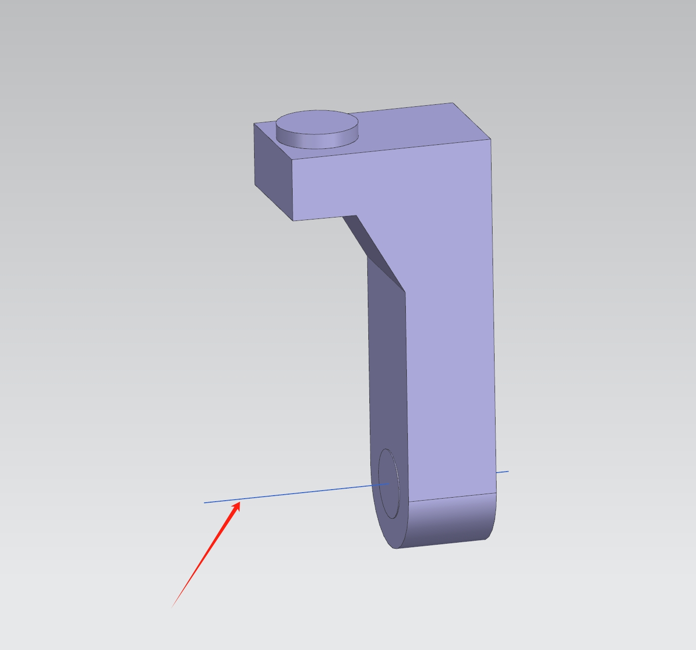
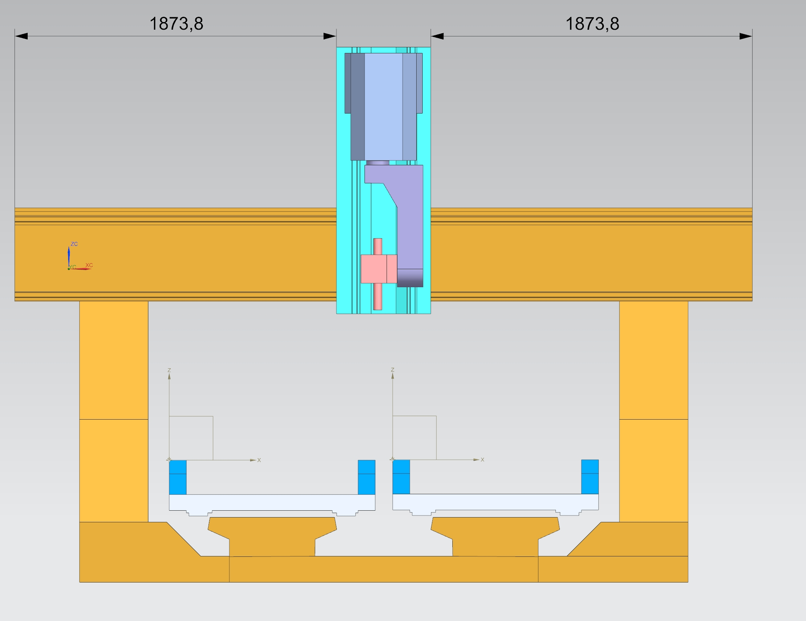
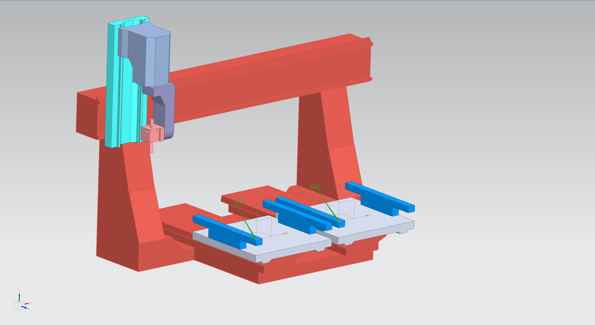
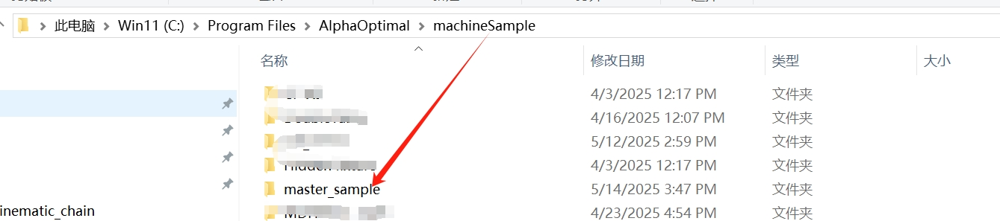
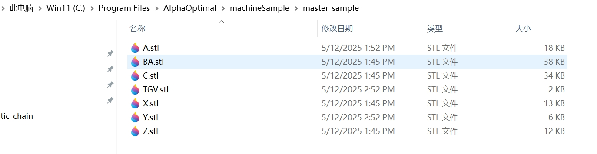

# 新建运动链-第一步:输出机床模型

## 定义世界坐标系的位置

> 注:严格来说世界坐标系是具有`唯一性`且`不可修改`,这里说的`世界坐标系`，指的是:`Alpha Optimal软件内的世界坐标系`和CAD软件里面的`工件坐标系`的一种对应关系。把CAD软件内的`工件坐标系`当作`Alpha Optimal`里面的世界坐标系的位置.这样就明确了输出的模型位置

> 注：第一步和第二步的操作是组合操作.需要按照第二步的操作.先把X Z C A四个轴移动到`0`的位置再设置`世界坐标系`.否则设置的`世界坐标系位置`是错误的位置

---

  
1. 机床的X Z C A轴必须处于 <code>0</code> 的位置，如下图所示：

  

    
  

  
2. 定义世界坐标系的位置

  
  <ul>
    <li>以C轴的旋转中心点沿Z的负方向绘制一条线段LC</li>
  </ul>
  

    
  

  
  <ul>
    <li>以A轴的旋转中心点沿X的负方向绘制一条线段LA</li>
  </ul>
  

    
  

  
  <ul>
    <li>LC 和 LA的交汇点就是 <code>世界坐标系</code> 的 <strong>0</strong> 点位置</li>
    <li>设定坐标系到 <code>交汇点</code>，后续的模型输出都是以此坐标系为基准进行输出</li>
  </ul>
  

    
  

## 调整模型位置

目标:把每一个轴`X Y&U  Z C A`都移动机械坐标**0.0**的位置 

#### 模型初始姿态    

#### 模型调整  

- 调整X位置的方法:
    - 先移动X轴到中间位置(注意同时需要移动Z C A轴)
    - 再根据X轴的行程,移动行程的一半:注意是往X轴机械坐标`0`的方向移动
  

    
    

- 调整Z位置的方法:
    - 调整Z的最高位置距离顶面在：30 - 50mm之间.有实际物理机床的，以测量物理机床为准
    - 

    

- 调整C A角度为`0`的状态
    - 

    

- 调整Y&U位置
  - 移动Y&U到机械坐标`0`的位置
  - 定义工件坐标系在Y&U的位置
    - 

    

  - 以`工件坐标系`为起点,`世界坐标系`为目标点,复制Y(假如有Tgv,也要一同复制)到`世界坐标系`零位
    - 

    

## 记录理论值

> 说明:在配置运动链阶段,先要理论值写入到配置文件.用以验证配置的正确性.故:对一下数据进行记录，方便在初始时候使用

- 工件坐标系:
    - 
    - G54:左台面 x y z Point( 1185.2, -731.0, -1310.86 )
    - G55:右台面 x y z Point( 2486.67, -731.0, -1310.86 )
- RTCP值:
    - **注意:测量刀具安装点的时候，对应的主轴必须垂直朝下**
    - 
    - 格式: x y z 角度补偿.这里是**4**个值,中间以**一个空格**分割
    - x y z位移: 是从**安装点**到**世界坐标系**(注意:使用CAD测量的时,都是从`世界坐标系`到`安装点`.需要对取到的值进行`取反`操作)
    - 角度补偿:保持A轴在0°的时候，主轴中心轴线和Z轴的夹角(注意值的`取反`)
    - 示例:
        - T1: x y z 角度补偿
        - …………
        - TN: x y z 角度补偿

## 模型输出
- 
- 在软件的安装路径 machineSample文件夹内新建文件夹:`master_sample`
- 
- 合并模型:
  - 合并原则:一个轴或节点对应一个模型
- 输出原则：相同的模型只输出一个
- 输出格式: STL
- 