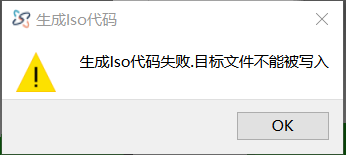

# ISO Code Generation Failed: Target Path Cannot Be Written

### Error Message
- 

### Cause
- The path defined in the post-processor file is either write-protected or does not exist.

### Solution
1. Navigate to the software installation directory and locate the `data.ini` file.
2. Find the line `PostProcessor=UserPostProcessor/AX5_OSAI.xml`. Note that `AX5_OSAI.xml` is the currently used post-processor file.
3. In the same directory, open the `UserPostProcessor` folder and locate the `AX5_OSAI.xml` file.
4. Open the `AX5_OSAI.xml` file with Notepad.
5. Search for **OutputDir** (case-sensitive).
6. Locate the line **OutputDir="D:/CNC"**. If the path `D:/CNC` does not exist, this error will occur. Specify the correct path. Note: On Windows systems, when copying the path (e.g., `D:\CNC`), you must manually replace `\` with `/`. Otherwise, the error will persist.