# Authorization and Registration

## Steps

1. **Ensure AlphaOptimal software is installed**
2. **Close the AlphaOptimal software**
3. **Open the installation directory**
   - Default path: `C:\Program Files\AlphaOptimal_v3`
4. **Navigate to the `bin\UserIdGenerator` folder**
   - 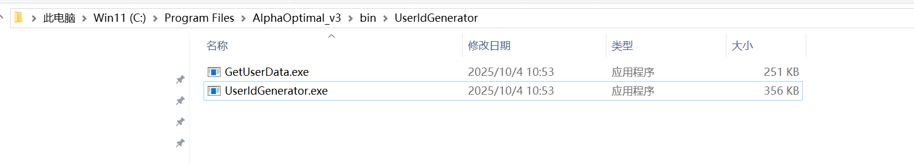
   - Run `GetUserData.exe` (as Administrator) to generate the `HostName.txt` file
   - Run `UserIdGenerator.exe` (as Administrator) to generate the `userId.txt` file
5. **Send the files**
   - Send the `HostName.txt` and `userId.txt` files to `Ruifan Software Company` to create the authorization
6. **Receive the authorization files**
   - `Ruifan Software Company` will provide the following files:
     - `HostName.lic` authorization file
     - `AlphaOptimal...txt` file
7. **Copy the authorization files**
   - Copy the above files to the software installation directory, ensuring they are in the same path as the `AlphaOptimal.exe` file (usually `C:\Program Files\AlphaOptimal_v3\bin`)
8. **Open the AlphaOptimal software**
   - If an authorization error appears:
     1. 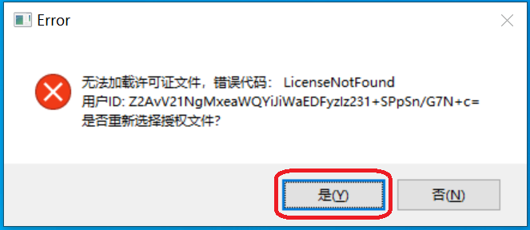
     2. 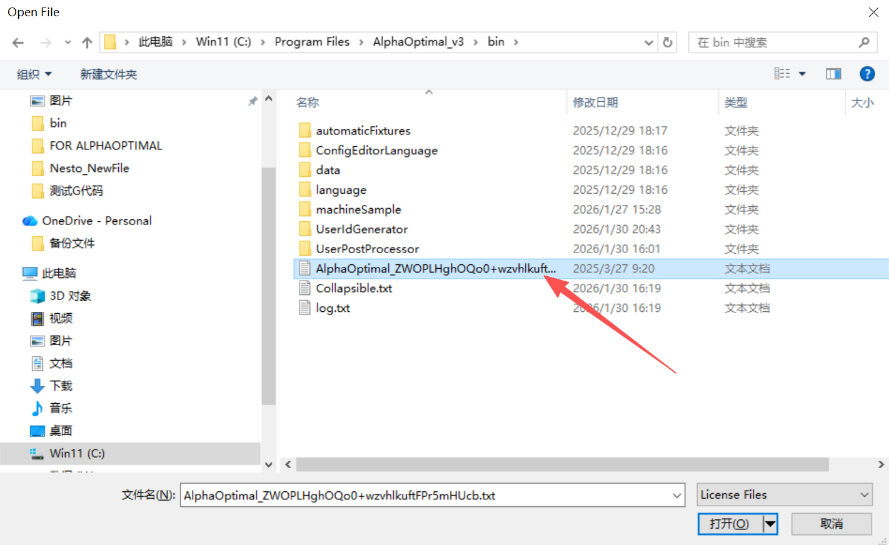
9. **Complete the authorization**

---

## Common Error Handling

### Error 1: Insufficient Windows Permissions

**Symptoms:**
- After selecting the authorization file, the software repeatedly prompts for the file upon reopening.
  - 

**Solution:**
1. Locate the software installation directory (default: `C:\Program Files\AlphaOptimal_v3`) and go one level up.
2. Right-click the `AlphaOptimal_v3` folder.
   - 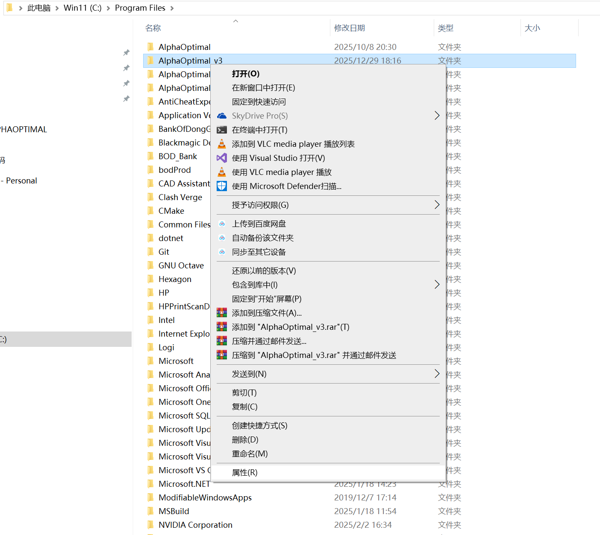
3. Select `Properties -> Security -> Edit`.
   - 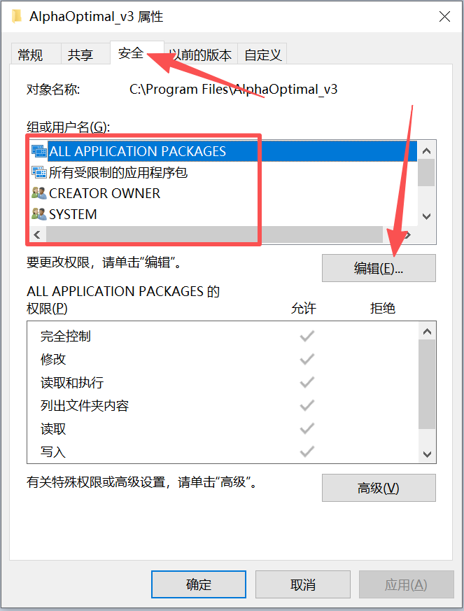
4. Grant "Full Control" to the following options:
   - ALL APPLICATION PACKAGES
   - All Restricted Application Packages
   - CREATOR OWNER
   - SYSTEM
   - Administrators
   - Users
   - TrustedInstaller
5. Click "OK".
   - 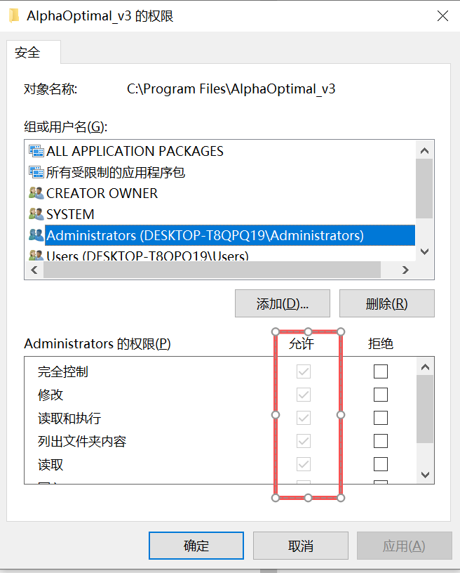
   - 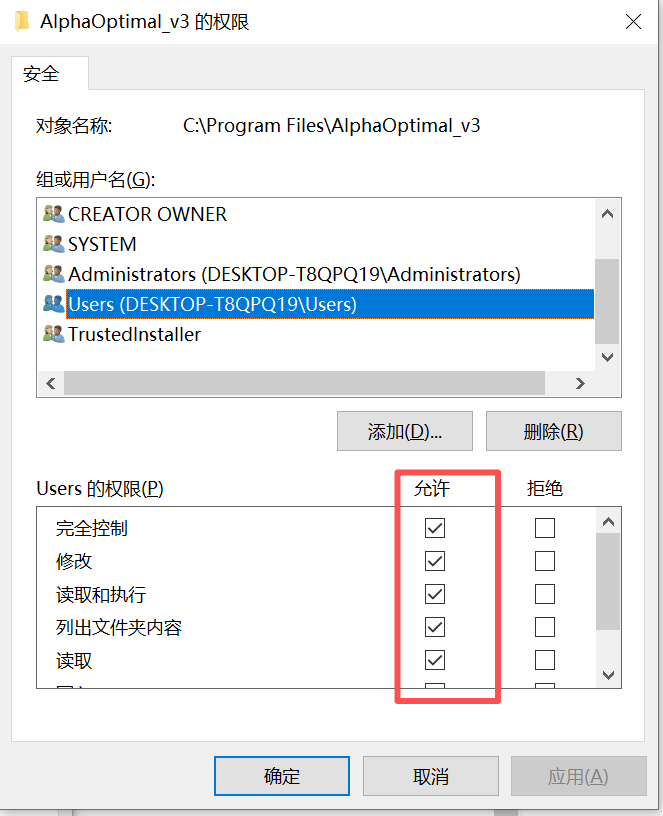
6. Reopen the AlphaOptimal software and select the authorization file. The issue should be resolved.

---

### Error 2: Multiple MAC Addresses on the PC

**Symptoms:**
- The software crashes.
- Check the log file (path: `C:\Program Files\AlphaOptimal_v3\bin\log.txt`), and the last line shows: `hasp not found`.

**Solution:**
1. Retrieve network information:
   - 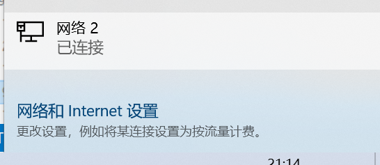
   - 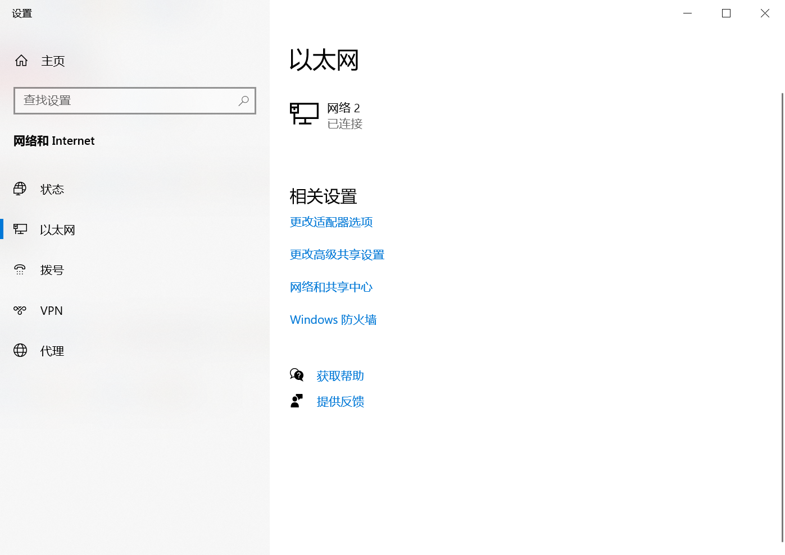
   - 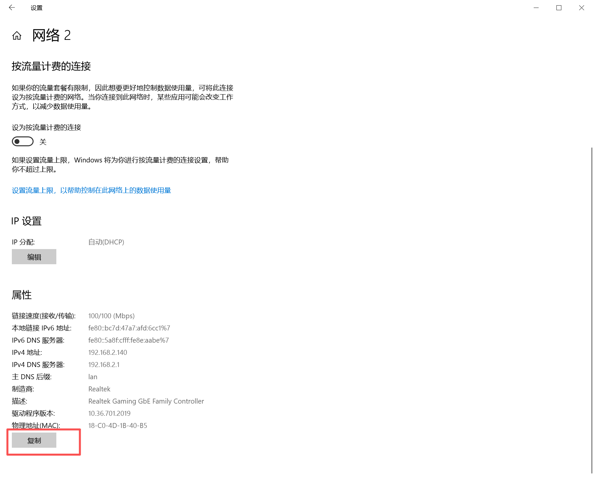
   - 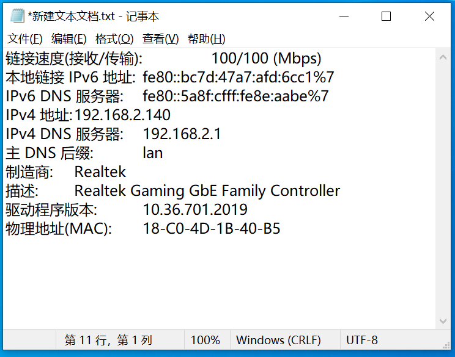
2. Send the retrieved network information to `Ruifan Software Company`.
3. `Ruifan Software Company` will update the `HostName.lic` file with the information.
4. After receiving the updated `HostName.lic` file, copy it to `C:\Program Files\AlphaOptimal_v3\bin` to replace the old file.
5. The software should now open successfully.