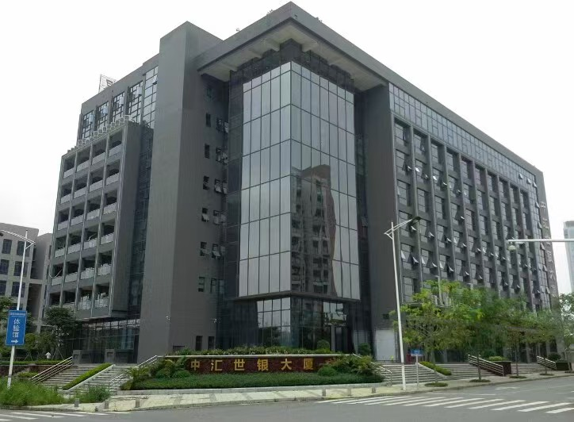
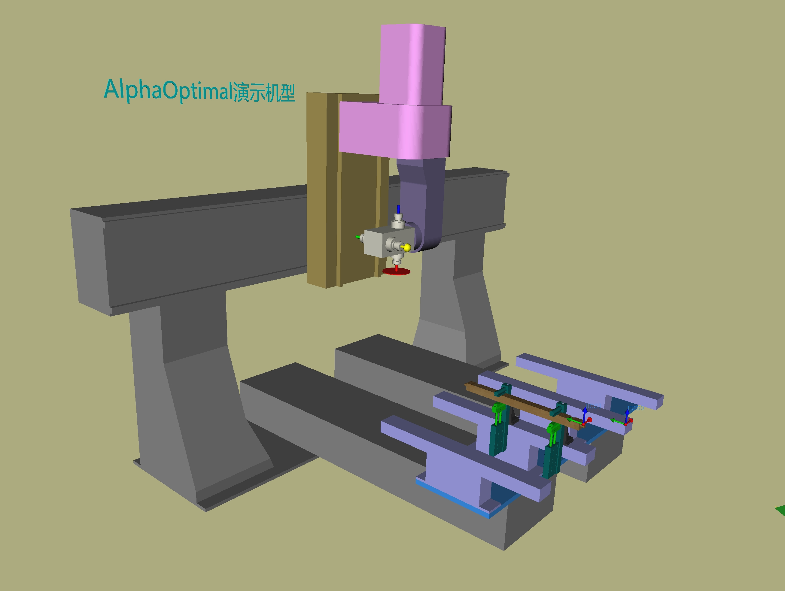

## 关于我们
---

  

    
  

  

  

    瑞凡软件位于东莞市松山湖总部三路。是一家从事多轴仿真优化软件开发、销售的公司。主要业务是销售自研的Alpha Optimal多轴优化仿真软件 和 给客户提供定制化机型的优化仿真软件.
    
    目前公司的主要经营范围在珠三角区域，在俄罗斯也有软件代理商。我们每年大约交付100套软，其中超过90%来自木材加工设备供应商，其它10%来自于复合材料加工设备供应商.    
   
    公司成立之前，主要从事多轴加工设备的应用。多年来在行业里面的实践，对于缺乏专用软件而产生的问题，认识的愈发深刻，遂成立了瑞凡软件公司，期望以多年在行业沉淀的经验和专业的知识，能够给有需求的客户提供高效、易用的专用软件.  
    
    公司高度重视售后服务:无论他是直接客户还是使用了我们软件的客户
   
  

  

---

## 我们的软件

  

    Alpha Optimal多轴仿真优化软件，提供了一个兼容性比较强的平台，也提供了自定义的工具。可以在这里面定义木材加工行业大多数的多轴加工中心机型。避免了因不同机型而要面对多款专用软件的尴尬。大多数的时候，只需要直接使用内置的配置工具，即可创建用户的机床。如果你的机床是高度定制化的，请告诉我们，我们会积极的给你开发一款量身订制的专用软件，让你的机床变得更易用、好用。
  

  

    
  

---

## 我们的宗旨
给客户提供: 好用 易用 稳定 高效 的专用软件

---

## 地址
> 地址:广东省东莞市松山湖园区总部三路20号1栋215室   
> 联系方式: 138 0963 5904
