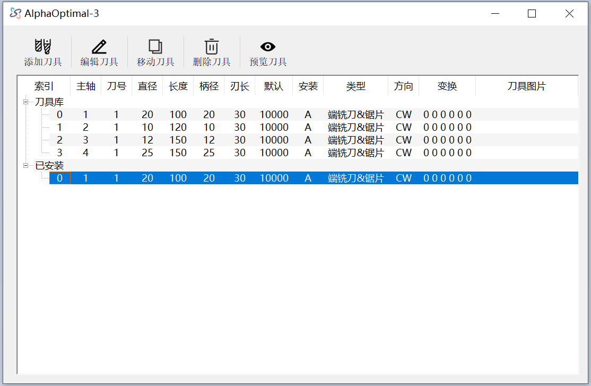
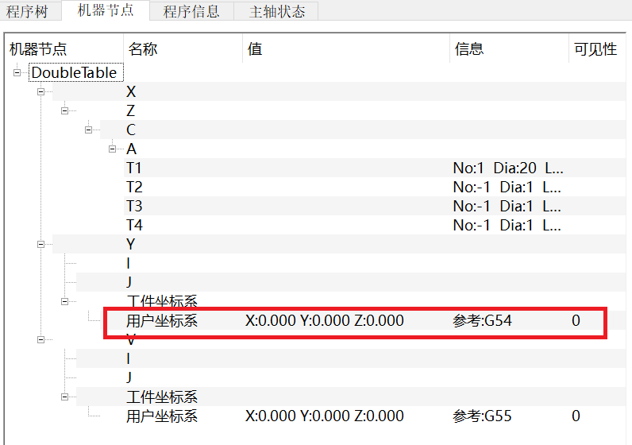
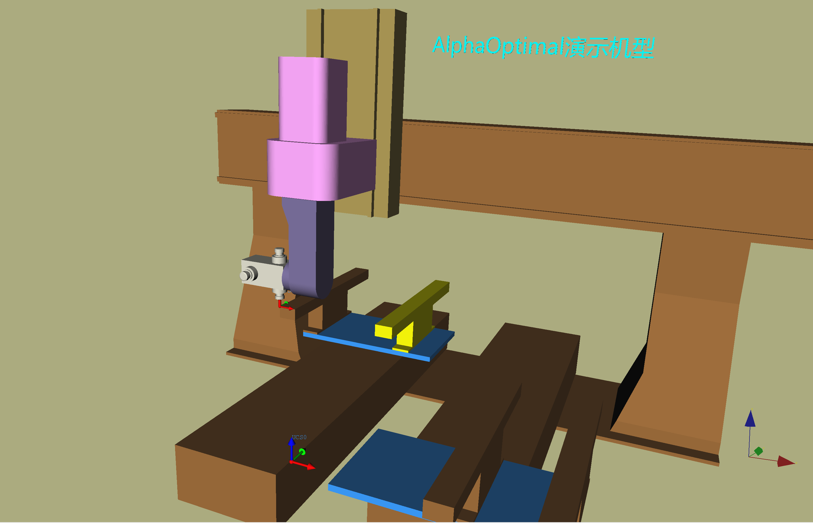
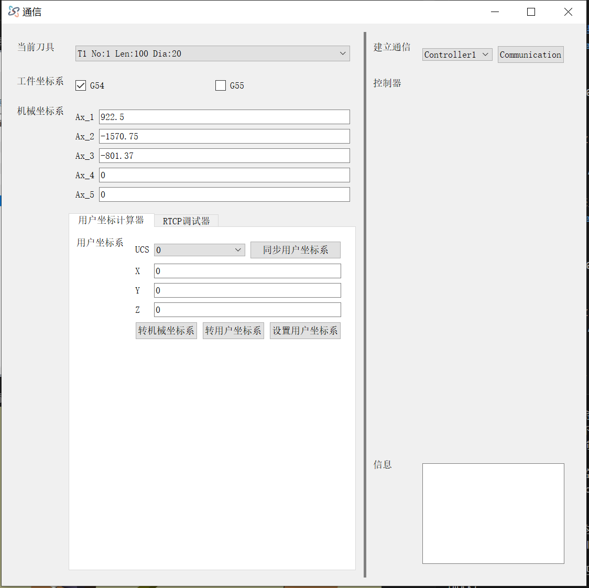

# 校正工件坐标系的原点位置

机型：**五轴加工中心**  
旋转轴：**第4轴:C 第5轴:A**  
工位数：**2**  
- **左工位** → 对应坐标系：G54  
- **右工位** → 对应坐标系：G55  

示例校正的原点：**G54**  
校正前提条件：**机床参数已正确设定**

---

## 操作步骤

1. **正确安装刀具**  
   刀具的所有数据必须完全正确。  
   

2. **确认用户坐标系为默认设置**  
   

3. **移动刀尖到原点位置**  
   在物理机床上将刀尖移动到工件坐标系原点。  
   

4. **点击工具栏 → 通讯**
   
5. **确认工件坐标系:G54 已经勾选**

6. **抄录机械坐标**  
将数控系统上的 **X Y Z C A** 坐标抄录到机械坐标系：`Ax_1 Ax_2 Ax_3 Ax_4 Ax_5`  

7. **同步与转换用户坐标系**: 先点击：**同步用户坐标系**  再点击按钮：**转用户坐标系**   

8. **记录补偿值**  
在用户坐标系中显示的 **X Y Z** 值为现有 **G54** 的补偿值。  
记录这些值并补偿到机床配置文件，然后重启软件    

9. **验证**     
重复步骤1  

---

## 额外说明

- 若要校正 **G54** 的位置，在通讯控件上记得选择 **G55**，并确保抄录的机械坐标与对应坐标系一一对应.