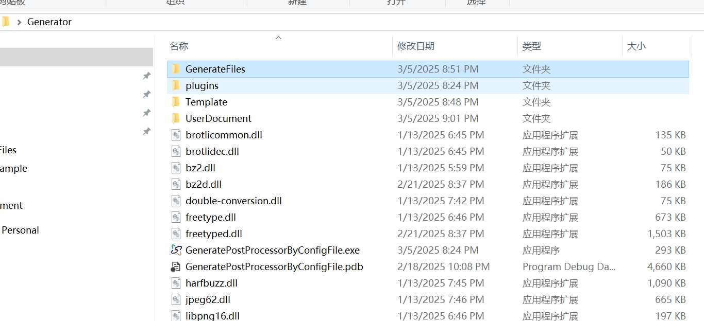
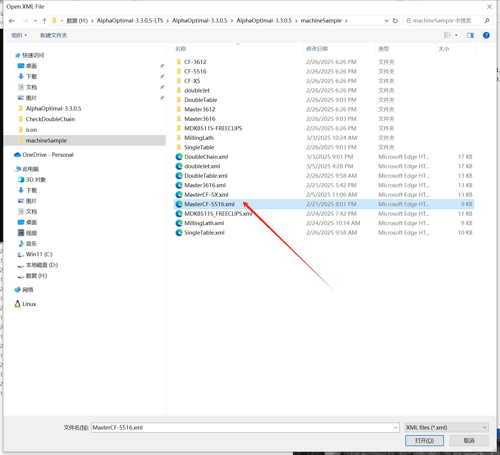
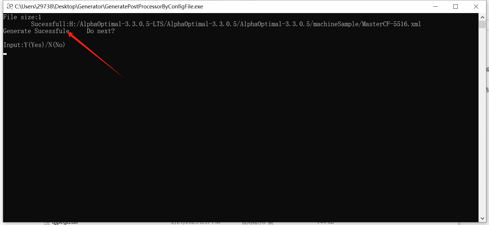
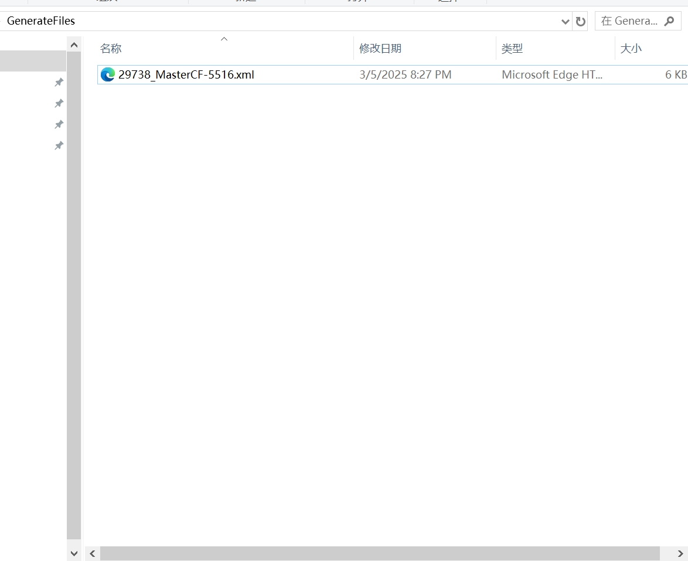

# 从旧版本配置文件提取后处理器设定

本指南介绍如何从 3.3.0.5 或之前版本的配置文件中提取加工模式的设定。

## 操作步骤

1. **启动程序**  
   双击 `GeneratePostProcessorByConfigFile.exe`  
   

2. **选择配置文件**  
   在弹出的选择框中选择旧的机床配置文件  
   

3. **转换提示**  
   等待程序提示 **转换成功**  
   

4. **查找生成的文件**  
   打开 `GenerateFiles` 文件夹，找到生成的后处理文件  
   

5. **编辑后处理器文件**  
   使用记事本打开后处理器文件。  
   根据 **[用户后处理](../userDocument/PostProcessor.md)** 文档中 **详解: Regulation** 的说明，对文件中的标定进行修改。

6. **完成设置**  
   修改完成后，将文件拷贝到 `UserPostProcessor` 文件夹内。

7. **调用后处理器**  
   最后，根据 **[用户后处理](../userDocument/PostProcessor.md)** 文档中的 **调用** 部分调用后处理器。
