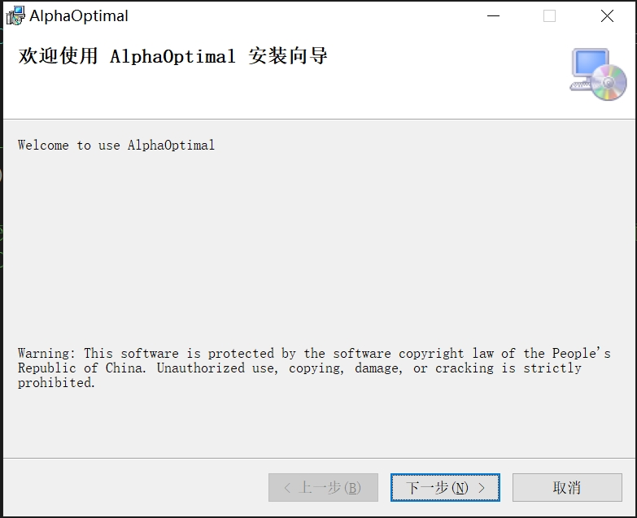
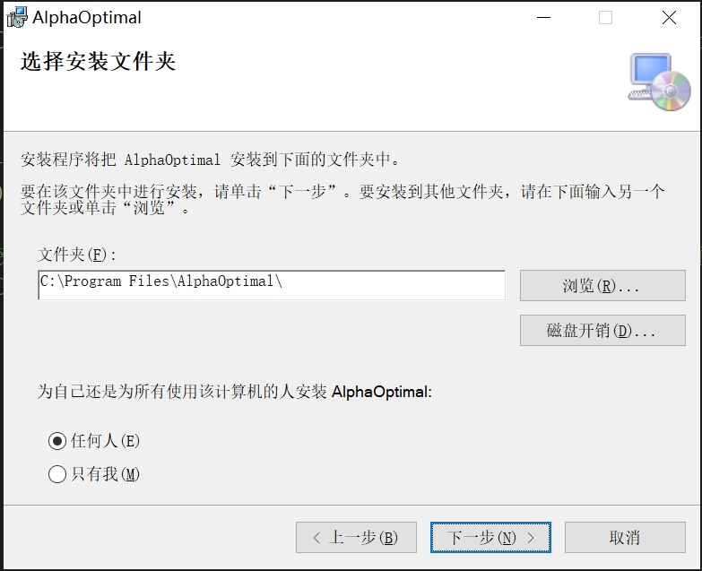
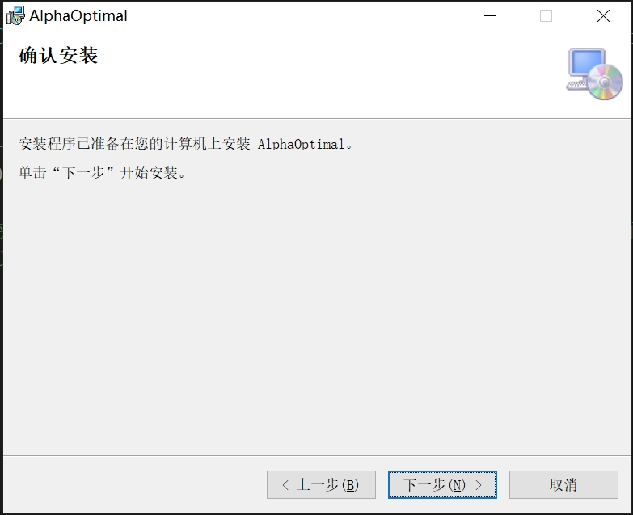
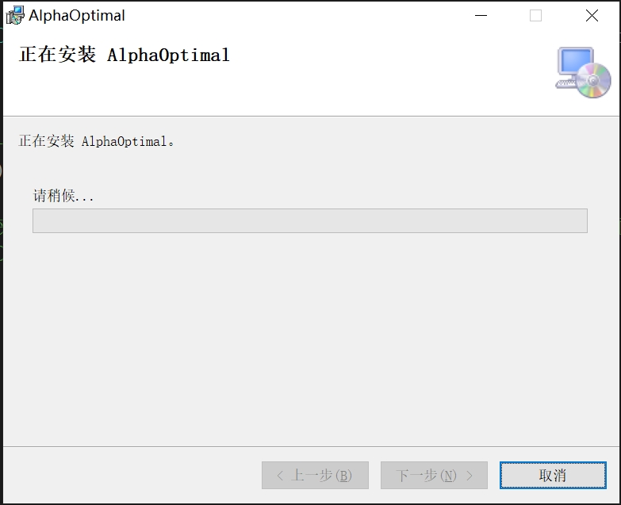
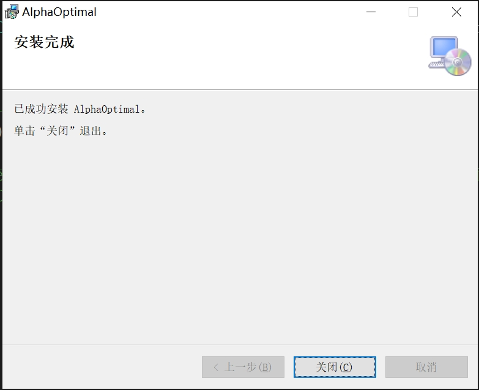
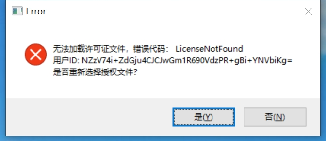
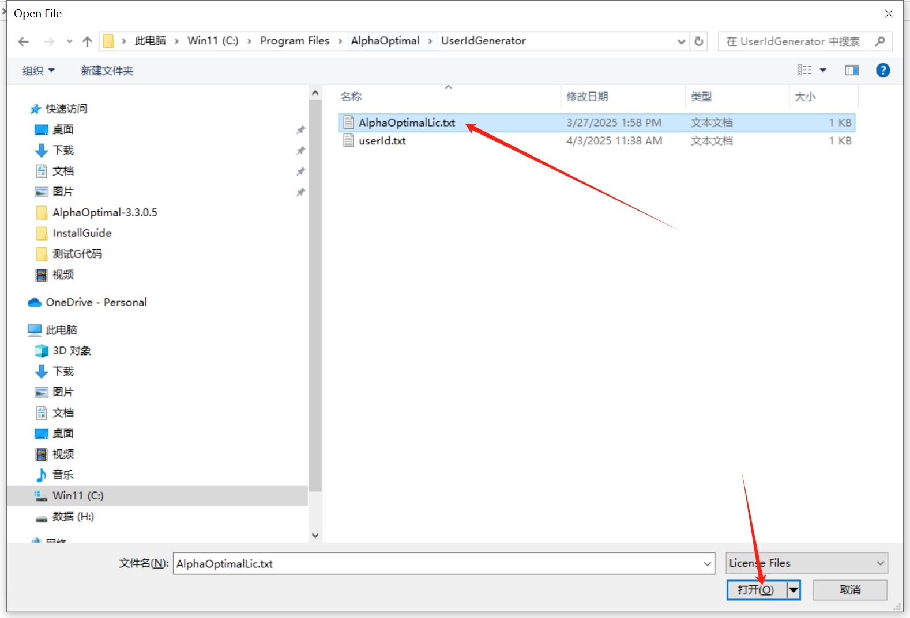

# Alpha Optimal 安装说明

---

## 1. 安装包说明

- 安装包包含两个文件：
  - **AlphaOptimalSetup.msi**
  - **setup.exe**  
    *说明：安装过程中，setup.exe提供必要的辅助资料，这两份文件必须放在同一目录下。*

---

## 2. 安装步骤

   1. **第一步**  
      
   2. **第二步**  
      
   3. **第三步**  
      
   4. **第四步**  
      
   5. **第五步**  
      

---

## 3. 注册 PC

> 注册说明：首次安装时需要注册。注册完成后，保留授权文件 **AlphaOptimalLic.txt**，对已注册的 PC 是永久有效的。

   1. **启动软件**  
      启动 *AlphaOptimal* 后可能出现错误提示：  
      
   2. **定位安装目录**  
      默认安装路径：`C:\Program Files\AlphaOptimal`（如已自定义请打开对应目录）
   3. **生成用户标识**  
      在安装目录下找到文件夹 **UserIdGenerator**（默认路径：`C:\Program Files\AlphaOptimal\UserIdGenerator`），双击运行 `UserIdGenerator.exe`，将自动生成文件 **userId.txt**
   4. **发送验证文件**  
      将生成的 **userId.txt** 文件发送给授权方
   5. **获取授权文件**  
      授权方根据 **userId.txt** 生成授权文件 **AlphaOptimalLic.txt**
   6. **保存并应用授权文件**  
      收到 **AlphaOptimalLic.txt** 后，请保存于本地，然后重新启动 *AlphaOptimal*  
      - 再次出现错误提示：  
        
      - 点击“是”，选择授权文件 **AlphaOptimalLic.txt**  
        
   7. **完成注册**  
      注册成功，软件即可正常使用

---

## 4. 配置文件移植
   - **1. 从之前版本移植的方法**   
     - 导出: 菜单:关于->一键打包。软件会把相关的资料全部复制到指定路径下
     - 导入: 手动把导出路径下的文件一一拷贝到软件安装路径下对应的路径
         - data.ini toollib.json这两个文件直接拷贝到安装路径下
         - 夹具相关拷贝到：automaticFixtures文件夹
         - 机床配置相关拷贝到:machineSample文件夹
         - 后处理器相关拷贝到:UserPostProcessor文件夹

   - **2. 从当前版本移植的方法**   
       - 导出: 菜单:关于->一键打包。软件会把相关的资料全部复制到指定路径下
       - 导入: 菜单:关于->导入反馈。软件会把指定路径下的文件全部复制到安装路径

## 5. 常见错误及解决方案

- **提示找不到 *.dll 文件**  
  解决方案：系统缺少组件，请安装 `VC_redist.x64.exe`  
  *说明：此文件可直接从微软官网下载，或向授权方索取。*
  

- **软件闪退（带加密狗）**  
  解决方案：检查加密狗尾部指示灯是否常亮；若不常亮，则需要安装加密狗驱动。

- [点击跳转到下载页面](../download_update.md)