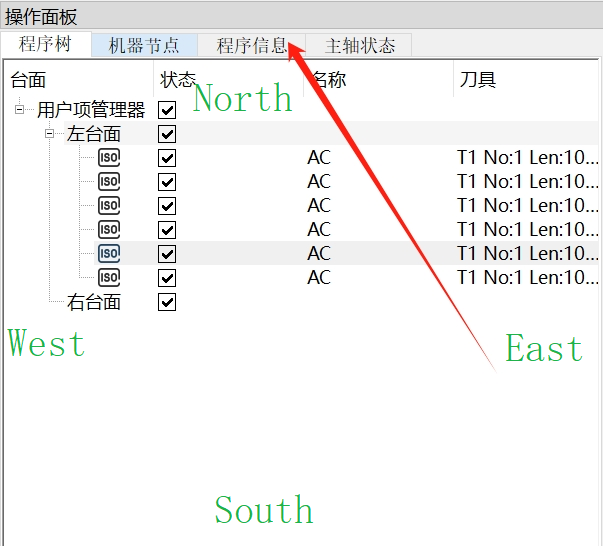
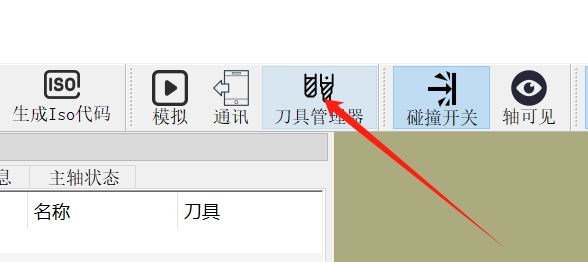
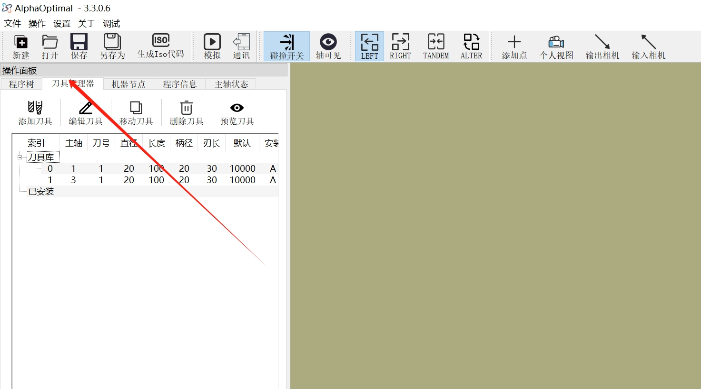
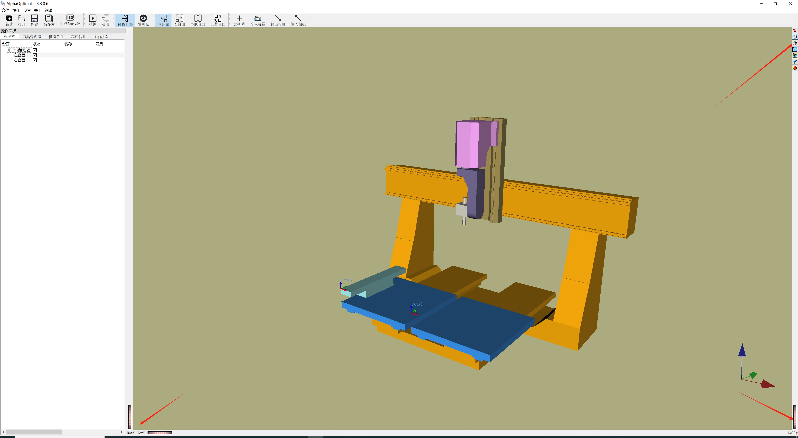

# data.ini 文件详解

> **文件路径**：软件安装目录下  
> **作用**：定义软件的默认操作参数

---

## 文件内容示例

```ini
[StatusPreProcessing]
PreLaunchTime=10.0
IsPreLaunch=true
PostProcessor=UserPostProcessor/Post_Processor.xml
TrajAlgorithem=0
TrajAlgorithemOptimal=3
ToleranceBlend=2.0
ToleranceBlendOptimal=100.0
CollisionObject=0.99

[MainInterface]
BackGroundColor=0.67 0.67 0.50
TabPosition=North
DockWidgetArea=0x1
IsDockWidgetFloatting=false
Language=Chinese
DefaultPath=E:/AlphaOptimal_Files
IsNewToolDialog=true
IsShow3DViewerDecoration=false

[UserData]
TemplatePath=

[Config]
UsedConfig=machineSample/Machine_Sample.xml

[MotionNode]
StopWhenTheSpindleStatusChanges=false
IsRepeatNodesEnable=false
AxisNodeRepeatTransformations=1000 0 0
AxisNodeRepeatCount=1 1 1 1
AxisNodeRepeatNames=X Z C A

[DebugFunction]
IsAllowReadIsoCode=false
IsShowAxisInfo=false
```

---

## 配置项说明

### [StatusPreProcessing]  
| 参数                | 说明                           |
|---------------------|--------------------------------|
| PreLaunchTime       | 主轴预启动时间（单位：秒）      |
| IsPreLaunch         | 是否开启主轴预启动（true/false）|
| PostProcessor       | 后处理器路径                   |
| IsAdaptiveEnabled   | 是否启用自适应（true/false）   |
| AdaptiveThreshold   | 自适应阈值                     |

---

### [MainInterface]  
| 参数                    | 说明                                   |
|-------------------------|----------------------------------------|
| BackGroundColor         | 3D视口背景色（R G B）                  |
| TabPosition             | 标签页位置（North/South/West/East）    |
| DockWidgetArea          | 停靠窗口区域（默认0x1）                |
| IsDockWidgetFloatting   | 停靠窗口是否浮动（默认false）         |
| Language                | 界面语言（Chinese/English/Russia）     |
| DefaultPath             | 默认打开路径                           |
| IsNewToolDialog         | 是否启用新刀具对话框（true/false）     |
| IsShow3DViewerDecoration| 是否显示3D视图装饰（true/false）       |

- **TabPosition** 取值示意：  
  

- **IsNewToolDialog**  
    - true：  
    - false：

- **IsShow3DViewerDecoration**  
    - true：有侧边栏按钮  
    - false：隐藏侧边栏按钮  
    - 

---

### [Config]  
| 参数        | 说明                 |
|-------------|----------------------|
| UsedConfig  | 当前使用的配置文件路径|

---

### [MotionNode]  
| 参数                          | 说明                       |
|-------------------------------|----------------------------|
| StopWhenTheSpindleStatusChanges| 主轴状态变化时是否停止     |
| IsRepeatNodesEnable           | 是否启用节点重复           |
| AxisNodeRepeatTransformations | 重复变换参数               |
| AxisNodeRepeatCount           | 重复次数                   |
| AxisNodeRepeatNames           | 轴名称                     |

---

### [DebugFunction]  
| 参数              | 说明                 |
|-------------------|----------------------|
| IsAllowReadIsoCode| 是否允许读取ISO代码  |
| IsShowAxisInfo    | 是否显示轴信息       |

---

> **提示**：大部分参数可在软件内通过“设置”界面修改，无需手动编辑 data.ini 文件。