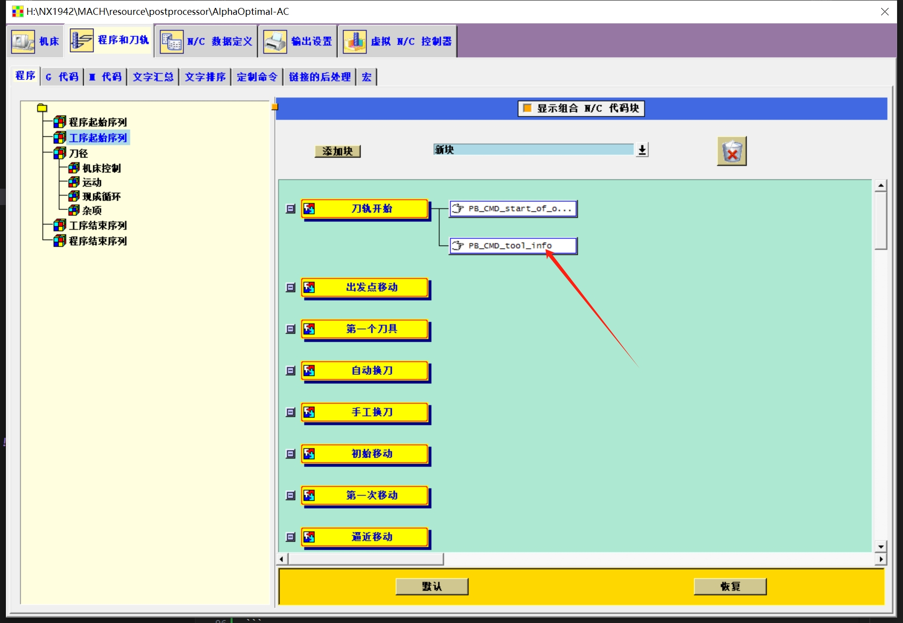
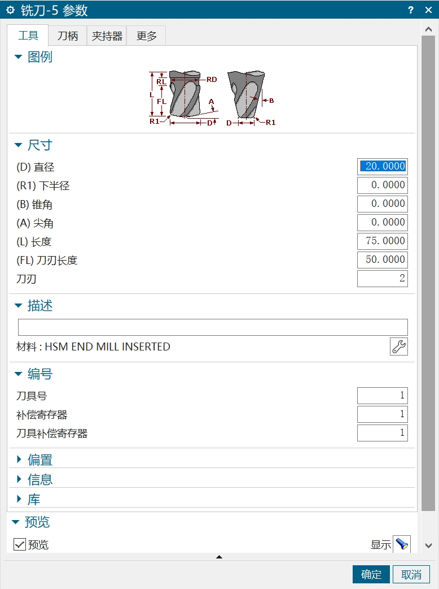

# Iso代码格式要求

>  警告:配套的后处理 **不要输出循环,应当全部输出点坐标**

### 名词解释:
- 程序段:是指在CAM编程时,针对每一个特征进行加工的程序
    - 例：执行一个钻孔加工,这一个钻孔加工的G代码称之为一个程序段
    - 例: 执行一个多轴轮廓加工，这个轮廓加工的称之为一个程序段
- 刀具信息:
    - 是指在每一个程序段的第一行,包含了AlphaOptimal自动匹配刀具所需的信息
- 程序段分隔符:
    - 这个是AlphaOptimal对程序段进行分割的标识符

### 标识的设定
1. 程序段分割符:`;SECTION`
2. 刀具信息标识:`SpindleNo=2 ToolNumber=1 TD=20.0`  
   1. 刀具信息匹配标识必须在程序段的**第一行**  
   2. 匹配优先顺序:**直径->主轴号->刀具号.逐层匹配.当无法匹配时,会返回刀具列表的第一个**    
   3. **特殊刀具不能被匹配**，必须手动选择.譬如:链锯    


### NX后处理器输出刀具匹配标识命令
   - **工序起始序列->刀轨开始->添加:定制命令**     
      

```        
    # 申明全局变量
    global mom_tool_diameter #刀具直径
    global mom_tool_type    #刀具类型
    global mom_tool_name    #刀具名称
    global mom_tool_number    # 刀具号 这里用它来描述对应的主轴号
    global mom_tool_adjust_register    #刀具寄存器 用它来描述对应机床的刀具号

    # 格式化刀具号 当作主轴号使用
    set spindle_number [format "SpindleNo=%.0f" $mom_tool_number]

    # 格式化补偿寄存器号 当作刀具号使用
    set tool_number [format "ToolNumber=%.0f" $mom_tool_adjust_register]

    # 格式化刀具直径
    set tool_diameter [format "TD=%.1f" $mom_tool_diameter]

    # 使用正则表达式判断 mom_tool_type 的值
    if { [regexp {Ball Mill} $mom_tool_type] } {
        set tool_type "Type=BallMill"
    } elseif { [regexp {Milling} $mom_tool_type] } {
        set tool_type "Type=EndMill"
    } elseif { [regexp {Drilling Tool} $mom_tool_type] } {
        set tool_type "Type=Drill"
    } else {
        set tool_type [format "Type=%s" $mom_tool_type]
    }

    # 格式化刀具名称
    set tool_name [format "ToolName=%s" $mom_tool_name]

    # 拼接字符串
    set tool_info [format "%s %s %s %s %s" $spindle_number $tool_number $tool_diameter $tool_type $tool_name]

    # 输出到NC代码
    MOM_output_literal "($tool_info)"


``` 


### NX CAM里面刀具设定
- **刀具号**:会被当做主轴号输出   
- **补偿寄存器**:会被当做刀具号输出       

    


### 整体段落格式
- 导入的G代码:</p>
    - **说明**: 这个程序组包含了一系列程序段，每个段之间以`;SECTION`分隔。这些程序段执行不同的任务，如下：
        ```
            程序段1
            ;SECTION
            程序段2
            ;SECTION
            程序段3
            ;SECTION
            ……
            程序段N
        ```
- **注意**:末尾不要添加`;SECTION`分隔符


### 第二行解释
```
    G代码1:G00 G90 X-15.5 Y76.88 Z60. C0.0 A0.0
    G代码2:G01 G90 X-15.5 Y76.88 Z60. C0.0 A0.0 F100000

    在G代码这里必须包含2组信息：

        1. 五个轴的位置:X Y Z C A 都必须包含.假如不包含,则默认为0.0

        2. 必须有关于速度的指令.G0 或者G1 ..... F100000。否则软件默认执行速度为F250

```

### 轴坐标格式:

|值|X1.0|X-0.5|X-.5|X.5|
|---|---|---|---|---|
|合格|&#x2705;|&#x2705;|&#x2705;|&#x2705;|

### 示例:
```
(SpindleNo=2 ToolNumber=1 TD=10.0 ....)  //刀具信息
G01 G90 X-15.5 Y76.88 Z60. C0.0 A0.0 F100000
N0020 Z53.
N0030 G01 X-16.11 Y75.35 Z52.91 F4250.
N0040 X-17.23 Y73.66 Z52.81
………………
N1500 Z31.
N1510 G00 Z60.
;SECTION    //标识


(SpindleNo=2 ToolNumber=1 TD=10.0 ....)  //刀具信息
N0010 G00 G90 X-15.5 Y76.88 Z60. C0.0 A0.0
N0020 Z53.
N0030 G01 X-16.11 Y75.35 Z52.91 F4250.
N0040 X-17.23 Y73.66 Z52.81
………………
N1500 Z31.
N1510 G00 Z60.
;SECTION    //标识


(SpindleNo=2 ToolNumber=1 TD=10.0 ....)  //刀具信息
N0010 G00 G90 X-15.5 Y76.88 Z60. C0.0 A0.0
N0020 Z53.
N0030 G01 X-16.11 Y75.35 Z52.91 F4250.
N0040 X-17.23 Y73.66 Z52.81
………………
N1500 Z31.
N1510 G00 Z60.

```


**最终输出样式**    
```
    (SpindleNo=2 ToolNumber=1 TD=20.0 Type=BallMill ToolName=D20R10)
    N0020 G00 X-10.000 Y213.000 Z213.000 C.000 A-90.000
    N0030 Y203.000
    N0040 G01 G90 Y200.000 F4250.
    N0050 Z210.000
    N0060 Z-10.000
    N0070 X5.000
    N0080 Z210.000
    N0090 X20.000
    N0100 Z-10.000
    N0110 X35.000
    N0120 Z210.000
    …………


```