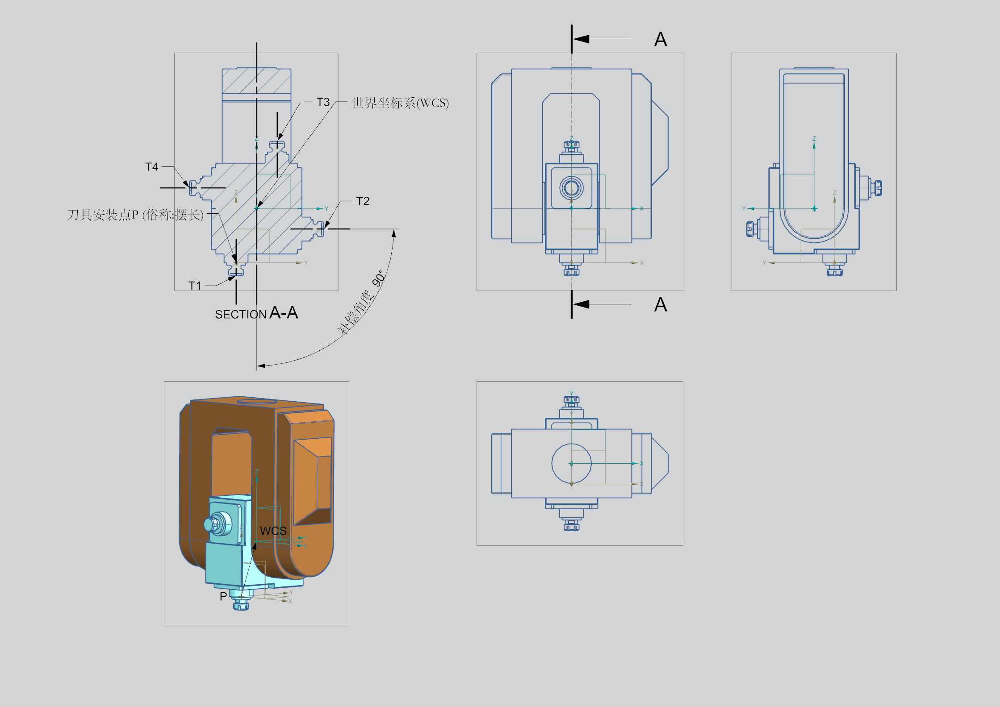

# 图示参数

> 此章节主要是针对现有的机型的参数进行图示讲解，过程中可能有部分描述为了更通俗易懂，将不会严格的采用数学上的严格定义来讲解，以解决面对的问题为主。不足之处，敬请谅解。

---
## 世界坐标系的位置
> 

---

## TCP是什么    
---
> 为实现通俗易懂的解释,在这里将其它不涉及的参数做理想化处理,不做考虑
**解释:**   

TCP(Tool Center Point),也叫RTCP(Rotation Tool Center Point).是五轴联动加工中的核心技术.`专门用于处理旋转轴的动态补偿.其核心原理是通过数控系统实时计算旋转轴运动对TCP位置的影响，并自动调整其他线性轴的位移，从而保持刀具中心点相对于工件的正确位置`.对RTCP的计算是复杂的，涉及到各种参数的补偿。在这里,我们对它进行理想化，一遍更通俗易懂的来讲解它的值的测定   

**组成数据**    
TCP或RTCP，它的数据由两部分组成:刀具安装点P和刀具长度
---

## 什么是刀具安装点

## 