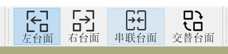

# 自定义后处理器

## 1. 作用
后处理器是一套 **规则**，用于处理输入的加工数据。经过预先定义的计算和格式化，生成机床可读取和执行的代码。

## 2. 存放路径
安装目录下的 **UserPostProcessor** 文件夹用于存放所有用户自定义的后处理器。

## 3. 调用步骤
- 将定义好的后处理器文件拷贝至 **UserPostProcessor** 文件夹。
- 打开安装路径下的 `data.ini` 文件。
- 找到节 **[StatusPreProcessing]**。
- 找到键值对 `PostProcessor=UserPostProcessor/AlphaPostProcessor.xml`，将 **AlphaPostProcessor** 替换为实际需要使用的后处理器文件名称（注意保留文件后缀 `.xml`）。

## 4. 通用性说明
仅当机床的 **结构** 和 **控制器** 发生变化时，才需要重新编写后处理器。

## 5. 文件结构
- **root**  
  - `version`：后处理器版本号（保留，不做修改）
  - `Regulation`：处理方式定义
  - `PrePostActions`：多运动链协同加工的机型专用（保留，不做修改）
  - `Configulation`：加工模式规划

## 6. 需要修改的部分
- **Regulation**
- **Configulation**


## 7. 详解：Regulation

- **Rapid**  
  开启高速高精功能  
  - Osai系统：`G500/G510`  
  - 新代系统：`G160`  
  *具体参数请咨询数控系统供应商*

- **Linear**  
  关闭高速高精功能  
  - Osai系统：`G600/G610`  
  - 新代系统：`G162`  
  *具体参数请咨询数控系统供应商*

- **OutputDir**  
  Iso代码的输出路径

- **Prepend**  
  软件默认使用 `G1` 执行机械坐标，格式为：  
  ```
  G1 X Y Z C A F1000
  ```  
  部分数控系统（如维宏数控系统）要求在每个 `G1` 前添加额外指令，例如：  
  ```
  G53 G1 X Y Z C A F1000
  ```  
  示例设置：  
  ```
  Prepend = "G53"
  ```  
  这样生成的 Iso 代码将在每个 `G1` 前自动插入 `G53`。

- **AccelerationScheme**  
  定义加减速方案，取值范围 `[0,1]`：  
  - `0`：表示时间编程（仅适用于 Osai 系统），生成代码示例：  
    ```
    G1 X Y Z C A t0.002
    ```
  - `1`：表示 F 编程（适用于所有数控系统），生成代码示例：  
    ```
    G1 X Y Z C A F1000
    ```  
  **设定建议：**  
  - 仅使用 Osai 系统的设备建议选 `0`
  - 若涉及多种数控系统，建议选 `1`

- **UserHeaderTail**  
  特殊设定，一般无需修改

- **MultiChain**  
  特殊设定，一般无需修改

---

- **EntrySequence:设定进刀顺序**  

```

    设置示例1： EntrySequence="1->2->4->5;3"   

    
        零位:G1 X-1500 Y0 Z0 C0 A0 F100000  
        起始位置:G1 X100 Y-1300 Z-500 C-50 A53.3 F100000  

        最终处理结果如下:   
        G1 X-1500 Y0 Z0 C0 A0 F100000  
        G1 X100 Y-1300 C-50 A53.3 F100000  
        G1 Z-500  F100000  

    
    设置示例2： EntrySequence=""

        零位:G1 X-1500 Y0 Z0 C0 A0 F100000  
        起始位置:G1 X100 Y-1300 Z-500 C-50 A53.3 F100000  

        最终处理结果如下:  
        G1 X-1500 Y0 Z0 C0 A0 F100000  
        G1 X100 Y-1300 Z-500 C-50 A53.3 F100000  
```

  **建议设定**  
  EntrySequence="1->2->4->5;3"  

---

- **ExitSequence:设定退刀顺序**  

```
    设置示例1: ExitSequence="3;1->2->4->5"  

      结束位置:G1 X100 Y-1300 Z-500 C-50 A53.3 F100000  
      零位:G1 X-1500 Y0 Z0 C0 A0 F100000  
      最终处理结果如下: 
      G1 X100 Y-1300 Z-500 C-50 A53.3 F100000   
      G1 Z0 F100000   
      G1 X-1500 Y0 C0 A0 F100000    


    设置示例2: ExitSequence=""  

      结束位置:G1 X100 Y-1300 Z-500 C-50 A53.3 F100000    
      零位:G1 X-1500 Y0 Z0 C0 A0 F100000    
      最终处理结果如下:   
      G1 X100 Y-1300 Z-500 C-50 A53.3 F100000   
      G1 X-1500 Y0 C0 A0 F100000  
```
  **建议设定**  
  ExitSequence="3;1->2->4->5"


## 8. 详解：Configulation

每个 **Configulation** 对应机床的一种加工模式。以常见的双Y台面为例，常有以下加工模式：  
1. 左台面  
2. 右台面  
3. 串联台面（合并左右台面为一台使用）  
4. 交替台面（左台面与右台面交替加工）

**属性说明：**
- **Name**：加工模式名称  
  - 左台面：`L`  
  - 右台面：`R`  
  - 串联台面：`T`  
  - 交替台面：`M`

- **NickName**：显示名称，与图标共同构成软件图标显示

- **Image**：显示图标，需存放于 **UserPostProcessor** 文件夹  
  

- **Prefix**：输出 Iso 代码文件的前缀

- **Suffix**：生成文件的后缀  
  示例：  
  假设保存名为 `alphaTest.alpha`，可设置：  
  - Prefix: `"L_"`  
  - Suffix: `".nc"`  
  最终生成文件为：`L_alphaTest.nc`
---
**节点说明：**
- `<Item>`：表示一行用户指令
- `<Coordinate>`：配置与工件坐标系对应的坐标名称

### 示例：左台面加工模式定义
```
<Configulation Name="L" NickName="左台面" Prefix="" Suffix=".nc" Image="left.png">
    <Item>(UDA)</Item>
    <Item>h0</Item>
    <Item>G79 Z0</Item>
    <Item>G79 X0 Y0 V0 C0 A0</Item>
    <Item>;Vacuum Off G54</Item>
    <Item>;Vacuum Off G55</Item>
    <Item>START</Item>
    <Item>;Vacuum On G54</Item>
    <Coordinate>G54</Coordinate>
    <Item>;Vacuum Off G54</Item>
    <Item>(GOTO,START)</Item>
</Configulation>
```

**最终生成的 Iso 代码示例：**
```
(UDA)
h0
G79 Z0
G79 X0 Y0 V0 C0 A0
;Vacuum Off G54
;Vacuum Off G55
START
;Vacuum On G54

;（此处为软件生成的加工动作）
...
...

;Vacuum Off G54
(GOTO,START)
```

**备注：**  
如果已有旧版本的配置文件，您可以直接点击：[提取运动模式](./ExtractByConfig.md) 来提取生成加工模式。