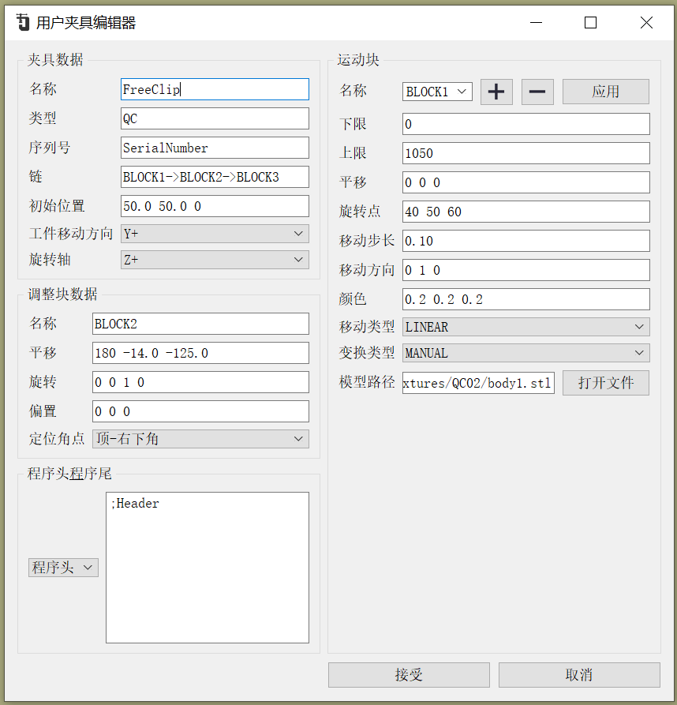
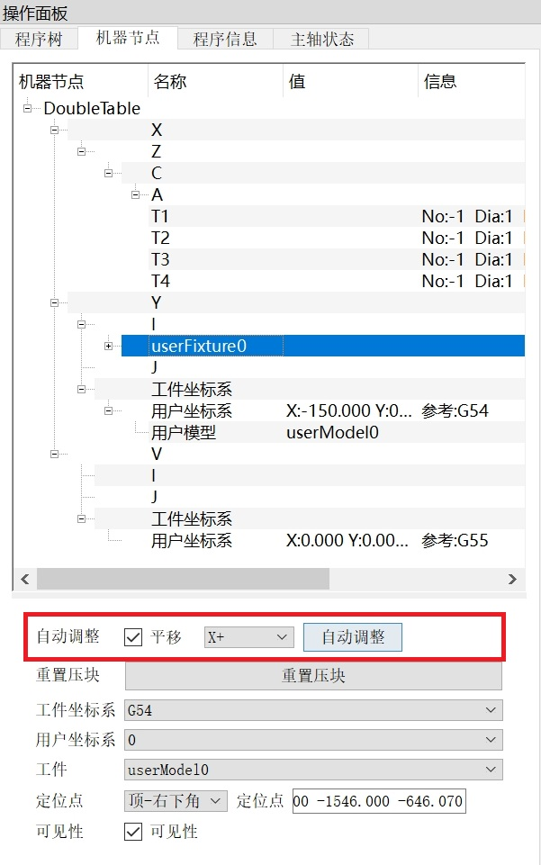
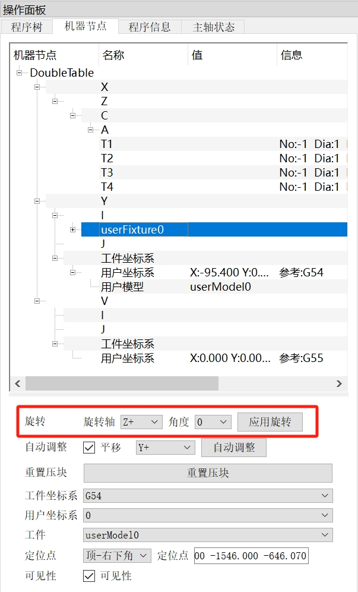
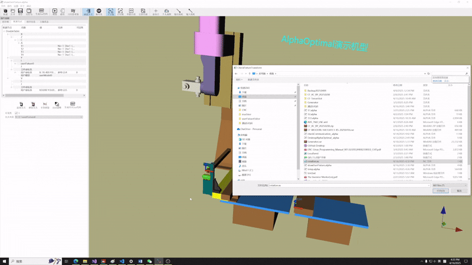
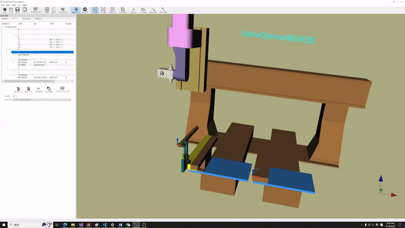

# 用户自定义夹具编辑器

## 参数解释:
- **夹具数据**
  - 名称:夹具名称
  - 类型:夹具类型
  - 序列号:夹具序列号
  - 链:定义夹具**块 与 块 之间的运动关系**
  - 初始位置:夹具的初始平移
  - 工件移动方向->可选方向:[X+ X- Y+ Y- Z+ Z- User_Defined None]
    - 设置为None
      - 默认不移动工件
      - 自动调整选项会被`隐藏`  
        
    - 设置为其它:
      - 跳转到示例: [用户夹具](User_Fixture_Example_1.md)
  - 旋转轴->可选择[X+ Y+ Z+ None]
    - 设置为：None
      - 默认夹具不能被旋转
      - 旋转选项会被`隐藏`  
           
    - 设置为:[X+ Y+ Z+]
      - 旋转选项显示,允许夹具旋转
      - 默认旋转轴:[X+ Y+ Z+]
      - 默认角度:0
      - 旋转角度设置为:0度  
        
      - 旋转角度设置为:90度
        