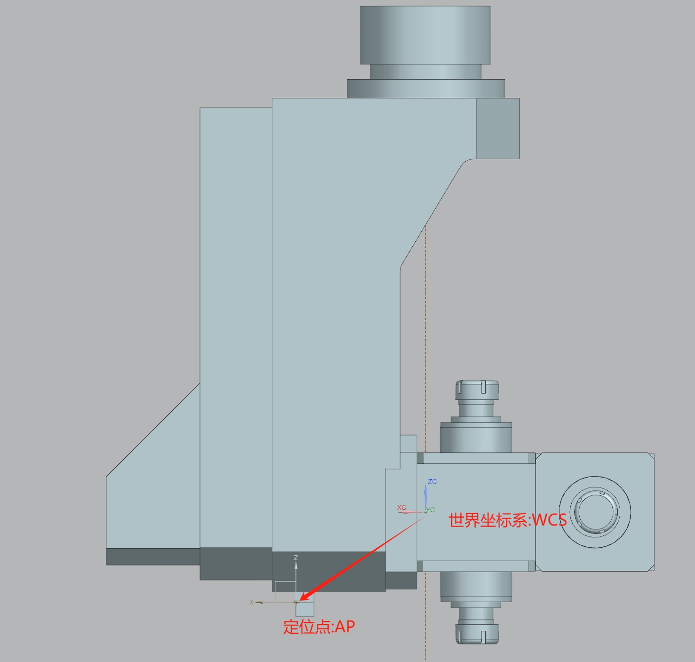
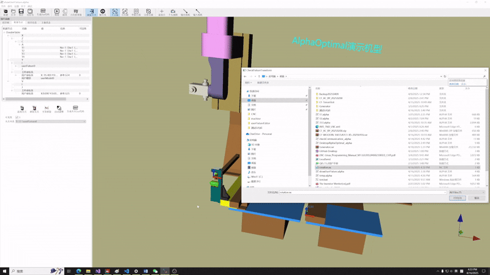
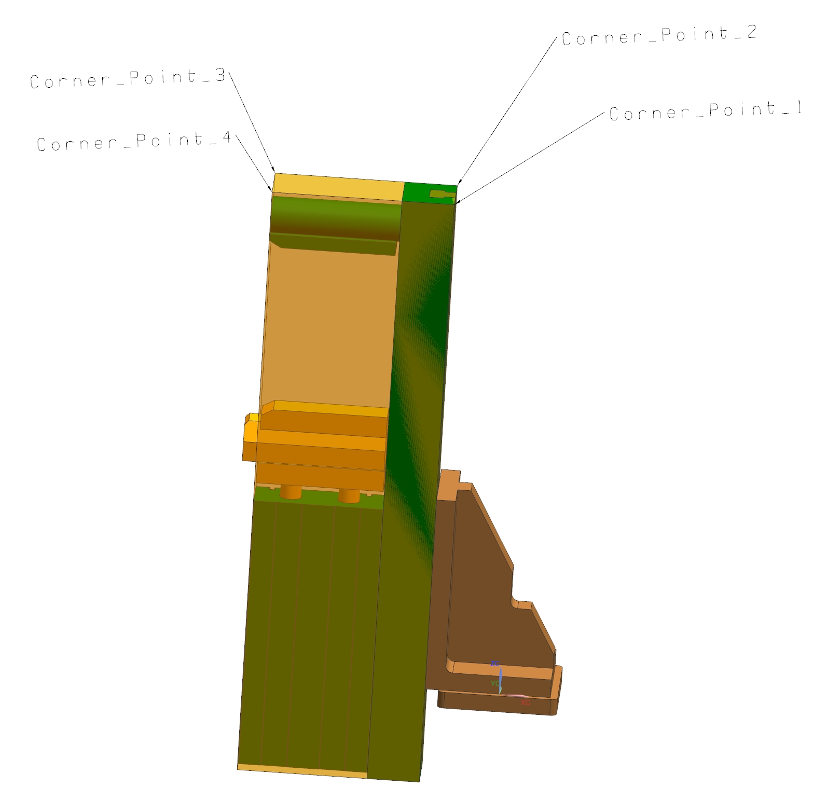

# 用户自定义夹具编辑器

## 参数解释:
- **调整块数据**
  - 名称:用于配合定位夹具的块名称.这个块必须存在(在右侧已经定义并且设置在运动链)
  - 平移:指从世界坐标系WCS到调整块定位点(Anchor Point.简称:AP)的位移  
    
  - 旋转:0 0 1 0
    - 旋转轴: 前三个值: 0 0 1表示的是一个旋转轴.这里0 0 0表示的是Z+.假如要设置为X+:1 0 0
    - 旋转角度:最后一个值`旋转角度`，表示在定位用户夹具的时候,符合旋转轴定义的轴要旋转一个指定的角度(通常是第4轴:C轴)
    - 示例1：设定为 0 0 1 0
      
    - 示例2: 设定为 0 0 1 90
      
  - 偏置:以定位点为基准 在定位夹具的时候X Y Z轴的移动增量
  - 定位角点:对调整块做一个包容体.选定包容体顶面的四个角点之一,移动机床，使定位点AP与指定的角点重合，以达到对夹具定位的功能。
    
  - 程序头&程序尾:定义执行夹具定位动作的前置&后置动作
