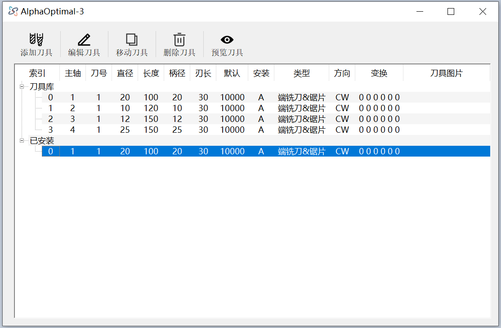
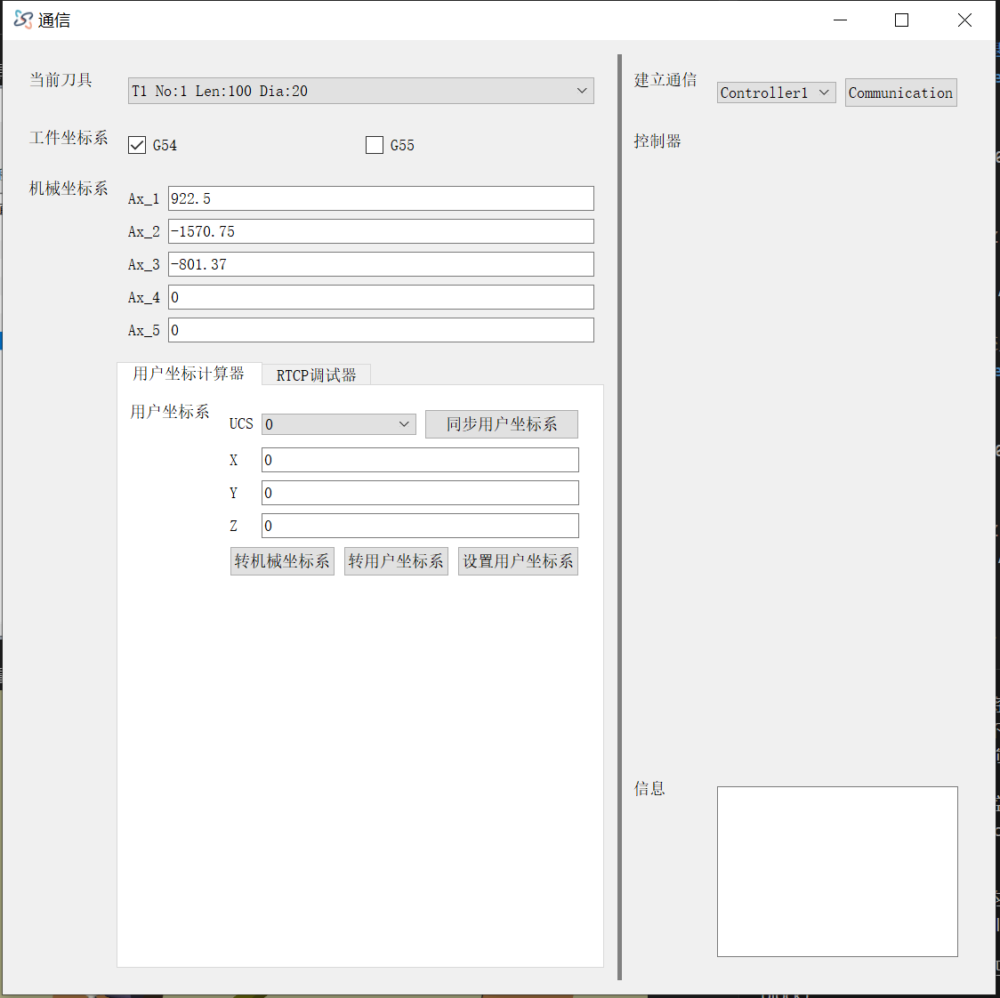

# 获取用户坐标系的值

机型：**五轴加工中心**  
旋转轴：**第4轴: C  第5轴: A**  
工位数：**2**  
- **左工位** → 对应坐标系：G54  
- **右工位** → 对应坐标系：G55  

示例获取的用户坐标系：**G54 -> 0**  
校正前提条件：**机床参数已正确设定**

---

## 操作步骤

1. **明确编程的MCS位置**  
   

2. **固定工件**  
   将工件固定于物理机床左台面（适合加工的任意位置）  
   

3. **正确安装刀具**  
   确保刀具所有数据完全正确  
   

4. **移动刀尖到编程MCS的零点位置**  
   在物理机床上将刀尖移动到零点  
   

5. **点击工具栏 → 通讯**

6. **确认工件坐标系**  
   确认【G54】已勾选

7. **抄录机械坐标**  
   将数控系统中显示的 **X, Y, Z, C, A** 坐标，抄录至机械坐标系：  
   `Ax_1 Ax_2 Ax_3 Ax_4 Ax_5`  
   

8. **点击：同步用户坐标系**

9. **选择要设定的坐标系Id: 0**

10. **点击：转用户坐标系**

11. **点击：设置用户坐标系**  
    系统会相应修改用户坐标系的值  
    

---

## 额外说明

- 若需设置其它用户坐标系或其它工位的坐标系，请在【通讯】界面选择相应坐标系，操作方法与上述一致。