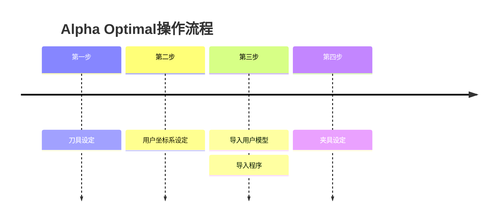
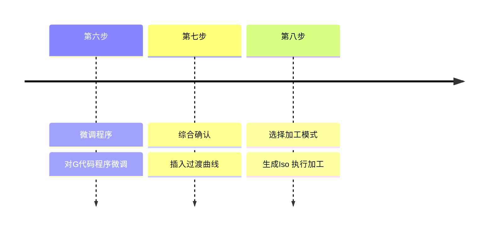

# 用户篇 - 操作向导

---

1. [跳转->刀具管理](./User_Operation_Tool_Manager.md)    
2. [跳转->获取用户坐标](./User_Operation_Get_UCS.md)    
3. [跳转->用户坐标系设定](./User_Operation_Get_UCS.md)    
4. [跳转->用户坐标系设定](./User_Operation_Get_UCS.md)    
5. [跳转->用户坐标系设定](./User_Operation_Get_UCS.md)    
6. [跳转->用户坐标系设定](./User_Operation_Get_UCS.md)    
7. [跳转->用户坐标系设定](./User_Operation_Get_UCS.md)    