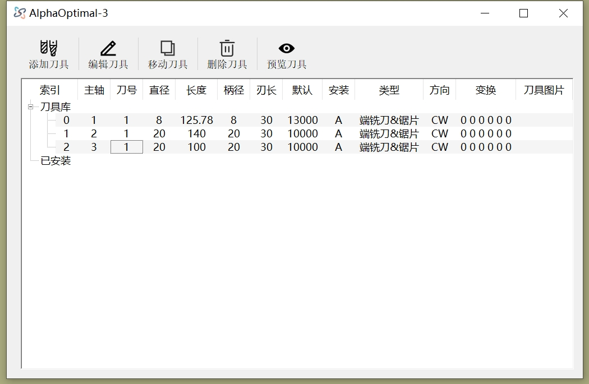
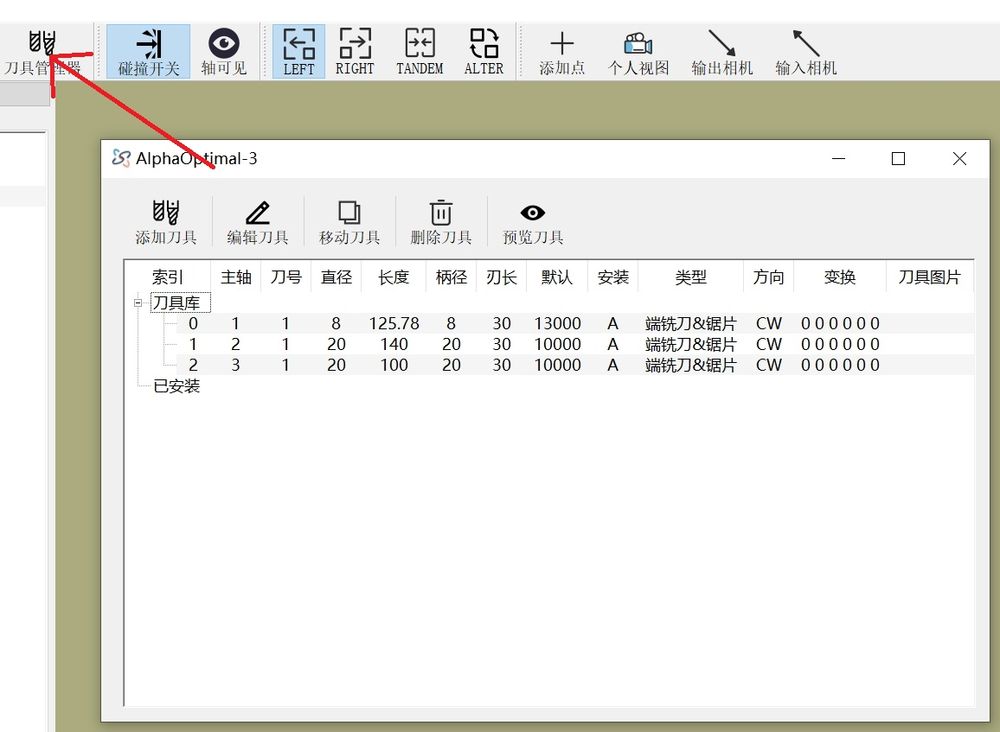
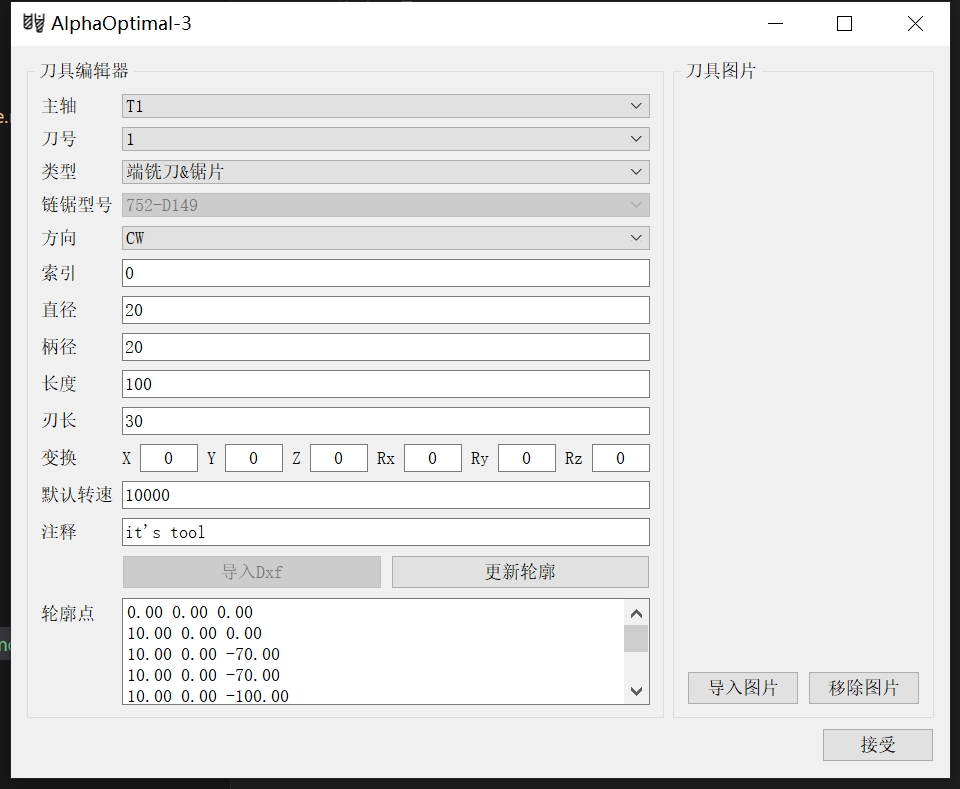

# 用户篇-刀具管理

>注意:如果软件安装后第一次使用,请务必先删除掉所有刀具.方法:按住 Shift ,选定`刀具库`下的所有刀具,然后点击`删除刀具`  

---

**刀具库下的刀具列表,在Alpha Optimal软件关闭时,会自动保存到软件安装路径下的toollib.json文件**   
**刀具列表是所有操作的基础.如果刀具列表为空,是不允许导入程序和其它的部分操作的**  

---
## 刀具管理器

- 刀具管理器分成3个部分:操作区 刀具库 已安装  
    - 操作区:对刀具进行增 删 改 预览    
    - 刀具库: 用户拥有的刀具.它是一个仓库，里面存储了刀具，现在不用
    - 已安装: 已经真实安装到机器上的刀具    

---

---

- 进入刀具管理器  

- 添加刀具：在新增刀具的时候,会提示:`找不到刀具号`.这个不需要理会,点击`Ok`即可
- 编辑刀具: 编辑参数
- 移动刀具: 
    -  选定**刀具库**的刀具,点击 `移动刀具`,假如**已安装**处`已经有`相同**索引**的刀具，则会执行参数同步功能
    -  选定**刀具库**的刀具,点击 `移动刀具`,假如**已安装**处`没有`相同**索引**的刀具，则会复制刀具到**已安装**
    -  选定**已安装**的刀具,点击 `移动刀具`,假如**刀具库**处`已经有`相同**索引**的刀具，则会执行参数同步功能
    -  选定**已安装**的刀具,点击 `移动刀具`,假如**刀具库**处`没有`相同**索引**的刀具，则会复制刀具到**已安装**
- 删除刀具: 删除选定的一把或者多把刀具.对**已安装**处的刀具进行删除操作，会检测是否被使用.`使用中`的不可被删除
- 预览刀具：对于一些特殊刀具 可以使用此功能来进行预览

## 刀具编辑器

### 进入刀具编辑器的方法  
- 刀具库内的刀具    
    - 双击 刀具
    - 选定刀具 -> 右键:编辑刀具
    - 选定刀具 -> 点击:编辑刀具
- 已安装的刀具
    - 选定刀具 -> 右键:编辑刀具
    - 选定刀具 -> 点击:编辑刀具

### 刀具编辑器界面

---
### 刀具参数解释
- 主轴: 安装刀具的主轴
- 刀号: 刀具号.非换刀主轴,刀具号都是1.换刀主轴根据刀具所在刀库的位置进行选择
- 类型: 
    - 端铣刀&锯片:适用于    
        -  直刀 
        -  锯片:锯片的直径,刃长:锯片厚度 柄径:安装锯片的杆的直径
        -  成型刀:用成型刀的最小直径
    - 球头刀
    - 用户刀具: 特殊刀型.需要用户输入刀具的轮廓点坐标或dxf文件
    - 链锯: 特殊定义,一般用户不使用,需要额外授权
- 方向：不修改
- 索引: 刀具的唯一标识,非常重要.软件自动生成,可被修改。不可重复
- 直径: 刀具的刃的直径
- 柄径: 刀柄的直径
- 长度: 刀具的总长度
- 刃长: 刀刃的长度
- 变换: 特殊刀具使用,一般用户不适用,需要额外授权
- 默认转速: 刀具的默认转速
- 注释:刀具的额外信息
- 导入图片: 记录刀具的图片
- 移除图片: 移除刀具的图片

[跳转->用户篇:操作向导](./User_Operation_Guide.md)