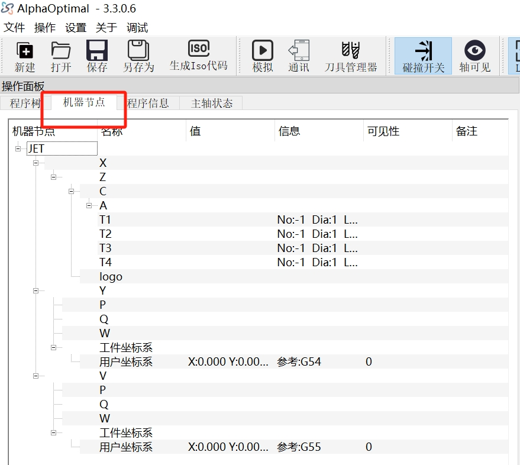
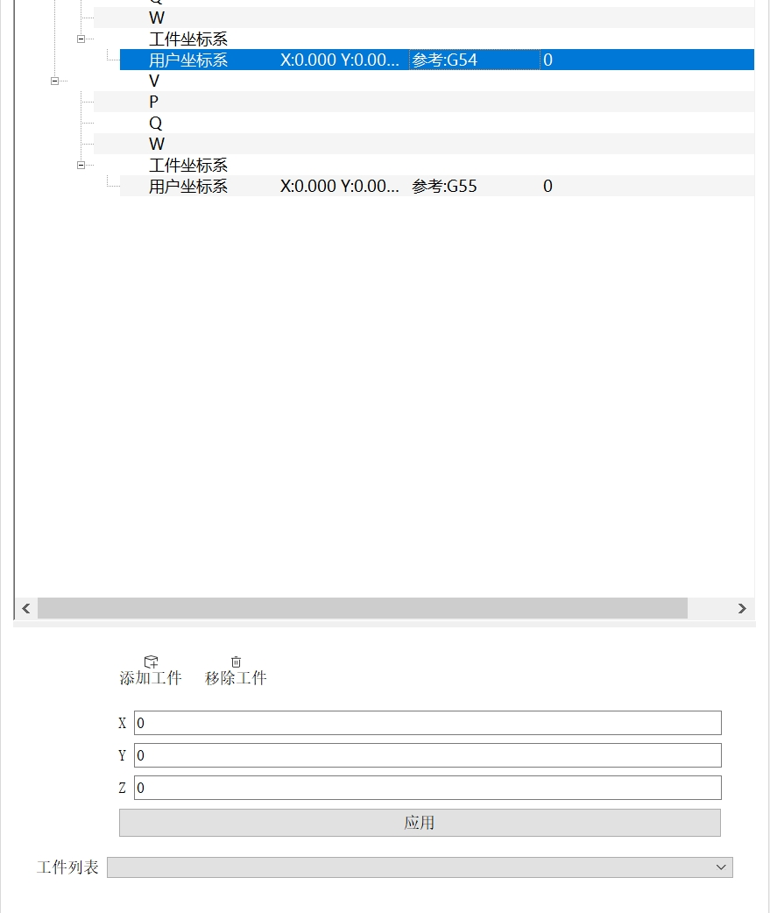
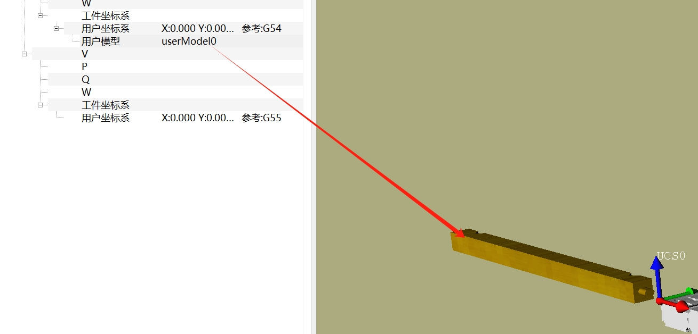
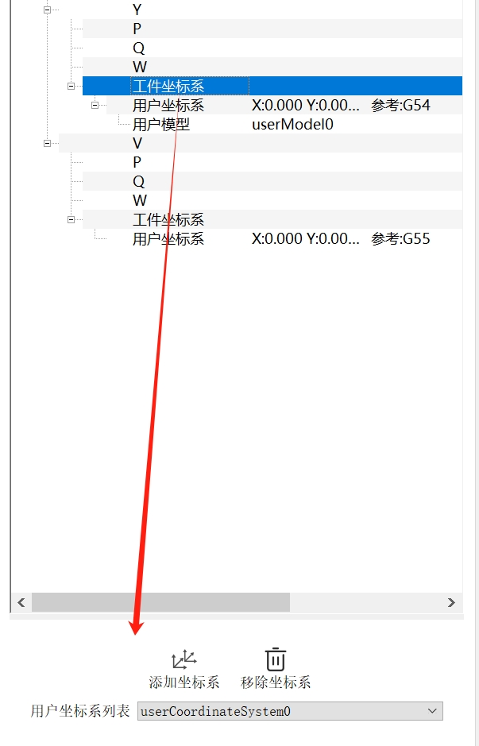

# 用户坐标系(UCS)

**强烈建议先看完下列文字内容后再观看视频**  
[观看:多用户坐标系用法视频讲解](../videos/用户坐标系用法示例.mp4)

> UCS:User Coordinate System 用户坐标系.它用来定义加工程序的位置.对应CAM编程里面的MCS   

| 工件坐标系 (WCS) | 用户坐标系       |
|----------------|------------------|
| WCS            | UCS 0 (默认,至少一个)     |
|                | UCS 1 (按需用户添加)         |
|                | UCS 2 (按需用户添加)         |

## 进入用户坐标系管理

## 用户坐标系属性    

### 添加工件
模型输出:以NX为例.用户坐标对应的是NX的WCS.**输出模型时务必让WCS和MCS重叠**  
添加工件:选定用户坐标->在用户坐标系属性界面点击:添加工件->选择要导入的模型
### 移除工件
删除`工件列表`中`当前名字的用户模型`.如果不清楚模型对应的名称.可点击用户坐标系下的名称,`右侧3D视图`会把对应的模型显示为`黄色`.
   

### 值
- X:
- Y:
- Z:
- 点击**应用**按钮后生效.生效后会自动重新计算相关的加工程序段
  
### 工件列表
- 用户坐标系保存的内容:
    - Iso轨迹:由软件自动管理,用户不可操作
    - 用户模型:由用户管理

## 添加用户坐标系
   
1. 选定要添加用户坐标系的**工件坐标系**     
2. 点击:添加坐标系  
3. 可以看到工件坐标系下多了一个用户坐标系.它的默认值:0 0 0  

## 删除用户坐标系

> 注意:使用中的用户坐标系不可被删除     

1. 选定要添加用户坐标系的**工件坐标系**         
2. 用过`用户坐标系列表`选定要删除的用户坐标系   
3. 点击:移除坐标系  

## 多用户坐标系的用法
1. 在一个台面内整列多加工程序   
2. 任意组合部件的加工程序   

