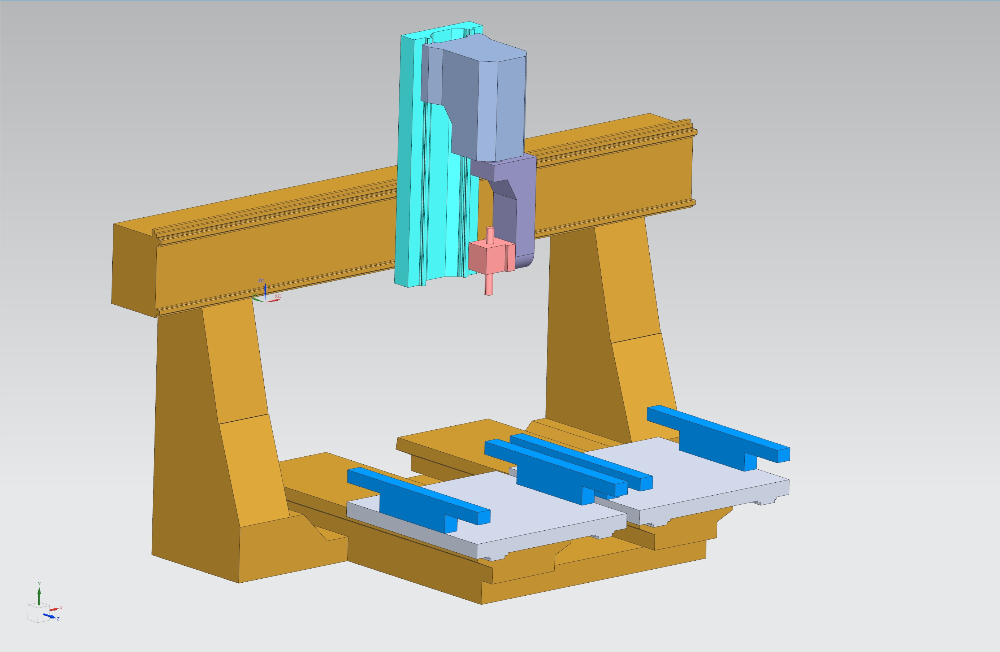

# 构造双转头机型说明
1. 软件版本:3.3.0.6
2. 请务必把整个示例看完.看完之后回忆操作流程。
3. 流程必须记住，细节可以查阅示例
4. 我们将及时的提供协助.在提供协助之前.请务必记录你在过程中遇到的问题和对问题的思考

## 示例说明

- 机器名称:master_sample
- 结构:双转头机型     
- 运动链1:X->Z->C->A;Y     
- 运动链2:X->Z->C->A;U  
- Tgv刷量:4
- Y和U一致

