# 新建运动链-第一步：输出机床模型

## 一、定义世界坐标系的位置

**说明：**  
1. 严格来说，世界坐标系具有**唯一性**且**不可修改**。这里的“世界坐标系”指的是 Alpha Optimal 软件内的世界坐标系与 CAD 软件中的工件坐标系的对应关系。请将 CAD 软件内的工件坐标系视为 Alpha Optimal 里的世界坐标系位置，这样可以明确输出模型的位置。  
2. **第一步和第二步为组合操作。**请先将 X、Y、Z、B 四个轴移动到 `0` 位置，再设置世界坐标系，否则设置的位置会有误。

---

### 1. 机床的 X、Z、A 轴必须处于 `0` 位置

- 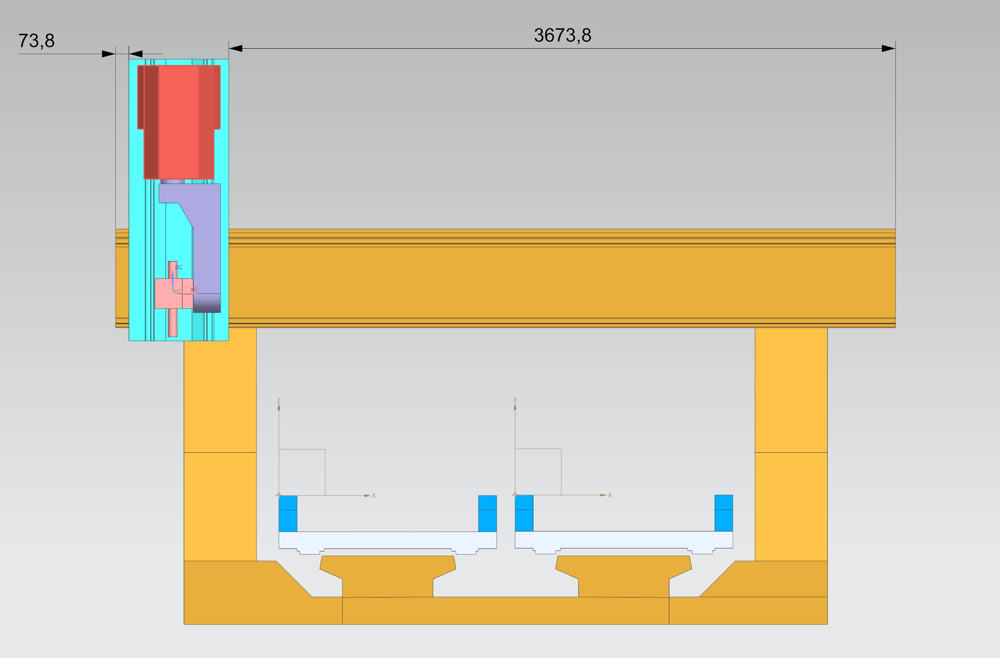

---

### 2. 定义世界坐标系的位置

- 以 C 轴的旋转中心点沿 Z 的负方向绘制一条线段 LC  
  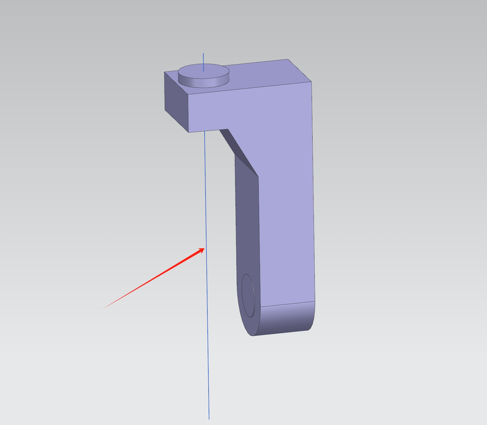

- 以 A 轴的旋转中心点沿 X 的负方向绘制一条线段 LA  
  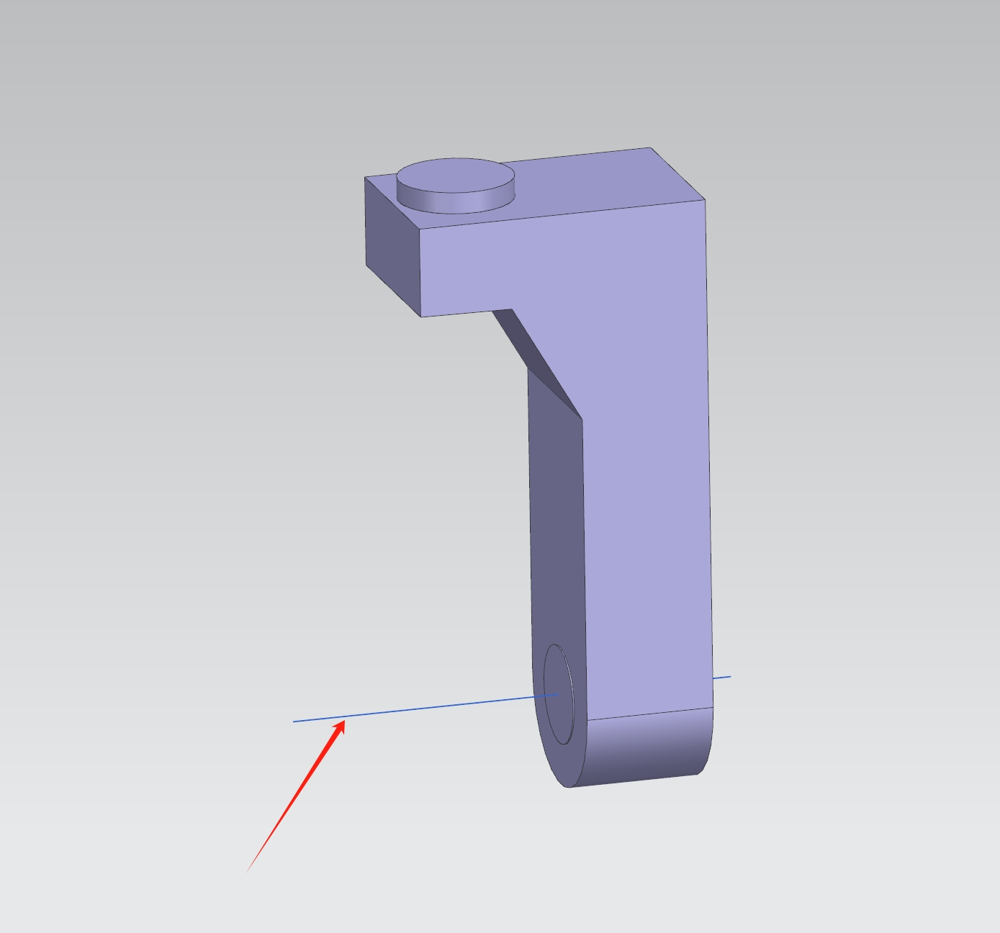

- LC 和 LA 的交汇点就是 **世界坐标系** 的 **0** 点位置
- 设定坐标系到交汇点，后续的模型输出都是以此坐标系为基准进行输出  
  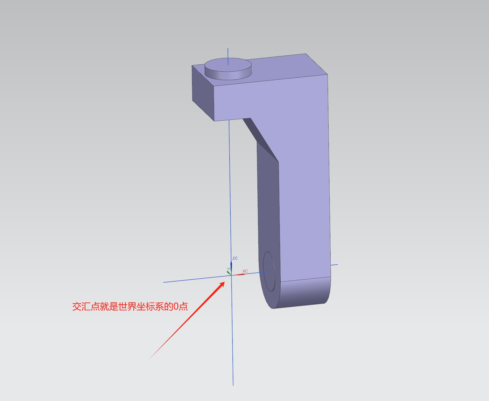

---

## 二、调整模型位置

  - 目标：把每一个轴 **X、Y&U、Z、C、A** 都移动到机械坐标 **0.0** 的位置。

### 1. 模型初始姿态

- 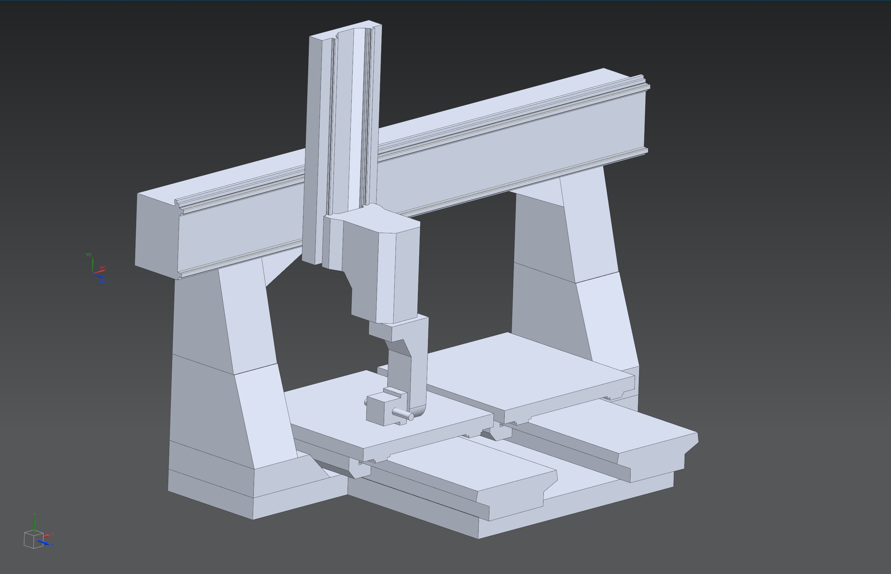

### 2. 模型调整方法

- **X 轴调整：**
    - 先移动 X 轴到中间位置（注意同时需要移动 Z、C、A 轴）
    - 再根据 X 轴的行程，移动行程的一半，往 X 轴机械坐标 `0` 的方向移动
    - 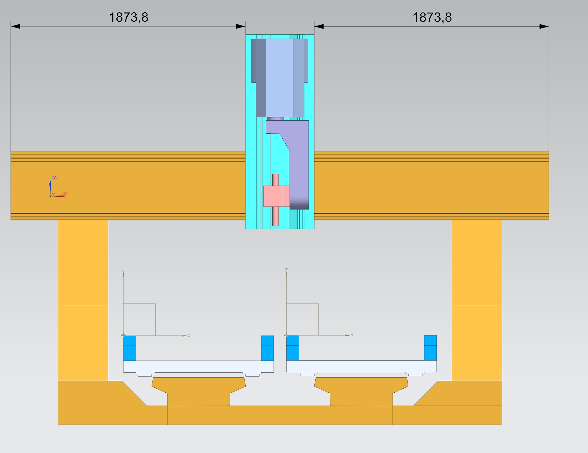
      

- **Z 轴调整：**
    - 调整 Z 的最高位置距离顶面在 30-50mm 之间。有实际物理机床的，以测量物理机床为准
    - 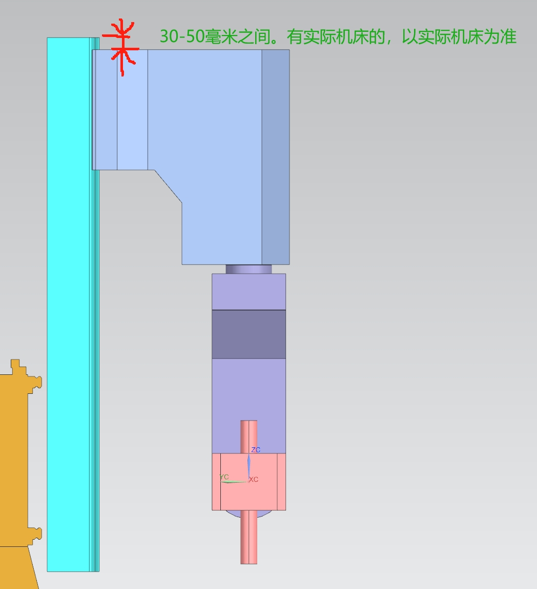

- **C、A 角度调整为 `0` 状态：**
    - 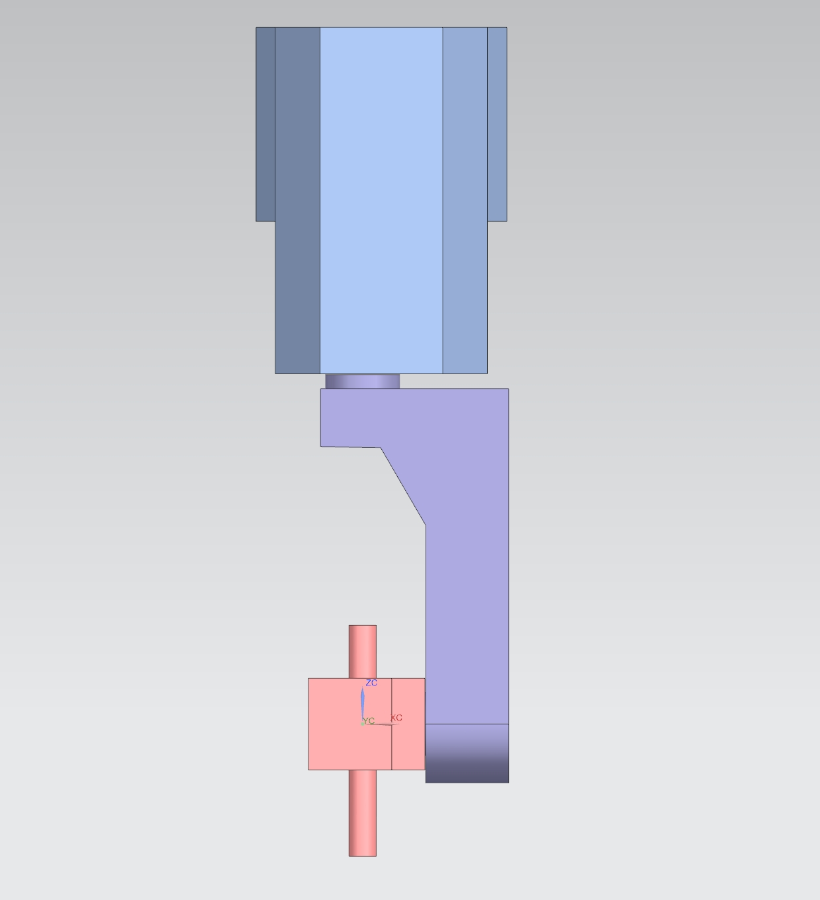

- **Y&U 轴调整：**
    - 移动 Y&U 到机械坐标 `0` 的位置
    - 定义工件坐标系在 Y&U 的位置
    - 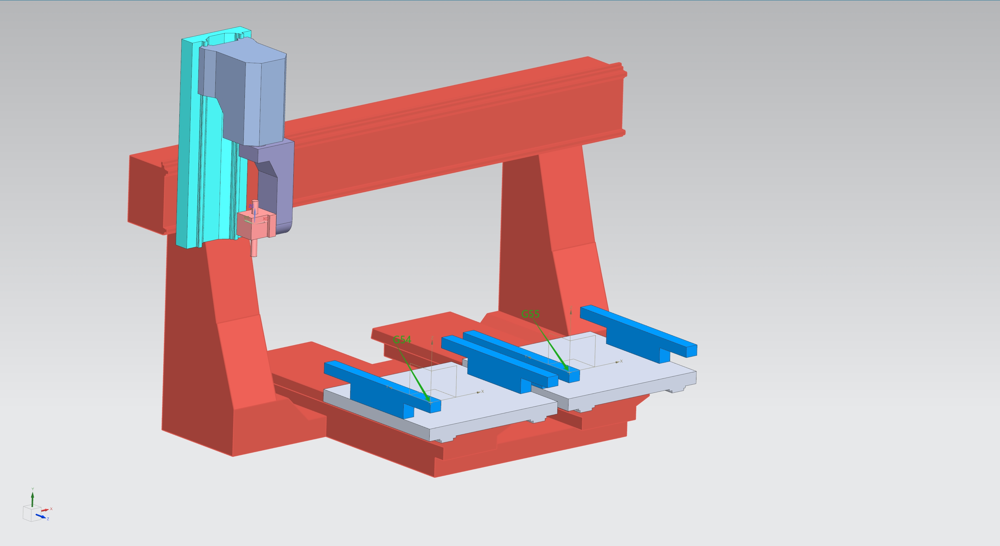
    - 以工件坐标系为起点，世界坐标系为目标点，复制 Y（如有 Tgv 也一同复制）到世界坐标系零位
    - 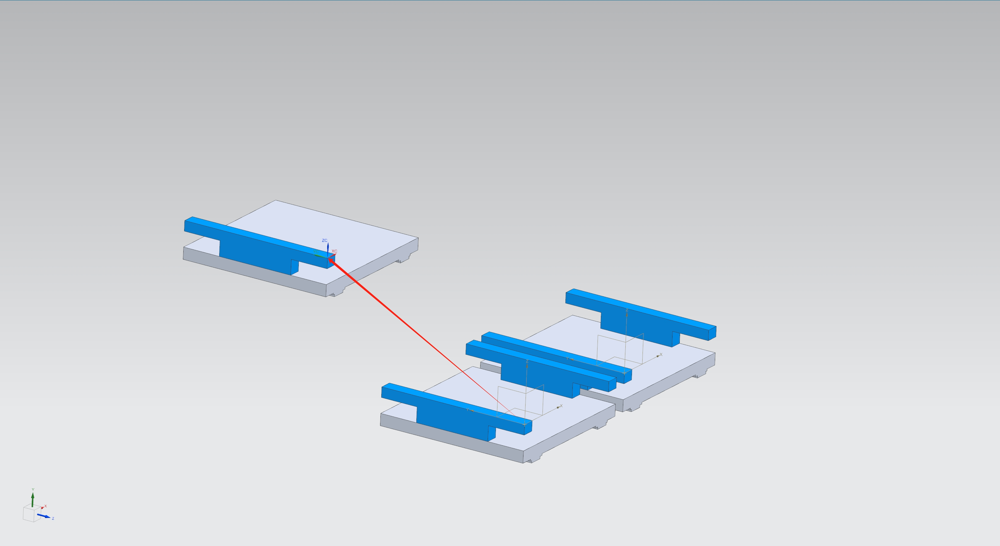

---

## 三、记录理论值

> 在配置运动链阶段，先将理论值写入配置文件，用以验证配置的正确性。请记录以下数据，方便初始使用。

- **工件坐标系：**
    - 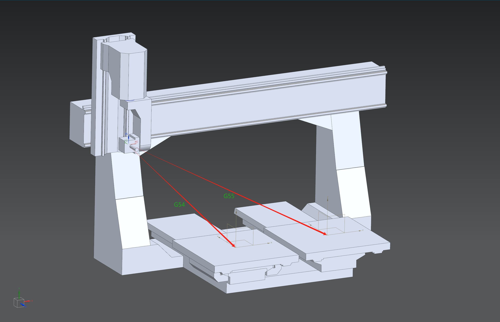
    - G54: 左台面 x y z Point( 1185.2, -731.0, -1310.86 )
    - G55: 右台面 x y z Point( 2486.67, -731.0, -1310.86 )

- **RTCP 值：**
    - **注意：测量刀具安装点时，主轴必须垂直朝下**
    - 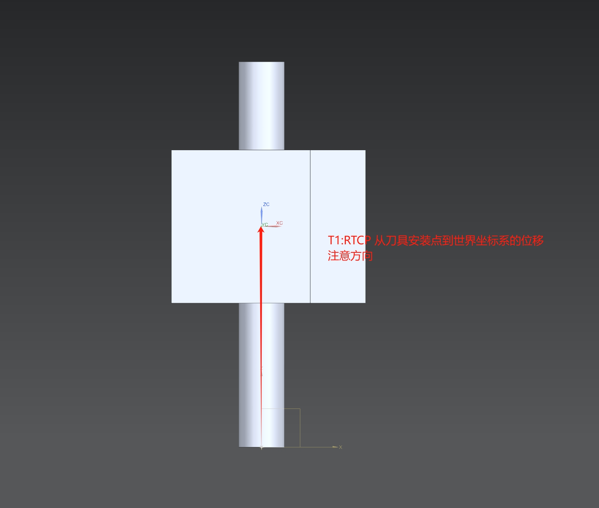
    - 格式：x y z 角度补偿（4 个值，空格分隔）
    - x y z 位移：从安装点到世界坐标系（CAD 测量时为世界坐标系到安装点，需取反）
    - 角度补偿：A 轴为 0° 时，主轴中心轴线与 Z 轴夹角（需取反）
    - 示例：
        - T1: x y z 角度补偿
        - …
        - TN: x y z 角度补偿

---

## 四、模型输出

- 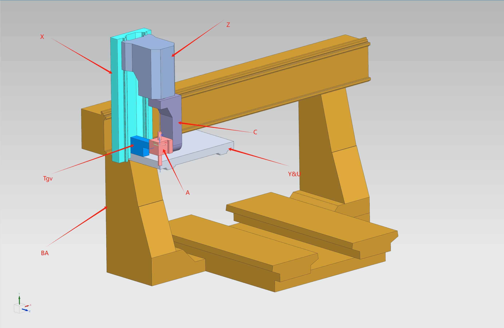
- 在软件的安装路径 `machineSample` 文件夹内新建文件夹：`master_sample`
- 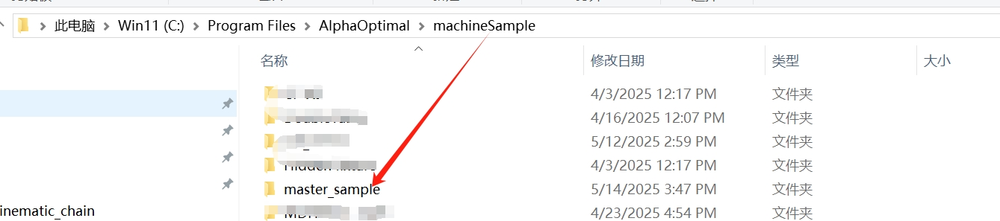
- **合并模型：**
    - 合并原则：一个轴或节点对应一个模型
    - 相同的模型只输出一个
    - 输出格式：STL
- 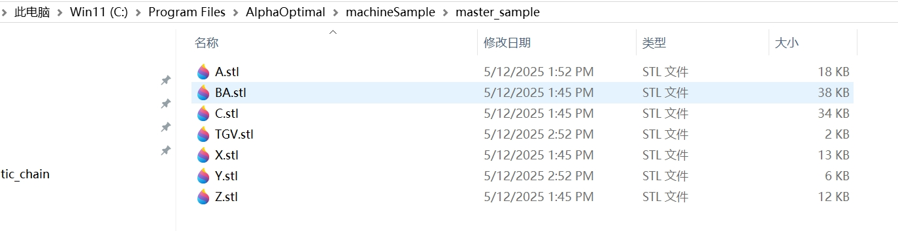