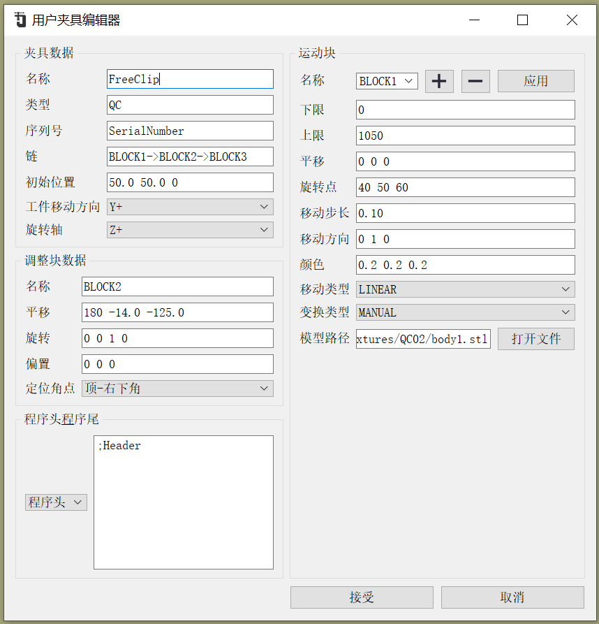
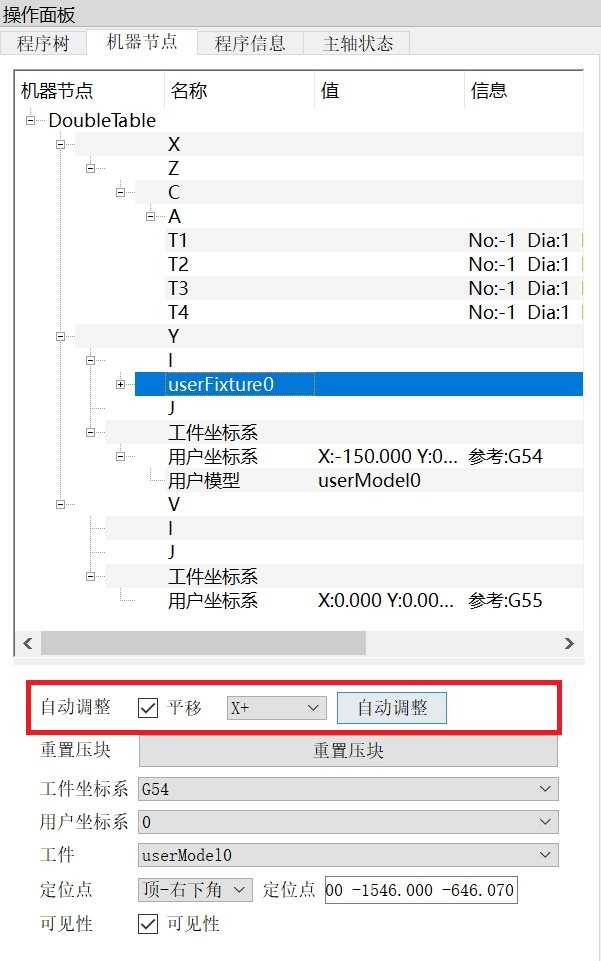

# 用户夹具示例1

## 示例说明:
- 夹具类型:FreeClip
- 工件移动方向:X+

### 1.工件 和 夹具的初始位置

### 2. 夹具属性
- 平移:默认勾选
- 方向:默认X+
- 允许自动调整  

### 3.点击:夹具属性->自动调整 的效果如下图所示  

通过 **移动用户坐标系**实现`用户夹具`对`工件`的夹持

### 4. 根据夹具的特性来设置**工件移动方向**，不必要每次都手动再次选择,可以极大的提升用户的体验