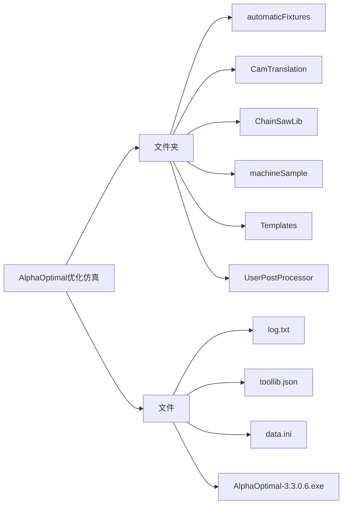

# 软件目录架构

**说明：**

- **automaticFixtures**：用户夹具库.存储所有的夹具的配置文件和模型  
- **CamTranslation**：Cam模块翻译  
- **ChainSawLib**：链锯库.特定机型支持链锯加工.在此存放数据  
- **machineSample**：用户机床库.存放机床配置文件和模型  
- **Templates**：用户模板存放路径  
- **UserPostProcessor**：用户后处理器.存放后处理器文件  
- **log.txt**：日志文件.记录软件的运行状态和错误信息  
- **toollib.json**：本地刀具库  
- **data.ini**：用户自定义配置文件 [详细说明](Instruction_data_file.md)  
- **AlphaOptimal-3.3.0.6.exe**：可执行文件  