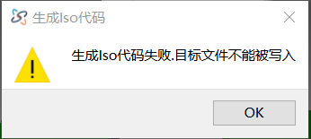

# 生成ISO失败 目标路径不能被写入

**错误提示**
- 

**原因**
- 后处理文件内定义的路径是拒绝写入或不存在

**解决方法**
1. 进入软件安装路径,找到data.ini文件
2. 找到 PostProcessor=UserPostProcessor/AX5_OSAI.xml.记住AX5_OSAI.xml即当前正在使用的后处理文件
3. 在相同路径，打开UserPostProcessor文件夹并找到AX5_OSAI.xml文件
4. 用记事本打开AX5_OSAI.xml文件
5. 找到OutputDir,可直接搜索：**OutputDir**,注意大小写
6. 找到**OutputDir="D:/CNC"**。当"D:/CNC"这个路径不存在,就会报此错误。重新指定正确的路径.注意：Windows系统下，复制路径为："D:\CNC" ,需要手动修改 `\` 为 `/`。否则此错误仍然存在.