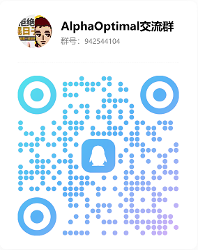

<section class="ao-showcase">
	

		About Us
		<h1 class="ao-hero__title">东莞市瑞凡软件有限公司</h1>
		

			我们专注于多轴仿真优化软件的研发、销售与服务，围绕真实生产场景持续打磨产品，帮助客户提升设备利用率、加工稳定性与现场交付效率。
		

	

	

		<article class="ao-value-card">
			<h3 class="ao-value-card__title">好用</h3>
			
界面逻辑清晰、操作路径直接，减少培训成本和切换成本。

		</article>
		<article class="ao-value-card">
			<h3 class="ao-value-card__title">易用</h3>
			
流程设计贴合现场，从程序导入到参数调整都可快速上手。

		</article>
		<article class="ao-value-card">
			<h3 class="ao-value-card__title">稳定</h3>
			
依托核心算法持续优化，保障复杂加工场景下的运行可靠性。

		</article>
		<article class="ao-value-card">
			<h3 class="ao-value-card__title">高效</h3>
			
通过仿真与优化联动，缩短调试周期并提升机床综合效率。

		</article>
		<article class="ao-value-card">
			<h3 class="ao-value-card__title">定制化服务</h3>
			
按行业工艺特征和机型差异提供专项优化策略与落地支持。

		</article>
		<article class="ao-value-card">
			<h3 class="ao-value-card__title">长期合作</h3>
			
从部署、培训到持续迭代，与客户共同打磨生产竞争力。

		</article>
	

	

		<article class="ao-contact-card">
			<h3>联系信息</h3>
			
电话：138-0963-5904

			
邮箱：297380404@qq.com

			
欢迎联系获取试用与实施建议。

		</article>
		<article class="ao-contact-card">
			<h3>社群与资讯</h3>
			
微信公众号：AlphaOptimal

			
QQ 沟通群扫码加入：

			

		</article>
	

</section>