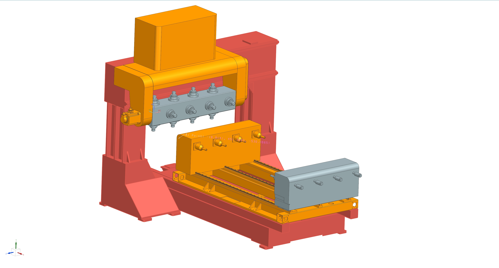

# 构造单转头单转台机型

**温馨提示:**已经录制了相关视频.可以在B站上观看[单转头单转台机型配置视频合集](https://www.bilibili.com/video/BV1Zi7WzoE4A/?share_source=copy_web&vd_source=fb14361fa8ee6e90e76041c1661bbe87)    

1. 软件版本:3.3.0.7
2. 请务必把整个示例看完.看完之后回忆操作流程。
3. 流程必须记住，细节可以查阅示例
4. 我们将及时的提供协助.在提供协助之前.请务必记录你在过程中遇到的问题和对问题的思考

## 示例说明

- 机器名称:Single_HeaderTable
- 结构:单转头单转台   
- 运动链1:X->Z->A;Y->B
- Tgv刷量:1

