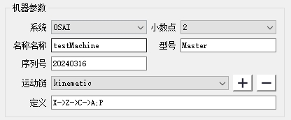

# 机床配置文件编辑器

本文档详细介绍机床配置文件编辑器各部分的界面和功能，内容组织清晰，方便查阅。

---

## 1. 主界面

---

## 2. 机器参数

**说明: 运动链的定义是非常重要的,它定义了设备的运动学。串联结构 `→` 连接， 并联结构 `;` 连接**

- **系统**：机器使用的系统
- **小数点**：定义轴坐标小数点后的位数（例：`X100.23` 或 `X100.234`）
- **名称**：机器名称
- **型号**：机器型号
- **序列号**：机器的序列号
- **运动链**：机器所使用的运动链
- **定义**：运动链的具体定义.点击:[运动链和轴id](ChainAndAxisId.md)  

---

## 3. NC轴定义

- **名称**：机械轴名称，应与机器上的轴名称一致
- **别名**：理论名称，用以匹配后处理器生成的G代码中的轴名称
- **id**：轴Id，必须准确设定.点击:[运动链和轴id](ChainAndAxisId.md)
- **最大速度**：轴允许的最大移动速度
- **零位**：机器回零时的位置
- **加速**：轴允许的最大加速度
- **位置**：轴3D模型的初始位置  
- **Jerk**：轴允许的最大加加速度
- **方向**：轴的运动方向
- **颜色**：轴3D模型显示的颜色
- **上限**：轴运动的上限
- **下限**：轴运动的下限
- **类型**：轴的运动类型（线性轴或旋转轴）
- **RTCP计算**：是否参与RTCP计算.此功能仅在双五轴头机型需要设定，其它机型默认勾选  
- **路径**：轴模型的存放路径.建议：采用相对路径 
  

---

## 4. 非NC轴定义

- **父项**：此非NC轴的安装轴
- **名称**：理论名称，用以匹配后处理器生成的G代码轴名称
- **下限**：轴运动的下限
- **上限**：轴运动的上限
- **位置**：轴3D模型的初始位置  
- **方向**：轴的运动方向
- **颜色**：轴3D模型显示的颜色
- **类型**：轴的运动类型（线性轴或旋转轴）
- **最大速度**：轴允许的最大移动速度
- **零位**：机器回零时的位置
- **加速**：轴允许的最大加速度
- **Jerk**：轴允许的最大加加速度
- **路径**：轴模型的存放路径  
  建议：采用相对路径

---

## 5. 主轴定义

- **参数**：主轴刀具的安装点，所对应数控系统的RTCP值，每组数据包含4个值（X、Y、Z和角度偏置）
- **方向**：刀具安装后的默认指向（使用默认值）
- **父项**：主轴的安装轴（双五轴头机型必须完整填写）
- **颜色**：安装刀具显示的颜色
- **启动**：主启动指令，`#`符号将会被替换为转速  指令必须是唯一的 不可与其它主轴的指令相同  
  例如：若1号刀具转速为10000，格式:`M103 [#]` 最终输出为 `M103 [10000]`
- **停止**：主轴停止指令  不可与其它主轴的指令相同  
- **检查**：主轴转速到达的检查指令  不可与其它主轴的指令相同  
- **换刀**：可换刀主轴使用的换刀指令（必须以M开头）
- **范围**：可换刀主轴的换刀范围.不换到主轴范围:1 换刀主轴按实际设定
- **共轴**：针对双出主轴，定义共轴的两个主轴

---

## 6. 工件坐标系

- **父项**：工件坐标系所依赖的（非）NC轴（可留空）
- **值**：工件坐标系相对于世界坐标系的偏置值
- **名称**：如G54 - G59 
    - 单台面:G54
    - 双台面:
        - 左台面:G54
        - 右台面:G55
- **别名**：工件坐标系的显示名称
- **运动链**：工件坐标系所在的运动链  **此处的运动链必须与“机器参数”中定义的保持一致**
  

---

## 7. 插补参数

- **插补周期**：软件执行插补的时间间隔  
  > 说明：大多数数控系统的插补周期:2ms 默认值为2ms，建议不要超过10（单位：毫秒）
- **快速阈值**：机床执行G0指令时允许的最大速度
- **未解释部分**：使用默认值，客户无需修改

## 8. 定义碰撞对象  
  
当以上参数都已经设置好之后.点击**更新碰撞对象列表**,它定义了哪些对象会被做碰撞检测.一般来说机床的`机架`是不需要做碰撞检测的，`特殊机型`需要对`机架`进行碰撞检测的，需要在模型导出时，**确认机架模型不与其它模型接触**，否则会无线出发**碰撞提示**

## 9. 自动加载夹具  
  
当以上参数都已经设置好之后.点击**更新用户夹具列表**，软件会对非NC轴自动设置加载夹具.核对需要加载夹具的非NC轴.需要设置那里就双击那里,不需要,则双击**删除图标**