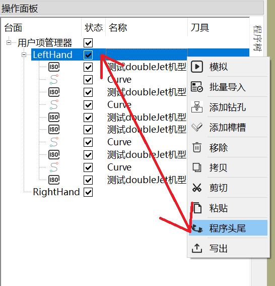
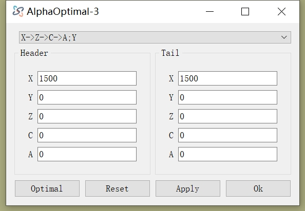
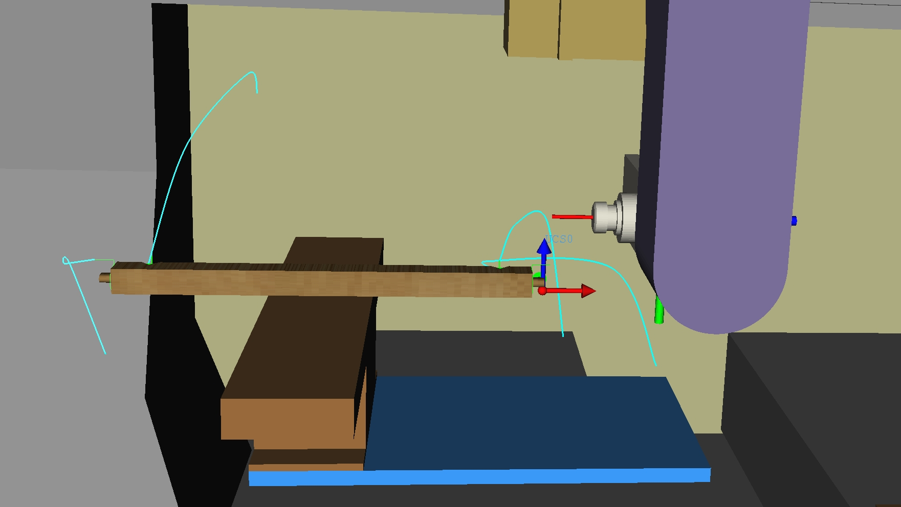

# 机床的起始位置姿态

## 默认的位置姿态：零位

默认的位置设置：**配置文件→NC轴→零位**

例如：需要设置默认的起始位置为：X-1500 Y0 Z0 C0 A0（假设X的行程在-3000 到 0之间，X-1500则刚好停留在中间位置）

- X轴零位：-1500
- Y轴零位：0
- Z轴零位：0
- C轴零位：0
- A轴零位：0

这样机器在执行程序之前，就会先移动到 `G1 X-1500 Y0 Z0 C0 A0` 的位置，加工完成也会移动到该位置。

---

**换刀机型说明：**  
在执行程序之前，换刀主轴上的刀具是有位置的，所以软件会先输出一次换刀动作。  
换刀动作之后，执行的逻辑是：移动刀具到加工起始点的正上方，以此为起点执行加工。完成之后移动到 `X-1500 Y0 Z0 C0 A0` 的位置。  
所以换刀机型不会以默认的位置姿态为起点，而是以加工程序起始点的正上方为起始点。

---

## 自定义位置姿态

1. **进入自定义起始点&结束点**  
   
2. **编辑界面**  
   
   - **Optimal**：优化起始点&结束点
     - Header：起始点
     - Tail：结束点
   - **Reset**：重置起始点&结束点（设置为默认值）

---

## 默认 VS 优化

