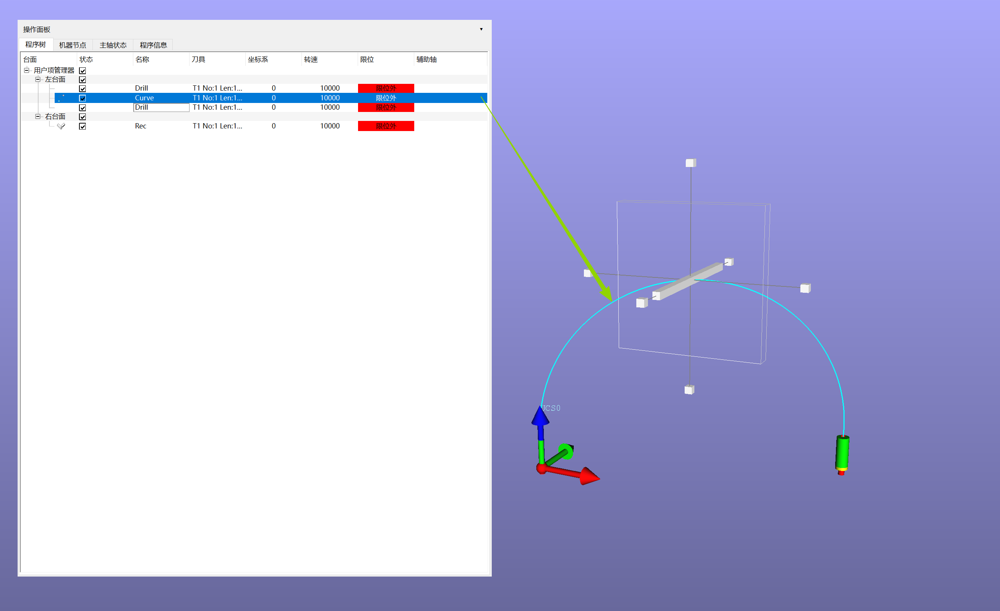

# 曲线路径程序段编辑器
[返回程序树预览](ProgramTree_ZH.md)

>注意 曲线路径程序段的功能时解决两个程序段之间的过渡问题.它不能独立存在

### 编辑方法
1. 通过编辑器编辑
   1. 选定要编辑的曲线路径程序段
   2. 右键菜单 `编辑` 或者 `双击`
   3. 进入编辑器
   4. 
2. 在3D视窗中直接交互(此方法只适用于修改控制点位置)
   - 按住ALT键,然后鼠标左键直接点击曲线路径
   - `拖拽器`
     - 拖拽器支持`移动` `缩放` `旋转`
     - 只有`移动`对轨迹生效.其它的操作只改变拖拽器本身，不改变曲线路径
     - 拖拽器的方向通过按键盘的CTRL键进行顺序切换.切换顺序是 Y->Z->X
     - 每按一次.白色的长方块就会切换一次。鼠标左键按住白色方块,即可实现移动
    - 

3. 编辑器参数说明
      - 1 ~ n 是指控制点的索引
      - 参照坐标系:用户坐标系
      - X:对应控制点的X坐标
      - Y:对应控制点的Y坐标
      - Z:对应控制点的Z坐标
      - t:旋转轴的增量.t = 0.0的时候，是上一个程序段的旋转轴角度；t=1.0时,是当前程序段的旋转轴角度
      - t示例说明:
        <pre>
            上一个程序段的最后一行:C30 A15
            当前程序段的第一行:C-50.3 A-65
            t=0.5
            计算如下:
            C的增量 IC = -50.3 - 30 = -80.3
            A的增量 IA = -65 - 15 = -80.0
            当前控制点C的角度 = 30 + t * IC = 30 + (0.5 * -80.3) = -10.15
            当前控制点A的角度 = 15 + t * IA = 15 + (0.5 * -80.0) = -25.0
            计算软件内部执行.理解它的计算方法即可
        </pre>

### 右侧区域:按钮组
- 模拟:模拟当前程序段的加工
- 接受:执行修改并关闭编辑器窗口
- 应用:执行修改
- 取消:取消修改
- 检查：显示当前程序段是否有超限位
	- 
	- 红色:超限位 
    	- 解释: -1208.5 标示当前程序段会执行到Y-1208.5这个地方.它超出了轴的极限值.**它不是程序段的极限值.也许后面还会有超出极限的位置.软件会在检测到有超限位的时候，记录下超限的位置并显示出来.不会往后再检查了**
  	- 绿色:限位内。可以执行加工
- 时间:显示当前程序段的加工耗时.这个值为最理想耗时.实际加工过程中,耗时应该会大于这个时间

[返回程序树预览](ProgramTree_ZH.md)