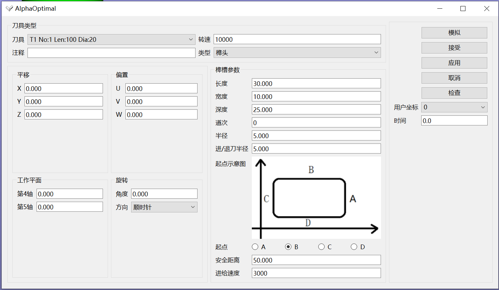
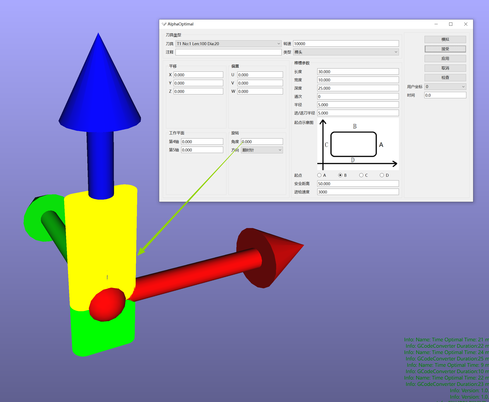

# 榫槽程序段编辑器

[返回程序树预览](ProgramTree_ZH.md)

## 进入方法
1. 选定要编辑的榫槽程序段.
2. 右键菜单
3. 编辑

## 榫槽编辑器

## 编辑器参数说明

### 刀具类型
- 刀具列表:手动选择适用于当前程序段加工的刀具
- 转速:手动修改当前程序段加工时的主轴转速.默认转速时创建刀具时设定的.
- 注释:用户注释
- 类型:榫槽的类型
  - 榫头
  - 榫槽

### 姿态
- 平移
  - 参照坐标系:用户坐标系
  - 进行X Y Z方向上的移动
- 偏置
  - 参照坐标系:用户坐标系
  - 需要结合旋转来计算.对用户坐标系进行旋转，得到新的坐标系.新坐标系的XYZ对应的就是UVW
  - 进行U V W方向上的移动
- 工作平面
  - 第4 5轴的旋转角度
- 旋转
  - 以榫头&榫槽的中心线为旋转轴进行旋转
  - 旋转图示：顺时针旋转 `0` 度 对比 顺时针旋转 `45` 度
    - 
    - 
### 榫槽参数
- 长度
- 宽度
- 深度
- 道次:是指分几次完成榫头&榫槽加工动作
  - 路径:矩形的螺旋线
  - 例:榫头&榫槽深度d=30,道次n=3.即每次榫头&榫槽加工深度depth = 30 / 3 = 10
- 半径：默认为`宽度 / 2.0`.可手动修改
- 进退刀半径
  - 加工类型 = 榫头,强制进退刀类型为`圆弧进退刀`
  - 加工类型 = 榫眼,强制进退刀类型为`直线`
- 起点示意图:把榫头&榫眼看作时一个矩形.从哪一个点开始加工.见编辑器内部图示
- 安全距离
- 进给:榫头&榫槽的速度

### 右侧区域:按钮组
- 模拟:模拟当前程序段的加工
- 接受：执行修改并关闭编辑器窗口
- 应用:执行修改
- 取消:取消修改
- 检查：显示当前程序段是否有超限位
    - 
    - 红色:超限位 
        - 解释: -1208.5 标示当前程序段会执行到Y-1208.5这个地方.它超出了轴的极限值.**它不是程序段的极限值.也许后面还会有超出极限的位置.软件会在检测到有超限位的时候，记录下超限的位置并显示出来.不会往后再检查了**
    - 绿色:限位内。可以执行加工
- 用户坐标:重新设定当前程序段所在的用户坐标系 详见[坐标系详解](../other/CoordinateSystem.md)
- 时间:显示当前程序段的加工耗时.这个值为最理想耗时.实际加工过程中,耗时应该会大于这个时间

[返回程序树预览](ProgramTree_ZH.md)