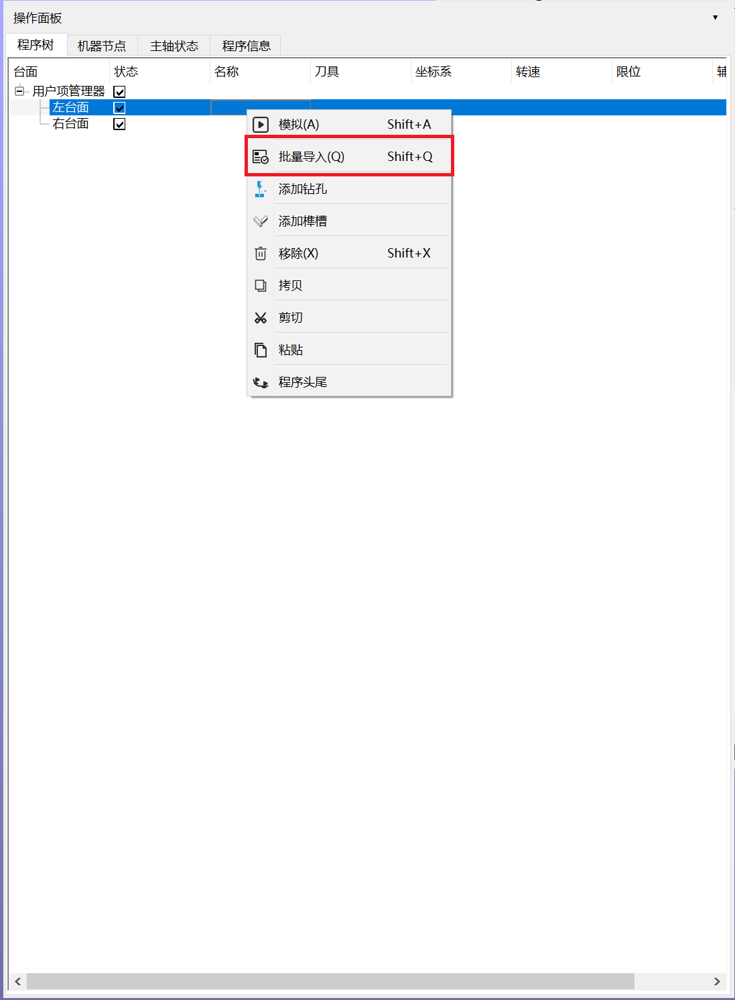
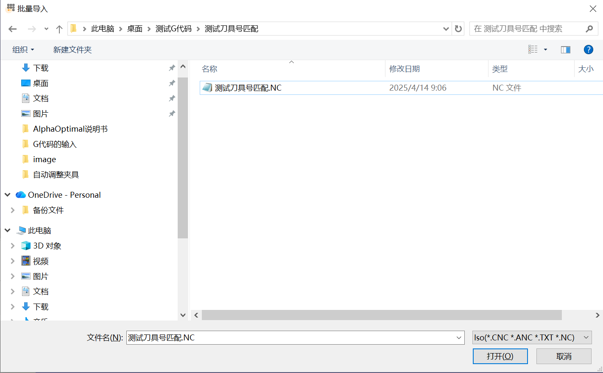

# **2.导入G代码**

   对于一个管理员来说.首先必须明确导入的Iso代码的正确格式.如果你是终端用户,不需要理会这个注释.如果你时设备制造商,必须对输入的Iso代码文件格式有清楚的理解并且编写正确的CAM后处理器,用于生成整个的Iso代码文件.这样才能导入到AlphaOptimal进行优化操作 

    点击跳转: [构建适用于AlphaOptimal的CAM后处理器](../other/PostProcessorOfCam.md)

   默认已经完成了刀具的设置

---

1. 选定需要导入程序的台面
   - 
2. 右键菜单->批量导入
   1. 首先弹出的时选择对话框.软件支持的G代码文件格式包括:`CNC` `NC` `TXT` `ANC`.格式不区分大小写
      -  
   2. 选定要导入的文件(可多选)
   3. 点击:确定
   4. 进入程序导入引导界面
      - 
      - 注:程序的自动拆分依赖文件内部的分隔符.详解:[Iso代码格式详解](../other/PostProcessorOfCam.md)
   5. 列说明
      1. 列3:刀具
         - 当前程序段使用的刀具.可根据程序段手动选择 
      2. 列4:坐标系 [坐标系详解](../other/CoordinateSystem.md)
         - 软件在一个台面上,同时支持N个用户坐标系:坐标系1 坐标系2 坐标系3 .....坐标系N
         - 可以把导入的程序应用在任意一个用户坐标系
         - 用户坐标系可根据用户需求任意设置
         - 坐标系 与 坐标系 之间可以任意排序.可以选择先加工坐标系1 ,也可以选择先加工坐标系2 ,也可以坐标系1 坐标系2混合加工.软件内部的联刀等功能可用.不受坐标系影响 
      3. 列5:刀具匹配
         -  匹配:更具程序段内部的标识,自动选择**已安装**的刀具.显示`匹配`
         -  继承:为识别到程序段内部标识或者根据标识未能找到对应的刀具.则显示`继承`
   6. UCS ids说明
      - 假设需要把导入的程序全部或部分放置在非默认的坐标系内执行加工
      - 选定要设置的程序段
      - 在UCS ids 复选框->下拉并选定坐标系Id。软件会更改选定部分的程序段
3. 程序导入完成
