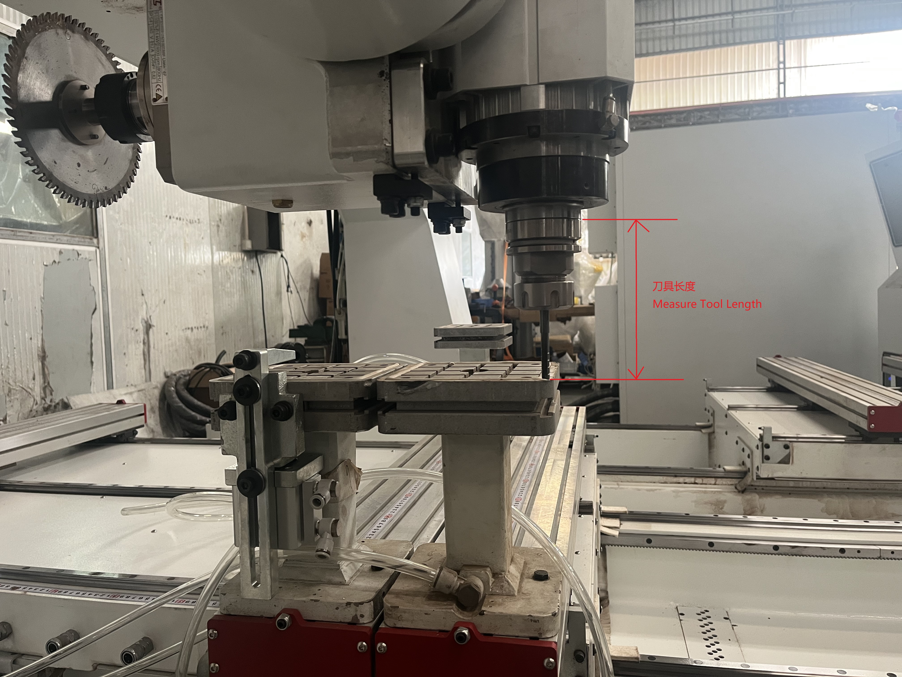
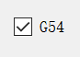
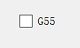
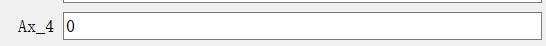
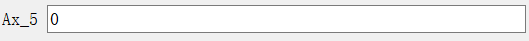
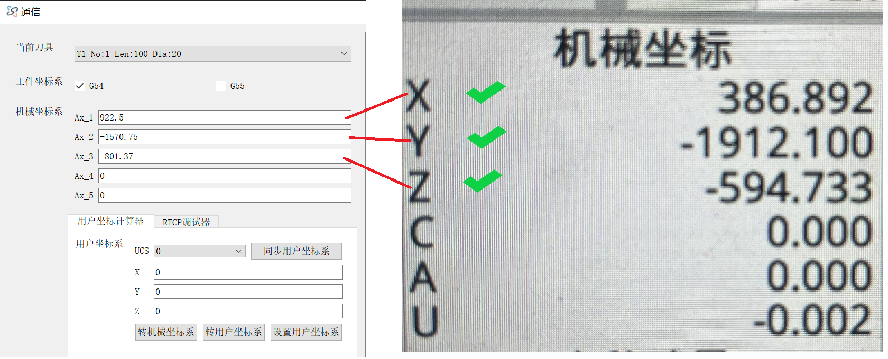
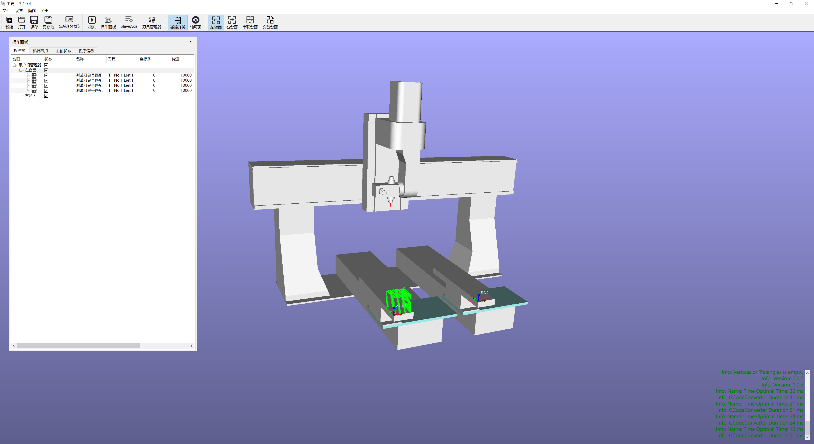

# 如何定位用户坐标系

## 前提:机器参数已经正确设置(加工坐标系 RTCP)

## 如何获取**用户坐标系**的值
1. 测量到正确的刀具长度.

2. 正确设置刀具.详见[正确设置刀具](../UserDocument/ToolManager_ZH.md)

3. 把工件固定在机器上面 

4. 将T1的刀尖移动到CAM编程时,对应的坐标系零点位置
      - 
      - 
      - 
5. 记录轴坐标
6. 点击工具栏 → 通讯 
7. 通讯界面 
8. 确认工件坐标系
      - 左台面勾选 G54 
      - 右台面勾选 G55 
9.  确认:第4&5轴的角度为0(A0 C0)
      - 
      - 
10. 抄录机械坐标 将数控系统上的 **X Y Z** 坐标抄录到机械坐标系：`Ax_1 Ax_2 Ax_3` 
    
11. 同步用户坐标系并选择要操作的用户坐标系Id
    - 

12. 转用户坐标系 并 应用数值 
    - 

## 创建多个用户坐标系的方法
1. 软件界面

2. 左侧:操作面板

3. 在 **操作面板**顶部,点击:机器节点

4. 选定要在哪个加工坐标系下添加用户坐标系

5. 修改用户坐标系的值
- 点击 **用户坐标系**
- 在下方的坐标系属性界面输入要修改的值
- 点击**应用**

6. 3D视窗显示

