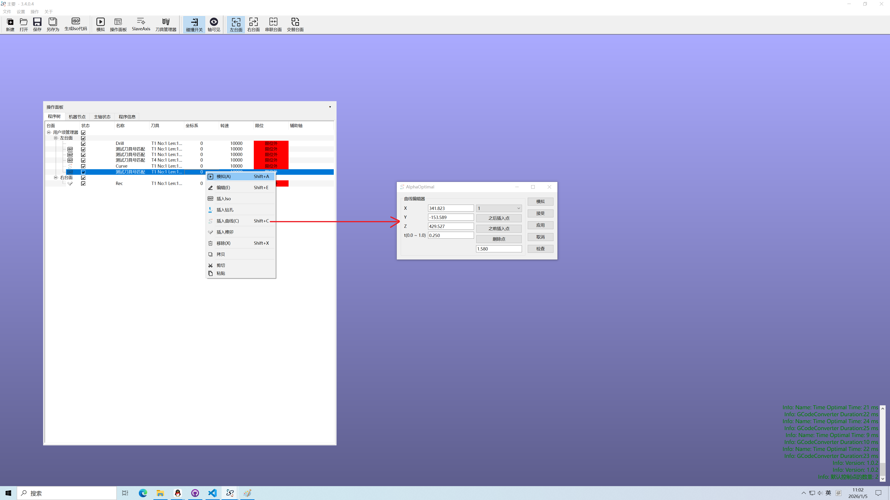
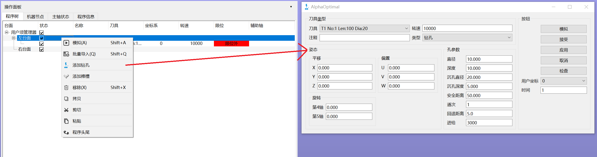

# 程序树

> 程序树的职责是管理所有程序段.也提供程序起始和结束位置的设定.

## 程序段类型:
1. Iso代码 
2. 孔加工 
3. 榫槽程序段 
4. 路径桥接 

## 程序树的信息列

| 列名           | 说明 |双击|
| -------------- | ---- |---|
| 类型           | 程序段类型（Iso/孔加工/榫槽程序段/路径桥接等） |进入编辑器|
| 状态           | 默认勾选；取消勾选则不输出，状态改变会重新计算自身及后续程序段 |进入编辑器|
| 名称           | 程序段名称 |进入编辑器|
| 刀具           | 程序段所用刀具|快速编辑|
| 用户坐标系 ID  | 程序段所在的用户坐标系|快速编辑|
| 转速           | 程序段转速（默认使用刀具转速，可单独设置） |快速编辑|
| 限位检查       | 快速提示程序段是否超出机器极限 |进入编辑器|
| 辅助轴         | 特殊机型使用，需要额外授权 |进入编辑器|

## 程序树
  - 

## 处理顺序
  1. 先检查每一个程序段是否符合加工预期
  2. 模拟相邻的程序段的下一个:确认从上一个程序段快速位移到当前程序段的快速位移是否安全
  3. 根据需求插入:桥接路径
  4. 设置程序的起始点和结束点
  5. 整体模拟 确认无碰撞
  6. 查看是否有程序段超限位
  7. 生成Iso
  8. 执行加工

## 插入**桥接路径**的方法
  - 桥接路径必须是桥接2个程序段
  - 选定下一个程序段
  - 右键菜单:插入曲线(快捷键:shift + C)
  - 自动插入并弹出编辑器
  - 点击确定.完成操作
  - 

## 添加孔加工程序段
  - 左键单击要插入孔加工程序段的台面
  - 右键菜单:添加钻孔
  - 点击确定完成
  - 

## 添加榫槽程序段
  - 左键单击要插入榫槽程序段的台面
  - 右键菜单:添加榫槽
  - 点击确定完成
  - 
## 程序段处理    
  - Iso程序段处理 [点击跳转](HandleIsoItem_ZH.md)
  - 孔加工程序段处理 [点击跳转](HandleHolesItem_ZH.md)
  - 榫槽程序段处理 [点击跳转](HandleRectItem_ZH.md)
  - 曲线路径程序段处理 [点击跳转](HandleCurveItem_ZH.md)