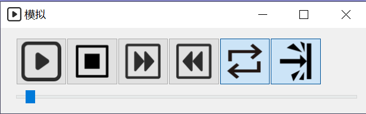

# 模拟

> 模拟动作伴随着整个程序.是检查的必要方法之一

| 图标 | 描述       |
|------|------------|
|     | 播放       |
|     | 停止       |
|  | 加大模拟倍率,最大倍率:10倍   |
| | 减小模拟倍率,最小倍率:1倍   |
|     | 循环.当被选定后.模拟动作会循环   |
| | 碰撞停止:模拟过程中出现碰撞，模拟是否停止. |
