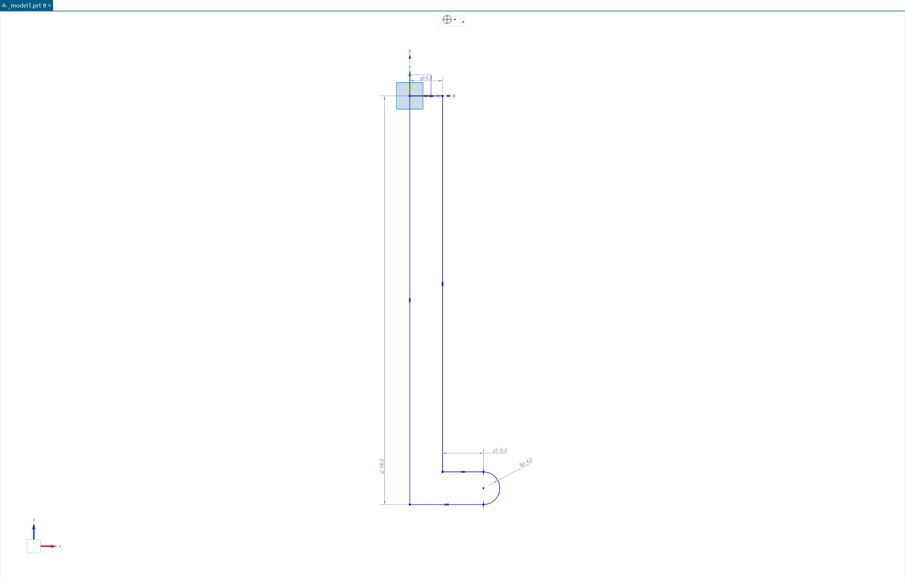
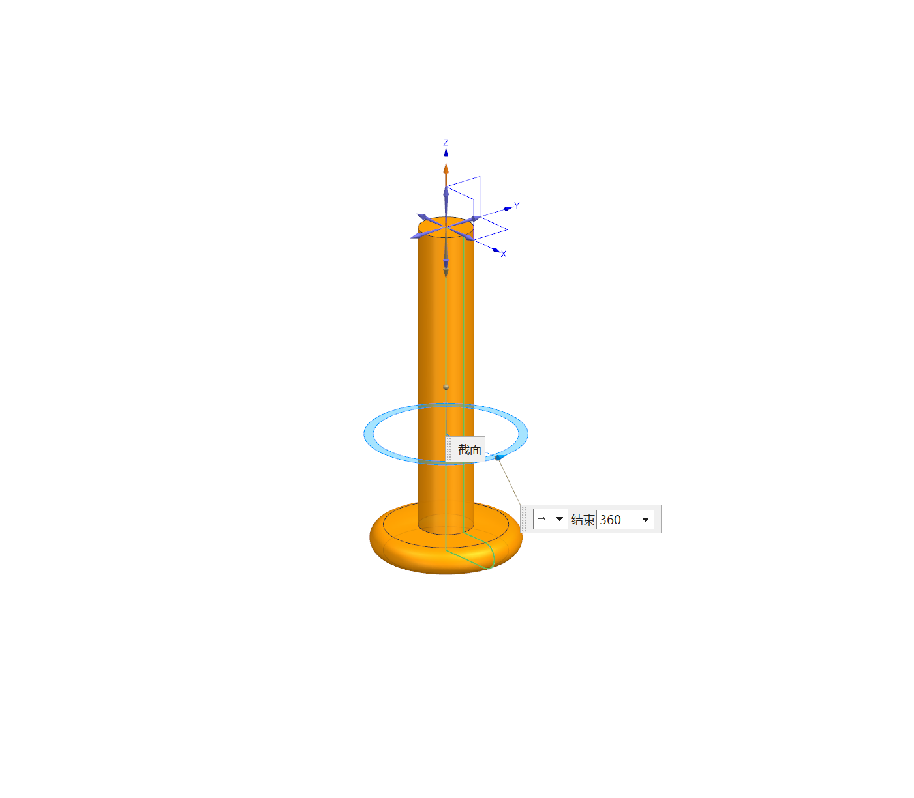
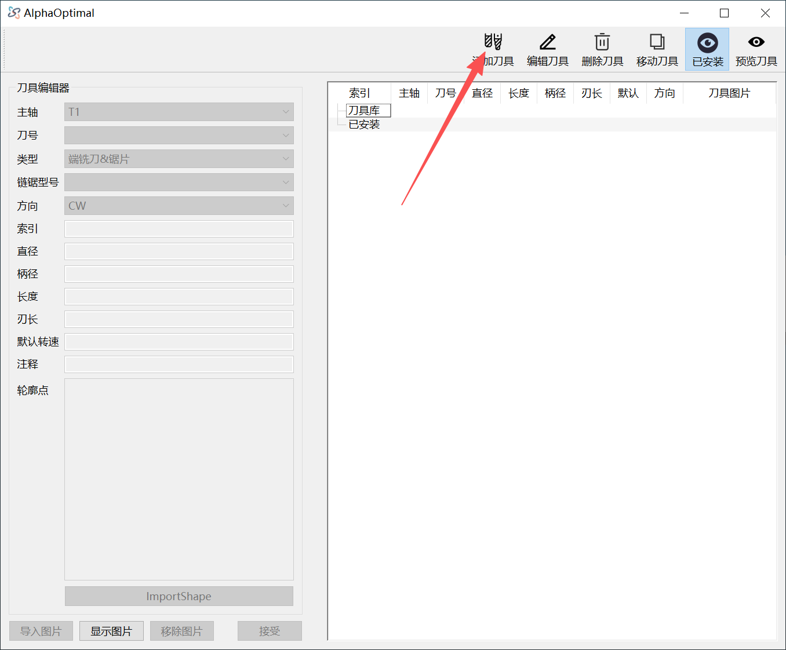
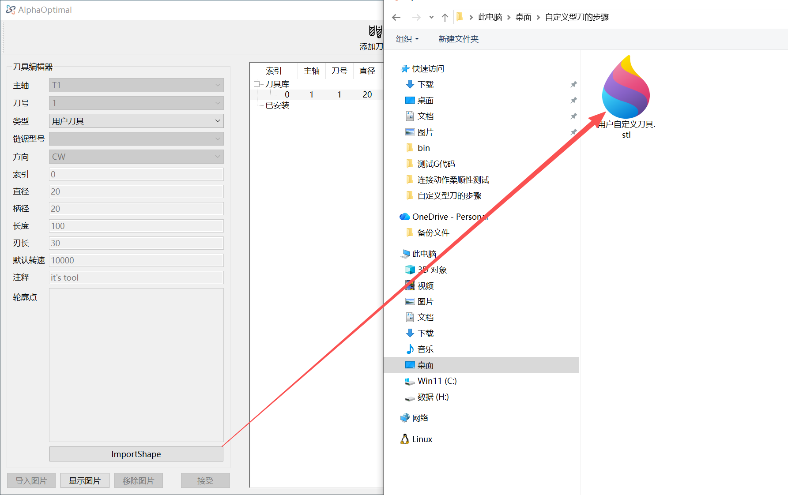
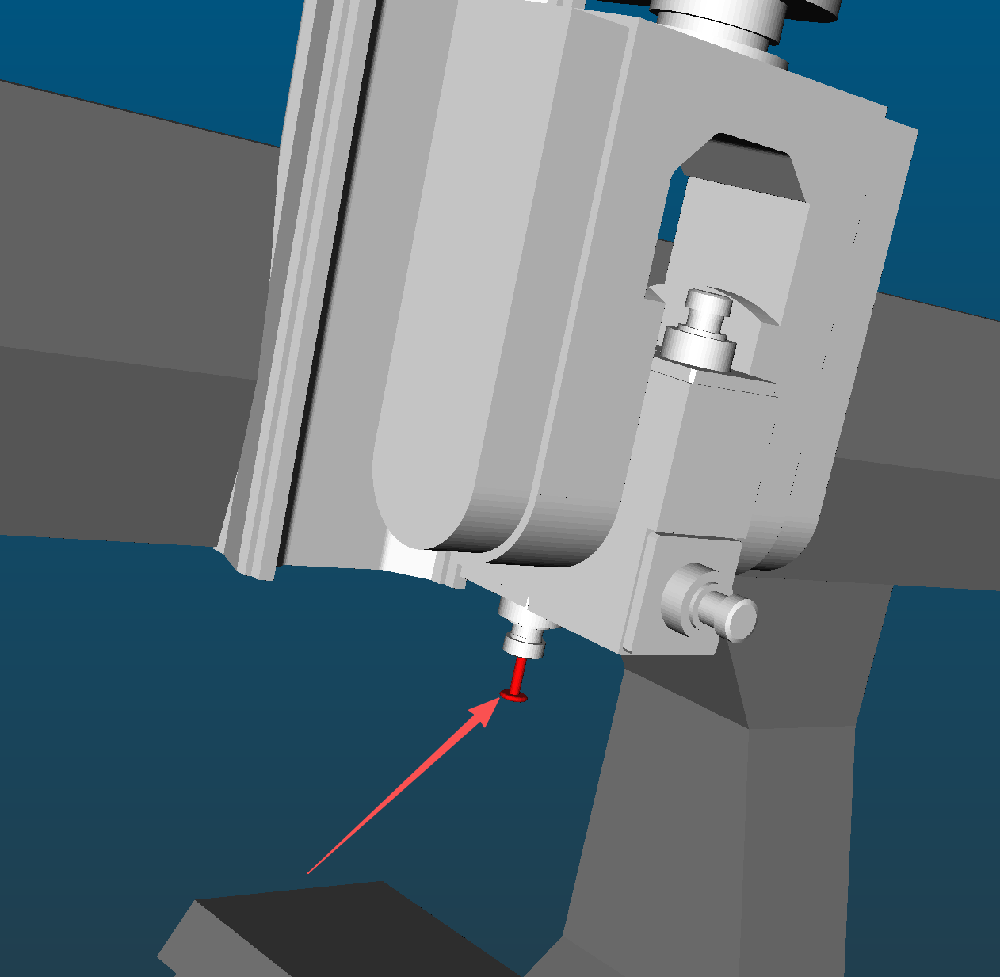

# 自定义刀具操作步骤

## **1.** 绘制刀具模型
- 绘制平面:XZ 沿-Z方向绘制

## **2.** 构建旋转体

## **3. 导出模型**.类型为：`STL`

## **4. 进入AlphaOptimal->刀具列表** 

## **5. 新增刀具 如果是已经存在的刀具:选定刀具 然后 点击 编辑刀具** 

## **6.编辑刀具**
- 如果是新增的刀具.刀具类型选择:**用户刀具**。然后点击下方的**ImportShape**按钮。选择第3步导出的STL文件.导入模型文件之后，软件会检查是否正确.正确之后，其它按钮才可使用。

## **7.设置正确的刀具长度/刀具直径**

## **8.点击 接受 按钮**
右侧的刀具列表更新

## **9.选定刀具 然后移动刀具** 就可以在机器模型上看到自定义的型刀了。
注意：如果型刀是安装在可换刀主轴.必须是在模拟的时候才能看到。非可换刀主轴为立即显示

