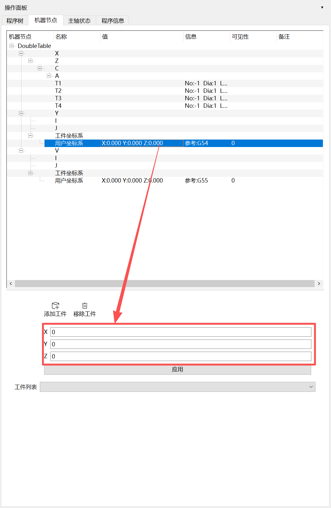
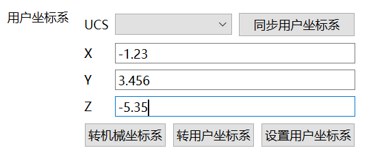
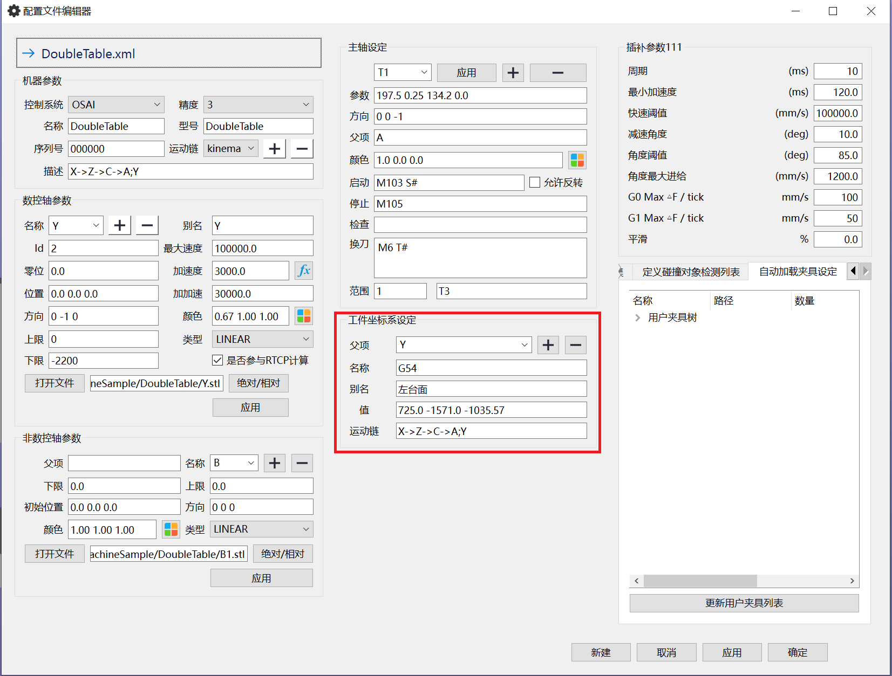
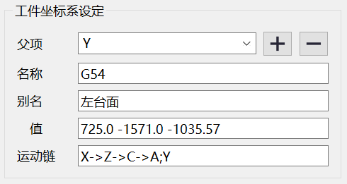

# 校正工件坐标系的原点位置

<pre>
   
   说明:
   机型：五轴加工中心
   旋转轴：第4轴:C 第5轴:A
   工位数：2
      左工位 → 对应坐标系：G54  
      右工位 → 对应坐标系：G55  
   示例校正的原点：G54
   校正前提条件:系统参数已经正确设定 刀具已经在软件内正确设置
   使用主轴:T1 (此类调试一律使用T1)
   
</pre>
---

## 操作步骤

1. 确认用户坐标系为默认设置
   

2. 移动刀尖到原点位置,在物理机床上将刀尖移动到工件坐标系原点
   1. 注意:以下图片可能跟你的机床有所差异，请以自己的机床为准。
   2. 图示
   

3. 转到AlphaOptimal软件，点击工具栏 → 通讯 
   
4. 确认工件坐标系:G54 已经勾选 
5. 确定C0 A0
   - C0  
   - A0  
6. 把轴1/2/3的值抄写到`Ax_1 Ax_2 Ax_3`

7. 同步用户坐标系(**注:此操作只执行一次即可**) 
    - 
8. 点击按钮：转用户坐标系 
    - 

9. 获取补偿值 (记录X=-1.23 Y=3.456 Z=-5.35的值.**这里最终应该显示的值: X=0.0 Y=0.0 Z=0.0**)
    - 
    - 假如计算出来的补偿值x=0.0,y=0.0,z=0.0，表示已经正确设置.无需执行后续操作

10. 执行补偿
    - 菜单:设置->编辑配置文件
      - 
      - 进入配置文件编辑器
        - 
      - 修改值
        - 
        - 取决于系统的不同.可能是加上记录的值,也可能是减去记录的值.可以试一下
        - 注意值本身的格式:X Y Z 中间以一个空格分割.不可写错
      - 点击确定.重启软件.确保物理机床不要做任何操作
11. 验证. 重复`第3 - 9`步，获取到的补偿值为 x =0.0,y = 0.0,z=0.0为止 

---

## 校正G55说明
- 它的操作和上述的操作是一样的.却别在于
  - 第4步:勾选G55
  - 第10步->修改值:选择G55 再修改值
