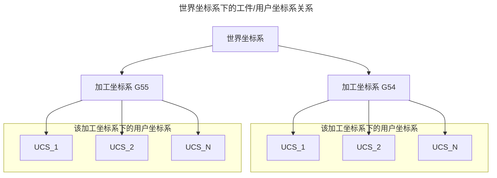

# 坐标系详解

## 类型
|序号|名称|缩写|用途|数量|可见性|
|---|---|---|---|---|---|
|1|世界坐标系|WCS|所有其它坐标系的基准|1|不可见|
|2|加工坐标系|MCS|参照世界坐标系移动.用户坐标系的基准|N|不可见|
|3|用户坐标系|UCS|参照加工坐标系移动.终端用户用于加工|N|可见|

## 坐标系的位置定义

### 世界坐标系
- 正交机型
- 双转头机型
- 位置:在两条旋转轴的交汇点.注意(此时所有的机械轴应该在0的位置)
- 图示:

- 说明:
  - 世界坐标系是固定不变的.
  - 加工坐标系:它提供了一个基准给用户坐标系.默认设置在这个位置.但不是固定的，也可以设置在其它位置.一般为了设置的简便和统一.默认在这个位置.它不影响用户坐标系的使用.它最大的功能是为用户坐标系提供变换参照.
  - 用户坐标系:每一个加工坐标系下都至少有一个用户坐标系.它负责提供交互端口给用户.实现让客户在台面的任意位置执行加工.当用户坐标系的位置{x=0,y=0,z=0}的时候.它和加工坐标系重叠
