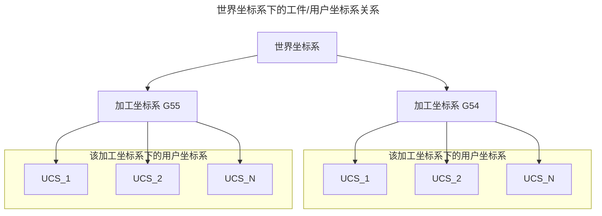
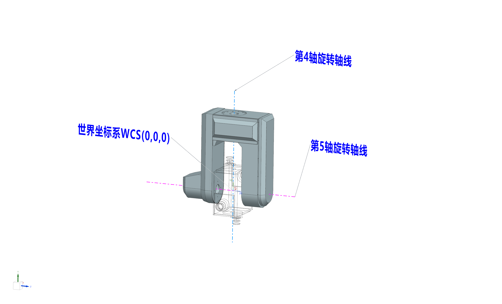
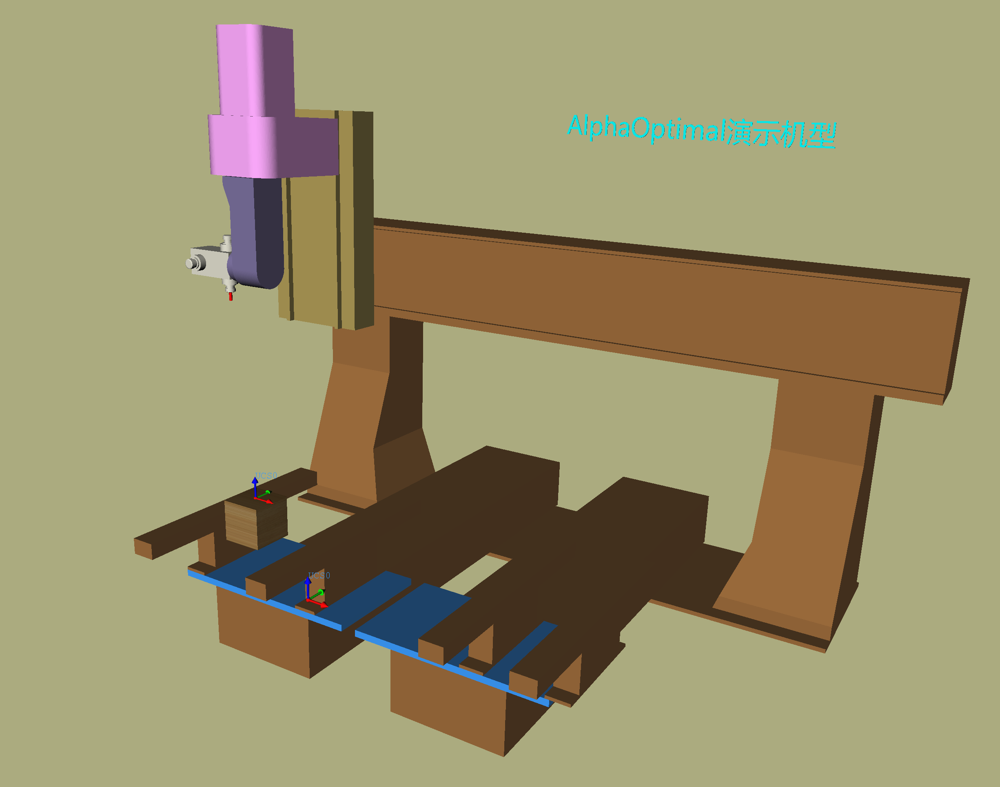

# 坐标系详解

## 类型
|序号|名称|缩写|用途|数量|可见性|
|---|---|---|---|---|---|
|1|世界坐标系|WCS|所有其它坐标系的基准|1|不可见|
|2|加工坐标系|MCS|参照世界坐标系移动.用户坐标系的基准|N|不可见|
|3|用户坐标系|UCS|参照加工坐标系移动.终端用户用于加工|N|可见|

## 坐标系的位置定义

### 世界坐标系
- 正交机型
- 双转头机型
- 位置:在两条旋转轴的交汇点.注意(此时所有的机械轴应该在0的位置)
- 图示:

- 说明:
  - 世界坐标系是固定不变的.
  - 加工坐标系:它提供了一个基准给用户坐标系.默认设置在这个位置.但不是固定的，也可以设置在其它位置.一般为了设置的简便和统一.默认在这个位置.它不影响用户坐标系的使用.它最大的功能是为用户坐标系提供变换参照.
  - 用户坐标系:每一个加工坐标系下都至少有一个用户坐标系.它负责提供交互端口给用户.实现让客户在台面的任意位置执行加工.当用户坐标系的位置{x=0,y=0,z=0}的时候.它和加工坐标系重叠

## 创建多个用户坐标系的方法
1. 软件界面

2. 左侧:操作面板

3. 在 **操作面板**顶部,点击:机器节点

4. 选定要在哪个加工坐标系下添加用户坐标系

5. 修改用户坐标系的值
- 点击 **用户坐标系**
- 在下方的坐标系属性界面输入要修改的值
- 点击**应用**

6. 3D视窗显示

## 如何获取**用户坐标系**的值
1. 正确设置刀具.详见[正确设置刀具](../UserDocument/ToolManager_ZH.md)

2. 把工件固定在机器上面

3. 将T1的刀尖移动到CAM编程时,对应的坐标系零点位置

4. **点击工具栏 → 通讯**
   
5. **确认工件坐标系:G54 已经勾选.假如要计算的是右台面.勾选G55**
6. **确认:第4&5轴的角度为0(A0 C0)**
7. **抄录机械坐标**  
将数控系统上的 **X Y Z** 坐标抄录到机械坐标系：`Ax_1 Ax_2 Ax_3`  

8. 点击：**同步用户坐标系**   
9. UCS->下拉:选择需要设置的用户坐标系Id
10. 点击:转用户坐标系
11. 点击:设置用户坐标系