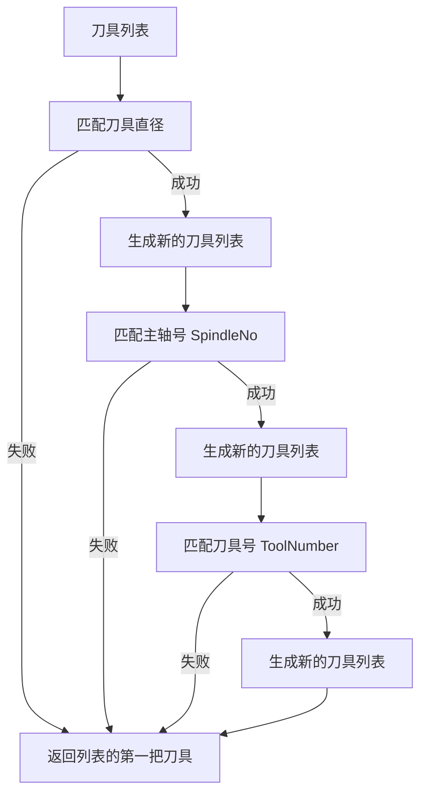

# 构建适用于AlphaOptimal的CAM后处理器

> AlphaOptimal软件的输入是标准的G代码文件。为了确保G代码能够被AlphaOptimal正确解析和处理，用户需要为所使用的第三方CAM软件编写一个专用的后处理器。该后处理器的作用是生成符合AlphaOptimal格式要求的G代码文件。

---
### 文件示例

<pre>
    <span style="color:blue;">(SpindleNo=2 ToolNumber=1 TD=10.0 ....)  //刀具信息</span>
    <span style="color:blue;">N0010 G01 G90 X-15.5 Y76.88 Z60. C0.0 A0.0 F100000  //快速定位 程序段的第二行必须输出全部轴的坐标位置.否则默认为0</span>
    N0020 Z53.
    <span style="color:blue;">N0030 G01 X-16.11 Y75.35 Z52.91 F4250.  // 开始加工 速度发生变化时.G1后必须跟随F</span>
    N0040 X-17.23 Y73.66 Z52.81
    ……
    ……
    N0210 G00 G90 X-15.5 Y76.88 Z60. //快速定位
    N0220 Z53.
    <span style="color:blue;">N0230 G01 X203.4 F4000  // 开始加工 速度发生变化时.G1后必须跟随F</span>
    ……
    ……
    N1500 Z31.
    N1510 G00 Z60.
    <span style="color:blue;">;SECTION    //分割标识符</span>
    <span style="color:blue;">(SpindleNo=2 ToolNumber=1 TD=10.0 ....)  //刀具信息</span>
    <span style="color:blue;">N0010 G00 G90 X-15.5 Y76.88 Z60. C0.0 A0.0 //快速定位 程序段的第二行必须输出全部轴的坐标位置.否则默认为0</span>
    N0020 Z53.
    <span style="color:blue;">N0030 G01 X-16.11 Y75.35 Z52.91 F4250.</span>
    N0040 X-17.23 Y73.66 Z52.81
    ……
    ……
    N1500 Z31.
    N1510 G00 Z60.
    <span style="color:blue;">;SECTION    //分割标识符</span>
    <span style="color:blue;">(SpindleNo=2 ToolNumber=1 TD=10.0 ....)  //刀具信息</span>
    <span style="color:blue;">N0010 G00 G90 X-15.5 Y76.88 Z60. C0.0 A0.0 //快速定位 程序段的第二行必须输出全部轴的坐标位置.否则默认为0</span>
    N0020 Z53.
    <span style="color:blue;">N0030 G01 X-16.11 Y75.35 Z52.91 F4250. // 开始加工 速度发生变化时.G1后必须跟随F</span>
    N0040 X-17.23 Y73.66 Z52.81
    ……
    ……
    N1500 Z31.
    N1510 G00 Z60.
    <span style="color:red;">// 最后一个程序段的末尾不要带分隔符 ;SECTION</span>
</pre>

---

### 解释
- 程序:是指一个部件的完整加工代码.它由N个程序段组成
- 程序段：指在CAM编程时，为每个加工特征生成的独立加工程序。
    - 例：执行一个钻孔加工，这个钻孔加工的G代码称为一个程序段。
    - 例：执行一个多轴轮廓加工，这个轮廓加工的G代码称为一个程序段。
- 刀具信息
    - 在每个程序段的第一行，包含AlphaOptimal自动匹配刀具所需的信息
    - SpindleNo -> 主轴号。具体格式 SpindleNo=1 
    - ToolNumber -> 刀具号。具体格式 ToolNumber=2
    - TD -> 刀具直径。具体格式 TD=12.0
    - 用`(...)`把它们包裹起来. 示例:`(SpindleNo=1 ToolNumber=2 TD=12.0 ....)` 中间用一个空格将它们分割
- 分隔符
    - 用于标识程序段的分隔符，AlphaOptimal通过该标识符将G代码分割为多个程序段
    - 标识 `;SECTION`
    - 最后一个程序段末尾不输出分隔符

---

## 配套的CAM后处理生成文件
- 程序
    - `必须输出点位坐标，不允许输出循环指令`，以确保AlphaOptimal能够正确解析每个加工路径。
    - 相邻的程序段以 `;SECTION` 分割。最后一个程序段最后一行不需要分隔符
        <pre>
        示例如下:
            程序段
            ;SECTION
            程序段
            ;SECTION
            ...
            ...
            程序段
            ;SECTION
            程序段
        </pre>

- 程序段
    - 第一行：输出刀具信息
      - 示例:`(SpindleNo=2 ToolNumber=1 TD=10.0 ....)`
    - 第二行:输出快速定位信息.必须包含所有轴的位置信息
      - G0 示例:`G00 G90 X-15.5 Y76.88 Z60. C0.0 A0.0`
      - G1 示例:`G01 G90 X-15.5 Y76.88 Z60. C0.0 A0.0 F100000`
    - 程序段中间部分.当速度发生切换时,需要重新定义进给速度
      ```
      G0 Z200
      Z50
      G1 Z10        // 错误 从 G0 切换到 G1  调用默认值250.   当前F = 250 
      G1 Z10 F3500  // 正确 从 G0 切换到 G1  适用用户定义的值.当前F = 3500
      ```
    -  注释行
       - 以`;`开头.例:`; This line is a comment. `
       - 以`//`开头.例:`// This line is a comment. `

- 轴坐标格式 

    | 值     | X1.0 | X-0.5 | X-.5 | X.5 |
    |--------|------|-------|------|-----|
    | 合格   | ✅   | ✅    | ✅   | ✅  |

---

### 刀具信息匹配规则

- **匹配逻辑**：
  1. **匹配刀具直径（TD）**  
     - 从默认刀具列表中查找符合直径要求的刀具。
     - 如果匹配到多个刀具，则生成一个新的刀具列表，供下一步匹配主轴号。
     - 如果未匹配到任何刀具，则直接返回默认刀具列表中的第一把刀具。

  2. **匹配主轴号（SpindleNo）**  
     - 在上一步生成的刀具列表中，继续匹配主轴号。
     - 如果匹配到多个刀具，则生成一个新的刀具列表，供下一步匹配刀具号。
     - 如果未匹配到任何刀具，则直接返回当前刀具列表中的第一把刀具。

  3. **匹配刀具号（ToolNumber）**  
     - 在上一步生成的刀具列表中，继续匹配刀具号。
     - 如果匹配到多个刀具，则生成一个新的刀具列表。
     - 如果未匹配到任何刀具，则直接返回当前刀具列表中的第一把刀具。

  4. **返回结果**  
     - 最终返回符合所有条件的刀具列表中的第一把刀具。



---

### 演示如何在NX中输出刀具匹配信息
- 首先需要知道如何适用NX的后处理构造器.
- 工序起始序列->刀轨开始->添加:定制命令
   

```        
    # 申明全局变量
    global mom_tool_diameter #刀具直径
    global mom_tool_type    #刀具类型
    global mom_tool_name    #刀具名称
    global mom_tool_number    # 刀具号 这里用它来描述对应的主轴号
    global mom_tool_adjust_register    #刀具寄存器 用它来描述对应机床的刀具号

    # 格式化刀具号 当作主轴号使用
    set spindle_number [format "SpindleNo=%.0f" $mom_tool_number]

    # 格式化补偿寄存器号 当作刀具号使用
    set tool_number [format "ToolNumber=%.0f" $mom_tool_adjust_register]

    # 格式化刀具直径
    set tool_diameter [format "TD=%.1f" $mom_tool_diameter]

    # 使用正则表达式判断 mom_tool_type 的值
    if { [regexp {Ball Mill} $mom_tool_type] } {
        set tool_type "Type=BallMill"
    } elseif { [regexp {Milling} $mom_tool_type] } {
        set tool_type "Type=EndMill"
    } elseif { [regexp {Drilling Tool} $mom_tool_type] } {
        set tool_type "Type=Drill"
    } else {
        set tool_type [format "Type=%s" $mom_tool_type]
    }

    # 格式化刀具名称
    set tool_name [format "ToolName=%s" $mom_tool_name]

    # 拼接字符串
    set tool_info [format "%s %s %s %s %s" $spindle_number $tool_number $tool_diameter $tool_type $tool_name]

    # 输出到NC代码
    MOM_output_literal "($tool_info)"


``` 

- NX CAM中的刀具设定
  - 刀具号:会被当做主轴号输出   
  - 补偿寄存器:会被当做刀具号输出       
  - 

