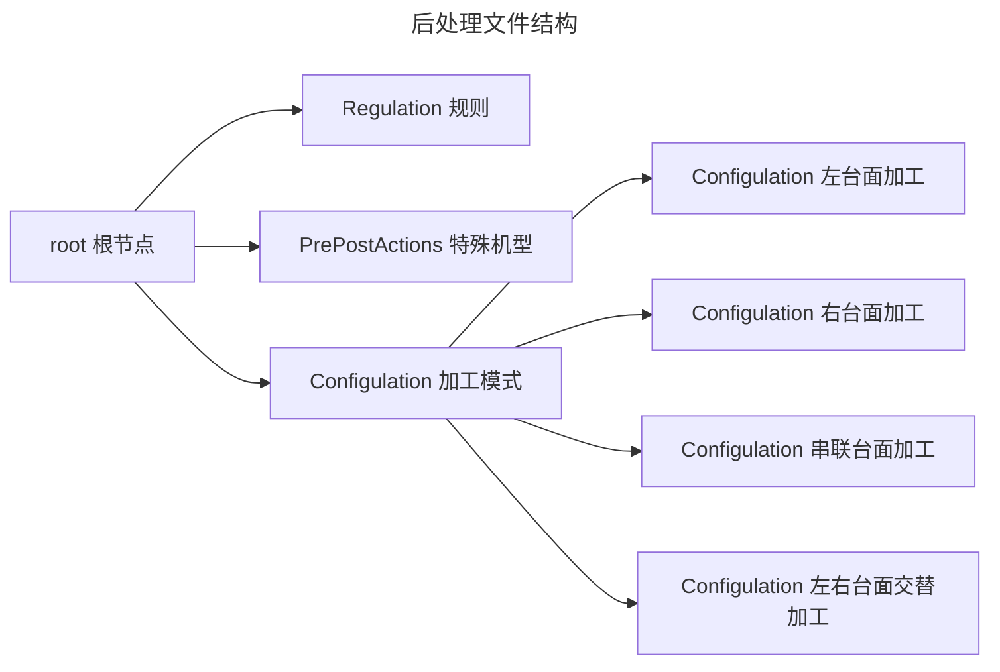
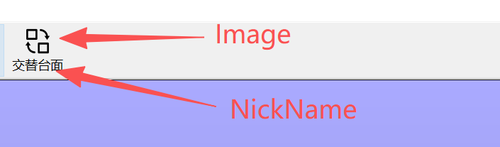

# 自定义后处理器

### 作用
后处理器是一套 **规则**，用于处理输入的加工数据(这个数据是由软件内部提供)。经过预先定义的计算和格式化，生成机床可读取和执行的代码.它是**xml格式**

---

### 后处理文件结构


---

### 安装路径
安装目录下的 **UserPostProcessor** 文件夹用于存放所有后处理器文件。
```
假设软件安装路径:C:\Program Files\AlphaOptimal_v3\bin
后处理文件夹 `UserPostProcessor` 就在bin文件夹下.具体路径:C:\Program Files\AlphaOptimal_v3\bin\UserPostProcessor

```

---

### Regulation 节点详解

```xml
<Regulation Rapid="G500" OutputDir="D:/CNC" Linear="G600" Prepend="" AccelerationScheme="1" UserHeaderTail="true" MultiChain="0" EntrySequence="2;4->5;1;3" ExitSequence="3;4->5;1->2"></Regulation>
```
- 
  | 名称                | 值                  | 说明                                                          |
  |---------------------|---------------------|--------------------------------------------------------------|
  | Rapid              | G500               | 开启高速高精功能，具体参数请咨询数控系统供应商                     |
  | OutputDir          | D:/CNC             | Iso代码的输出路径.注意windows系统： `\`  此处: `/`               |
  | Linear             | G600               | 关闭高速高精功能，具体参数请咨询数控系统供应商                     |
  | Prepend            | （空）             | 在每个 `G1` 前添加额外指令，例如 `G53`（部分数控系统需要）          |
  | AccelerationScheme | 1                  | `0` 时间编程:`G1 X100 t0.002`;`1` 表示 F 编程：`G1 X100 F3000` |
  | UserHeaderTail     | true               | 特殊设定，一般无需修改。                                          |
  | MultiChain         | 0                  | 特殊设定，一般无需修改。                                          |
  | EntrySequence      | 1->2->4->5;3        | 设定进刀顺序，示例：`1->2->4->5;3`                                |
  | ExitSequence       | 3;1->2->4->5       | 设定退刀顺序，示例：`3;1->2->4->5`                                |

- EntrySequence & ExitSequence的值里面的数字代表轴的Id.`X=1 Y=2 Z=3 C=4 A=5` 详见:[轴Id和运动链](../AdminDocument/buildMachineConfig/ChainAndAxisId.md)

- EntrySequence 详解  
  - 示例1:EntrySequence="1->2->4->5;3"
  <pre>
      零位:G1 X-1500 Y0 Z0 C0 A0 F100000  
      起始位置:G1 X100 Y-1300 Z-500 C-50 A53.3 F100000  

      最终处理结果如下:   
      G1 X-1500 Y0 Z0 C0 A0 F100000  
      G1 X100 Y-1300 C-50 A53.3 F100000  //移动XYCA
      G1 Z-500  F100000                  // 移动Z坐标

      // 执行效果:先移动刀具到加工起始点的Z上方,然后再移动Z到加工点
  </pre>

  - 示例2： EntrySequence=""
  <pre>
      零位:G1 X-1500 Y0 Z0 C0 A0 F100000  
      起始位置:G1 X100 Y-1300 Z-500 C-50 A53.3 F100000  

      最终处理结果如下:  
      G1 X-1500 Y0 Z0 C0 A0 F100000  
      G1 X100 Y-1300 Z-500 C-50 A53.3 F100000  

      // 执行效果:直接一条斜线从起始点到目标点
  </pre>

  - **建议设定:EntrySequence="1->2->4->5;3"**
  
---
- **ExitSequence:设定退刀顺序**  
  - 示例1: ExitSequence="3;1->2->4->5"
  <pre>
    结束位置:G1 X100 Y-1300 Z-500 C-50 A53.3 F100000  
    零位:G1 X-1500 Y0 Z0 C0 A0 F100000  

    最终处理结果如下: 
    G1 X100 Y-1300 Z-500 C-50 A53.3 F100000   
    G1 Z0 F100000               // Z移动到0位
    G1 X-1500 Y0 C0 A0 F100000  // XYCA移动到0位

     // 执行效果:先移动Z到零位,然后再移动XYCA到零位
  </pre>
  - 示例2:ExitSequence=""
  <pre>
    结束位置:G1 X100 Y-1300 Z-500 C-50 A53.3 F100000    
    零位:G1 X-1500 Y0 Z0 C0 A0 F100000    
    最终处理结果如下:   
    G1 X100 Y-1300 Z-500 C-50 A53.3 F100000   
    G1 X-1500 Y0 C0 A0 F100000  

     // 执行效果:直接一条斜线 移动到零位
  </pre>

  - **建议设定: ExitSequence="3;1->2->4->5"**


---
### PrePostActions 节点详解:特殊机型使用.一般情况无需填写
---

### Configulation 节点详解

```xml
<Configulation Name="L" NickName="左台面" Prefix="" Suffix=".nc" Image="left.png" >
  <Item>G500</Item>
  <Item>(SDA)</Item>
  <Item>"BEGIN"</Item>
  <Item>(GTO,A,@TABREQNO=1)</Item>
  <Item>(GTO,B,@TABREQNO=2)</Item>
  <Item>"A"</Item>
  <Item>G40</Item>
  <Item>G90</Item>
  <Item>G80</Item>
  <Item>G27 G0</Item>
  <Item>M05</Item>
  <Item>G0 G79 Z0.0</Item>
  <Item>G0 G79 A0.0 C0.0 </Item>
  <Coordinate>G54</Coordinate>
  <Item>G0 Z0.0</Item>
  <Item>M05</Item>
  <Item> G0 G79 Z0.0</Item>
  <Item>"EXIT"</Item>
  <Item>G0 A0.0 C0.0</Item>
  <Item>(CLT,NCEND)</Item>
  <Item>M30</Item>
  <Item>  </Item>
  <Item>   </Item>
</Configulation>
```
---
- 

#### Configulation 节点属性解释

  ```xml
  <Configulation Name="R" NickName="右台面" Prefix="" Suffix=".nc" Image="right.png">
  ```

  - 
    | 名称      | 值         | 说明                                                                 |
    |-----------|------------|----------------------------------------------------------------------|
    | Name      | L          | 加工模式名称，`L` 表示左台面加工模式。 **格式:单个英文字母 大写**       |
    | NickName  | NickName   | 显示名称，与图标共同构成软件图标显示。                                |
    | Prefix    | Prefix_    | 文件名`alphaTest`， 生成的文件名:`Prefix_alphaTest`。用户自定义|
    | Suffix    | _Suffix.nc | 文件名`alphaTest`， 生成的文件名:`alphaTest_Suffix.nc` 用户自定义|
    | Image     | left.png   | 显示图标，需存放于 **UserPostProcessor** 文件夹中。                   |

  - 

  </p></p></p>

#### Configulation 子节点解释
- 
  | 名称       | 说明                   |      值         |
  |------------|-----------------------|-----------------|
  | Item       | 一个`<Item> </Item>`就是一行文本.可以是任意内容|按照数控系统的要求写入|
  | Coordinate | 对应程序树下的左台面&右台面 |这个值必须是在机器配置文件内已经被定义的 大多数的时候是G54 G55|

- 完整Configulation示例
  - 说明
    1. 此示例使用的数控系统:OSAI
    2. 机型结构:XYZCA
    3. 双台面.Y V
    4. 为方便理解.会在每一行后面添加注释信息. `//注释`,这个在xml文件内是不被允许的,此处仅作示例使用
   
```xml
<Configulation Name="L" NickName="左台面" Prefix="" Suffix=".nc" Image="left.png" >
  <Item>G500</Item>                 // 关闭高速高精功能
  <Item>(SDA)</Item>                // 取消台面从动功能
  <Item>G40</Item>                  // 取消刀具补偿
  <Item>G90</Item>                  // 定义绝对编程
  <Item>G80</Item>                  // 取消固定循环
  <Item>G27 G0</Item>               // 返回参考点
  <Item>M05</Item>                  // 停止所有主轴旋转
  <Item>G0 G79 Z0.0</Item>          // Z轴返回参考点
  <Item>G0 G79 A0.0 C0.0 </Item>    // A C轴返回参考点
  <Item>"BEGIN"</Item>              // 标记:用于循环.可配合OSAI系统的GTO语句使用. (GTO,BEGIN)
  <Item>(GTO,A,@TABREQNO=1)</Item>  // OSAI系统的检测指令
  <Item>(GTO,B,@TABREQNO=2)</Item>  // OSAI系统的检测指令
  <Coordinate>G54</Coordinate>      // 软件标识:在此处插入Iso代码
  <Item>(CLT,NCEND)</Item>          // OSAI系统指令
  <Item>(GTO,BEGIN)</Item>          // 跳转指令.从头开始查找BEGIN这个标签.从BEGIN这重新执行
  <Item>M30</Item>                  // 程序结束
  <Item>  </Item>                   // 空行 .OSAI系统要求加工程序最后必须带2行空行.否则会报错
  <Item>   </Item>                  // 空行 .OSAI系统要求加工程序最后必须带2行空行.否则会报错
</Configulation>
```
