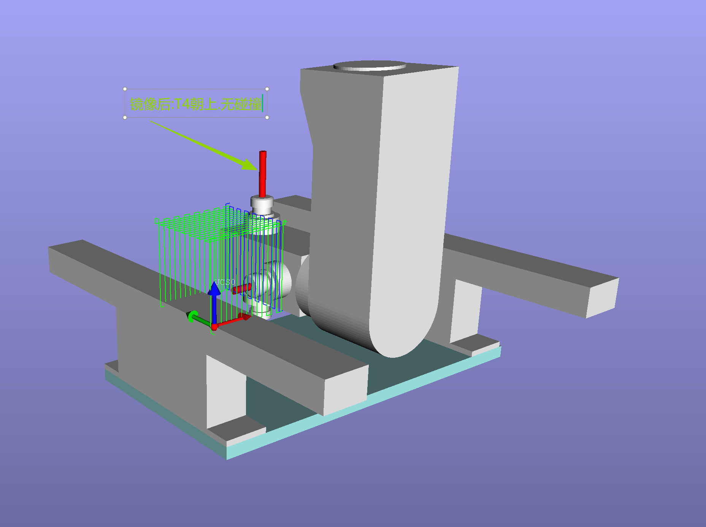
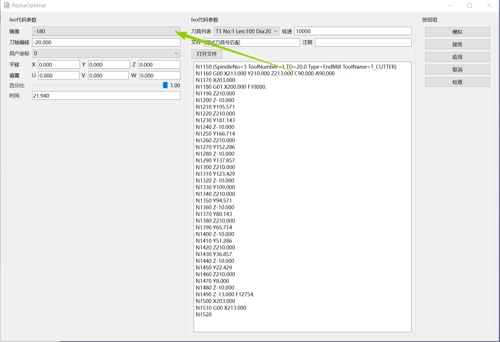
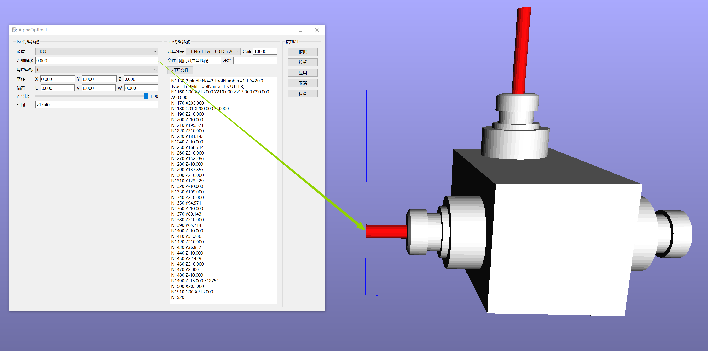

# Iso程序段编辑器

[返回程序树预览](../document/ProgramTree_ZH.md)

## 进入方法
1. 选定要编辑的Iso程序段.
2. 右键菜单
3. 编辑


## 编辑器参数说明

### 左侧区域
- 镜像:此操作不是必须的,如果默认值0符合加工需求,则不修改
	- 取值范围[0,-180,180]
	- 作用:强制刀轴动作镜像
	- 计算方法:第4轴 = 当前值 + [0,-180,180];第五轴 = 当前值 * -1.0
	- 举例说明	
		```
		当前坐标值:C-270.0 A-45	
		执行刀轴镜像.镜像角度选择 180	
		结果如下:	
			C = -270 + 180 = -90 -->C-90	
			A = -45 * -1.0 = 45  -->A45	
		最终执行坐标:C-90 A45	
		```
	- 镜像前后姿态对比</p>
		
		
	- 镜像值的选取一般原则:
    	- 取和第一行G代码内第4轴相反的值.
    	- 例子:
        	- 第一个C的值是正数:C199.35.镜像角度取:-180
        	- 第一个C的值是负数:C-199.35 镜像角度取:180
        	- 第一个C的角度:0 ,镜像角度任意。(这种情况一般不需要执行刀轴镜像)
      	- 第一个第4轴的角度 = C90.000 镜像角度选择:-180
        	- 
- 刀轴偏移:此操作不是必须的,如果默认值0符合加工需求,则不修改
  - 沿着刀轴矢量方向进行移动
  - 可用于改变加工的深度
  - 适用范围:任意加工方式 `三轴加工` `定向加工` `4联动加工` `5联动加工`
  - 常用于:`弯曲木的轮廓切割` `孔加工` `榫眼加工` 等</p></p>
  - 刀轴偏移 = 0</p></p>
		
  - 刀轴偏移 = 20</p></p>
		
  - 刀轴偏移 = -20</p></p>
		

- 用户坐标:重新设定当前程序段所在的用户坐标系 详见[坐标系详解](../other/CoordinateSystem.md)
- 平移:此操作不是必须的,根据实际修改
  - 沿世**界坐标系**的**XYZ**方向移动程序段
- 偏置:此操作不是必须的,根据实际修改
  - 沿加**工平面**所在的**UVW**方向 移动程序段
- 百分比:特殊机型使用.不修改
- 时间:显示当前程序段的加工耗时.这个值为最理想耗时.实际加工过程中,耗时应该会大于这个时间

### 中间区域
- 刀具列表:手动选择适用于当前程序段加工的刀具
- 转速:手动修改当前程序段加工时的主轴转速
- 文件:当前Iso代码的文件来源
- 注释:用户注释
- 打开文件:重新选择Iso代码文件.仅适用于当前程序段
### 右侧区域:按钮组
- 模拟:模拟当前程序段的加工
- 接受：执行修改并关闭编辑器窗口
- 应用:执行修改
- 取消:取消修改
- 检查：显示当前程序段是否有超限位
	- 
	- 红色:超限位 
    	- 解释: -1208.5 标示当前程序段会执行到Y-1208.5这个地方.它超出了轴的极限值.**它不是程序段的极限值.也许后面还会有超出极限的位置.软件会在检测到有超限位的时候，记录下超限的位置并显示出来.不会往后再检查了**
  	- 绿色:限位内。可以执行加工


[返回程序树预览](../document/ProgramTree_ZH.md)