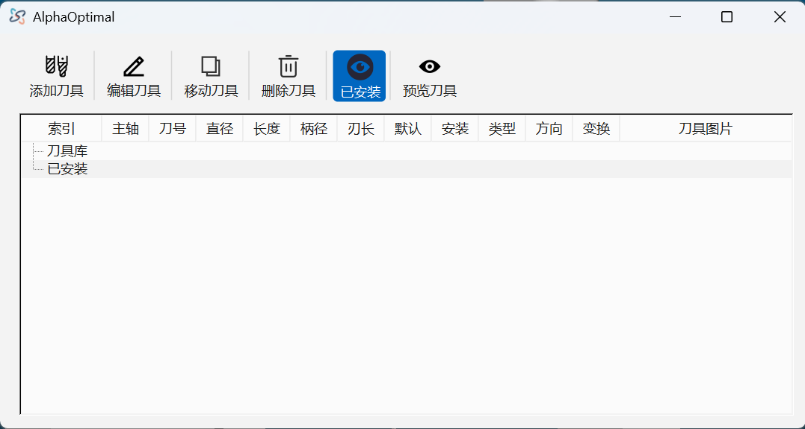

# **1. 刀具管理**

> 刀具列表不为空是所有操作的前提.所以设置刀具是软件操作的第一步,无论需要执行软件的任何功能,请务必先设置必要的刀具

1. 进入刀具管理器


2. 
    1. 刀具的唯一标识是它的**索引**
    2. **刀具库**:保存创建好的刀具，但是这个刀具不会在机器模型上显示，也不能被程序段调用
    3. **已安装**:指已经安装在机器上的刀具,它可以比使用
    4. 刀具库内的刀具信息,会自动保存在软件安装路径下的`toollib.json`文件内,当刀具管理器被激活打开时,程序会自动加载
    5. 已安装的刀具,如果它有被程序段使用，它会被保存在程序文件.不会因为刀具库内没有对应索引的刀具而丢失

3. 刀具管理界面

- 添加刀具:新增一把刀具
- 编辑刀具:编辑选定的刀具
  - 刀具库内的刀具编辑方法:
    - 选定刀具-> 点击:编辑刀具,也可以右键菜单:编辑刀具
    - 直接双击选定的刀具
  - 已安装的刀具编辑方法:
    - 选定刀具-> 点击:编辑刀具,也可以右键菜单:编辑刀具
- 移动刀具:
    - 把刀具从刀具库移动到已安装,或从已安装移动到刀具库.
    - 这里的移动也包含了数据同步功能
    - 例子：
        ```
            刀具：
            索引：1
            主轴: T1
            刀号: 1
            直径: 20mm
            现在的位置:刀具库
            
            操作:选定刀具->点击:移动刀具

            情况1：已安装 没有索引==1的刀具
                执行结果:复制,会复制一份相同的刀具刀 已安装
            情况2: 已安装 有索引==1的刀具
                执行结果:数据同步.会把 已安装 下,索引==1的刀具的数据，设置为


        ```
- 删除刀具
  - 刀具库内的刀具:它可以被删除
  - 已经安装的刀具:在执行删除动作时,会做检测.它如果被使用,软件则会拒绝删除该刀具
- 已安装
  - 只显示已经安装的刀具.假设刀具库里面创建了100把刀具,已安装处只使用了4把.当点击此按钮时.刀具库处只显示4把已经安装的刀具
- 预览刀具

# 刀具编辑器
- 在刀具管理器中执行编辑刀具
- 

## 输入详解:
- 主轴:刀具安装的主轴
- 刀号:刀具的编号.`换刀机型`选择正确的刀号，`非换刀机型`无需理会
- 类型：刀具的类型->[端铣刀&锯片 球头刀 用户刀具 链锯]
  - 端铣刀&锯片.锯片可以通过设置柄径和直径进行快速的定义
  - 球头刀
  - 用户刀具:对于特殊刀型,用户可以选择此类型.然后再`轮廓点`的文本输入框内输入刀具轮廓.也可以直接导入DXF文件
  - 链锯:需要定义链锯的配置文件。请联系**东莞市瑞凡软件公司**
- 链锯型号:需要定义链锯的配置文件。请联系**东莞市瑞凡软件公司**
- 方向:需要主轴反转的.直接`设置转速为负值` 此选项暂不起作用
- 索引:刀具**唯一**的标识
- 直径:刀具的直径(切割部分的直径)
- 柄径:刀柄的直径
- 长度:刀具的总长度.指安装在机器上后，测量到的刀具长度.并非刀具本身的刀具
- 刃长:刀刃的长度
- 变换:特殊选项,一般用户无需理会
- 默认转速:刀具的默认转速.程序段调用此刀具的时候,默认的主轴转速
- 注释
- 轮廓点:端铣刀&&锯片 球头刀无需理会.软件会自动生成并显示在此处.用户刀具 则必须在此处输入,或者导入DXF文件
- 导入图片:显示刀具图片
- 删除图片:删除刀具图片

## 直接操作
- 新建刀具->弹出:刀具编辑器->设置到刀具参数->点击**接受**
- 在**刀具库**选定要使用的刀具(可多选)
- 点击:**移动刀具**
- 已安装:在**刀具库**选定的刀具就会复制到**已安装**.并且在3D视图上会显示对应的刀具(`换刀主轴此时不显示,换刀主轴只有在模拟时刻才会显示对应的刀具`)
- 当**已安装**处有刀具之后,表示已经准备好了刀具.才能执行后续操作

## 常规警告
- 
- 提示找不到刀具号.这个警告不是严重错误.它提示 当前刀具的刀具号,在此配置文件内找不到.进入刀具编辑器后，刀具号会被设置成默认的。确认即可。